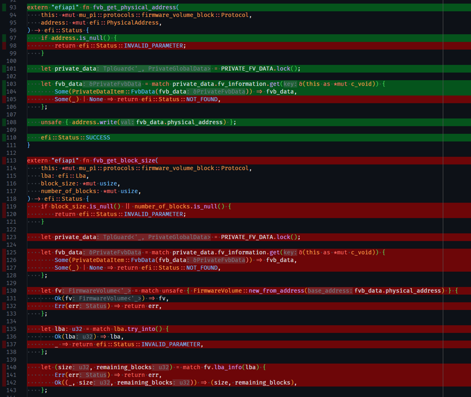

# Rust Tooling in Patina

## Overview

The Patina project relies on Rust's tooling ecosystem to maintain consistent quality, security, and reliability for
UEFI firmware development. This document summarizes the tooling in use, highlights how it is integrated into Patina's
workflow, and contrasts the approach with common practices in C-based firmware projects where relevant.

## Summary Table

The table below shows the comprehensive tool suite used in Patina compared to traditional C firmware development tools:

| Tool Category | Patina (Rust) Tool | Traditional C Tool | Key Advantages |
|---------------|-------------------|-------------------|----------------|
| **Benchmarking** | `cargo bench` | Custom timing code | Statistical analysis, regression detection |
| **Build System** | `cargo-make` | GNU Make, CMake | Cross-platform, declarative |
| **Code Formatting** | `rustfmt` | Uncrustify, ClangFormat | Built-in, consistent, configurable |
| **Documentation** | `rustdoc` | Doxygen | Code-synchronized, testable examples |
| **Security & License Auditing** | `cargo-deny` | Manual tracking and spreadsheets | Automated vulnerability and license policy enforcement |
| **Spell Checking** | `cspell` | Manual proofreading | Automated technical dictionary |
| **Static Analysis** | `clippy` | PC-lint, PVS-Studio, Coverity | Compiler-integrated, zero-config |
| **Undefined Behavior Analysis** | `cargo miri` | Valgrind, UBSan | Catches memory safety issues in unsafe code |
| **Test Coverage** | `cargo-llvm-cov` | gcov, OpenCppCoverage | Integrated coverage collection |

## The cargo Ecosystem: Central Command Hub

### Tooling Strategy

Patina prioritizes mature, off-the-shelf tooling to avoid maintaining bespoke infrastructure. Experience with other
firmware projects shows that custom build systems and analyzers introduce long-term maintenance risk and complicates
onboarding. Using standard Rust tooling keeps Patina aligned with the broader ecosystem and allows the Patina team to
focus on firmware functionality.

**[cargo](https://doc.rust-lang.org/cargo/)** is the common entry point for these tools. It offers a consistent
interface for building, testing, and extending the workflow without constraining developers to project-specific
wrappers. Cargo provides a standardized interface that works identically across host environments (Windows, Linux,
macOS) and is the central command used to orchestrate all development tasks.

### cargo

**Purpose**: Cargo is Rust's integrated package manager and build system that serves as the central command hub for the
entire development workflow, from dependency management to tool management.

**Why a "Central Commans" is valuable**:

- **Universal Interface**: Single command entry point for all development tasks (`cargo make build`, `cargo make test`,
  `cargo make doc`, etc.)
- **Plugin Architecture**: Extensible through cargo subcommands that integrate seamlessly with existing workflows
- **Tool Discovery**: Automatic discovery and integration of third-party tools
- **Workspace Management**: Unified management of multi-crate projects with shared configurations

### Tool Installation and Management

Cargo also handles tool distribution. Patina supports two installation strategies, depending on whether a build from
source is required or a pre-built binary is acceptable. In most cases, Patina uses pre-built binaries to minimize setup
time.

**Source-based Installation**:

This will compile tools from source, which can take several minutes per tool. It is particularly useful if the user
needs the tool to be built against their exact environment (e.g. rustc version, custom patches, etc.).

```bash
# Install tools from source with full compilation
cargo install cargo-make        # Build orchestration
cargo install cargo-deny        # Security and license auditing
cargo install cargo-llvm-cov    # Coverage analysis
```

**Binary Installation with cargo-binstall**:

The [`cargo-binstall`](https://github.com/cargo-bins/cargo-binstall) helper downloads pre-built artifacts when they are
available:

```bash
# Install cargo-binstall itself
cargo install cargo-binstall

# Install tools as pre-compiled binaries (much faster)
cargo binstall cargo-make
cargo binstall cargo-deny
cargo binstall cargo-llvm-cov
```

It is recommended to use `cargo-binstall` when possible to minimize setup time.

### Tool Discovery and Version Management

`cargo-binstall` streamlines discovery and version control for external tooling by downloading pre-built binaries when
available.

**Automatic Release Discovery and Selection**:

- Scans GitHub releases for compatible binaries
- Detects the target architecture/platform automatically
- Downloads the appropriate binary for the current system

**Version Management**:

- Tracks semantic versioning of installed tools
- Provides an easy upgrade path for tool updates
- Allows specific versions of tools to be installed as needed

**Security and Verification**:

- Verifies checksums and signatures when available
- Downloads from trusted sources (GitHub releases)

### Integration with Development Workflow

The tools available with cargo make development simple and consistent across all Patina repos:

```bash
# Standard cargo commands work universally
cargo make check      # Fast compilation check
cargo make build      # Full compilation
cargo make test       # Run test suite
cargo make doc        # Generate documentation
cargo make cov        # Generate unit test code coverage
cargo make deny       # Check for security and license compliance in dependencies

cargo make all   # Run the same commands used in CI/CD
```

Developers can run targeted commands based on the changes they've made and then run the full suite (`cargo make all`)
when they are finished to test against the same commands that will be used in CI. This allows for quick feedback during
development without waiting for the full suite to complete.

### Traditional C Firmware Tools

In a traditional C UEFI workspace, there is often developer confusion about how to build, what is supported in a given
workspace and/or firmware package, and which tools to use for various tasks.  In Patina, these commands are
standardized, documented, and work identically across all supported platforms.

### Benefits of Standard Tooling

Patina's use of community tooling has several benefits:

- Bug fixes and improvements benefit the entire ecosystem
- Easy onboarding and skill set transfer between Rust projects
- No time investment needed from firmware developers to maintain custom tools
- No licensing fees for proprietary analysis tools
- No vendor lock-in to elaborate project-specific tooling
- Security updates provided by tool maintainers
- Tools evolve with the language and best practices

These practices let Patina developers concentrate on firmware behavior instead of maintaining custom infrastructure.

## Rust Tools

### cargo bench (Performance Benchmarking)

**Purpose**: Statistical benchmarking framework for performance regression detection and optimization validation.

**Value**:

- **Integration**: Works with existing test infrastructure
- **Micro-benchmarks**: Fine-grained performance measurement
- **Regression Detection**: Automated performance regression alerts
- **Statistical Analysis**: Multiple iterations with outlier detection

Provides statistically rigorous benchmarking:

```rust
#[cfg(test)]
mod benches {
    use super::*;
    use test::Bencher;  // Built-in benchmarking framework

    #[bench]
    fn bench_process_buffer(b: &mut Bencher) {
        let mut buffer = vec![0u8; 1024];

        b.iter(|| {
            // Automatically runs multiple iterations with statistical analysis
            process_buffer(&mut buffer);
        });
    }
}
```

**Configuration in Patina**:

```toml
# Makefile.toml - Benchmarking support
[tasks.bench]
command = "cargo"
args = ["bench", "@@split(CARGO_MAKE_TASK_ARGS,;)"]
```

### cargo-make (Advanced Build Orchestration)

**Purpose**: Cross-platform task runner that abstracts complex build tasks into simple commands.

**Value**:

- **Conditional Execution**: Tasks execute based on environment, features, or dependencies
- **Cross-Platform Scripts**: Single configuration works on Windows, Linux, macOS
- **Customization**: Ability to establish dependencies between tasks and add custom script logic

[cargo-make](https://github.com/sagiegurari/cargo-make) provides declarative, cross-platform task definition. It is
the key extension to `cargo` that enables Patina to define complex workflows in a single configuration file and make
build commands consistent across all platforms and Patina repositories.

```toml
# Makefile.toml - works identically on all platforms
[tasks.check]
description = "Comprehensive code quality checks"
run_task = [
    { name = ["check_no_std", "check_std", "check_tests"], parallel = true }
]

[tasks.all]
description = "Complete PR readiness pipeline"
dependencies = [
    "deny", "clippy", "build", "build-x64", "build-aarch64",
    "test", "coverage", "fmt", "doc"
]
```

**Configuration in Patina**:

```toml
# Multi-target build support
[tasks.build-x64]
command = "cargo"
args = ["build", "--target", "x86_64-unknown-uefi", "@@split(NO_STD_FLAGS, )"]

[tasks.build-aarch64]
command = "cargo"
args = ["build", "--target", "aarch64-unknown-uefi", "@@split(NO_STD_FLAGS, )"]
```

The Patina `cargo-make` makefile: [Makefile.toml](https://github.com/OpenDevicePartnership/patina/blob/main/Makefile.toml)

### rustfmt (Code Formatting)

**Purpose**: Automatic code formatting tool that enforces consistent style across the entire codebase.

**Value**:

- **Easy & Documented Configuration**: Simple `rustfmt.toml` file for project-wide rules
- **Editor Integration**: Real-time formatting in editors like VS Code, IntelliJ, Vim, Emacs
- **Deterministic Output**: Code is always formatted identically
- **Incremental Formatting**: Only formats changed code for faster  execution
- **Zero Configuration**: Works out-of-the-box with sensible defaults

**Comparison to C Development**:

Traditional C firmware projects have struggled with formatting consistency and formatting feedback consumes valuable
code review time and energy. Some projects have adopted tools like Uncrustify, but they require extensive configuration
and customization and are not used consistently across all firmware repositories. This means when a platform integrates
firmware for multiple repositories, their codebase is often formatted inconsistently.

Patina uses the standard [rustfmt](https://rust-lang.github.io/rustfmt/) tool to produce consistently formatted code.

Patina configuration is defined in [rustfmt.toml](https://github.com/OpenDevicePartnership/patina/blob/main/rustfmt.toml).

### rustdoc (Documentation Generation)

**Purpose**: Built-in documentation generator that creates interactive, searchable documentation directly from source
code and comments.

**Value**:

- **Code Synchronization**: Documentation is embedded in source code, preventing drift from code
- **Cross-References**: Automatic linking between types, functions, and modules
- **Interactive Examples**: Runnable code examples in the browser
- **Testable Examples**: Code examples in documentation are automatically tested

**Comparison to C Development**:

Traditional C documentation uses external tools like Doxygen, which often become outdated and is not synchronized with
the codebase:

```c
/**
  Processes a buffer by zeroing all elements.

  @param[in,out] Buffer         Pointer to the buffer to process.
  @param[in]     BufferSize     Size of the buffer in bytes.

  @retval EFI_SUCCESS           The buffer was processed successfully.
  @retval EFI_INVALID_PARAMETER Buffer is NULL or BufferSize is 0.

**/
EFI_STATUS
ProcessBuffer (
  IN OUT UINT8  *Buffer,
  IN     UINTN  BufferSize
  );
```

Rust documentation using [rustdoc](https://doc.rust-lang.org/rustdoc/) is embedded and testable:

```rust
/// Processes a buffer by zeroing all elements.
///
/// # Arguments
/// * `buffer` - Mutable slice to process
///
/// # Examples
/// ```
/// let mut buffer = vec![1, 2, 3, 4];
/// process_buffer(&mut buffer);
/// assert_eq!(buffer, vec![0, 0, 0, 0]);  // This example is automatically tested!
/// ```
///
/// # Safety
/// This function is memory-safe due to Rust's slice bounds checking.
pub fn process_buffer(buffer: &mut [u8]) {
    for byte in buffer.iter_mut() {
        *byte = 0;
    }
}
```

**Configuration in Patina**:

```toml
# Makefile.toml - Documentation generation
[tasks.doc]
command = "cargo"
args = ["doc", "@@split(INDIVIDUAL_PACKAGE_TARGETS, )", "--features", "doc"]

[tasks.doc-open]
command = "cargo"
args = ["doc", "--features", "doc", "--open"]

# Environment variables for strict documentation
[env]
RUSTDOCFLAGS = "-D warnings -D missing_docs"
```

> Note: Patina defines its documentation requirements in the [Documentation Reference](../dev/documenting/reference.md)
> guide.

### cargo-deny (Security and License Auditing)

**Purpose**: Comprehensive dependency auditing tool that checks for security vulnerabilities, license compliance, and
dependency policy violations.

**Value**:

- **Dependency Policy**: Prevents supply chain attacks through dependency restrictions
- **License Compliance**: Ensures all dependencies meet licensing requirements
- **SBOM Generation**: Software Bill of Materials for regulatory compliance
- **Vulnerability Database**: Automatically checks against RustSec advisory database

[cargo-deny](https://embarkstudios.github.io/cargo-deny/) is configured in Patina with a single configuration file
[`deny.toml`](https://github.com/OpenDevicePartnership/patina/blob/main/deny.toml) is tracked and reviewed like any
other source code file in the codebase.

**Sample cargo-deny Output**:

```text
error[A001]: Potential security vulnerability detected
    ┌─ Cargo.lock:123:1
    │
123 │ openssl-sys v0.9.60
    │ ------------------- security vulnerability ID: RUSTSEC-2023-0044
    │
    = advisory: https://rustsec.org/advisories/RUSTSEC-2023-0044
    = Affected versions: < 0.9.61
    = Patched version: >= 0.9.61
```

**Configuration in Patina**:

```toml
# deny.toml - Comprehensive security and compliance policy
[advisories]
ignore = [
    { id = "RUSTSEC-2024-0436", reason = "Macros for token pasting. No longer maintained per readme." }
]

[licenses]
allow = ["Apache-2.0", "BSD-2-Clause-Patent", "MIT"]

[bans]
deny = [
    { crate = "tiny-keccak", reason = "Not updated in 5 years. Use alternative." }
]
```

**Key Documentation**: [cargo-deny Book](https://embarkstudios.github.io/cargo-deny/)

### cspell (Spell Checking)

**Purpose**: Spell checker that is applied against all technical documentation and source code with the ability to use
programming-language specific and custom dictionaries.

**Value**:

- **Automation**: Automated spell checking in local and sever CI
- **Custom Dictionaries**: Supports project-specific terminology and abbreviations
- **Multi-Language**: Supports code comments in multiple programming languages
- **Technical Dictionaries**: Built-in support for programming terms, acronyms, and technical jargon including the
  import of third-party dictionaries

**Configuration in Patina**:

```yaml
# cspell.yml example in Patina
language: en
dictionaries: ["makefile", "rust"]
ignorePaths: ["**/target/**", "**/book/**"]
ignoreRegExpList: ["/0x[0-9a-fA-F]+/", "asm!\\(.*?\\);"]
words:
  - aarch      # Architecture terms
  - acpibase   # ACPI terminology
  - dxefv      # UEFI-specific terms
  - edkii      # EDK II references
  ...
```

**Further Documentation**:

- [CSpell Configuration](https://cspell.org/docs/getting-started)
- [Patina Configuration](https://github.com/OpenDevicePartnership/patina/blob/main/cspell.yml)

### clippy (Static Analysis and Linting)

**Purpose**: Advanced static analysis tool that catches bugs, performance issues, and style problems beyond what the
compiler detects.

**Value**:

- **Compiler Integration**: Leverages Rust's compiler infrastructure for deep semantic analysis
- **Memory Safety**: Additional checks beyond Rust's built-in memory safety guarantees
- **Performance Insights**: Identifies inefficient patterns specific to systems programming
- **UEFI-Specific Lints**: Custom lints can be added for firmware-specific patterns

**Comparison to C Development**:

Traditional C static analysis tools like Coverity and CodeQL are expensive, require extensive configuration, and often
produce false positives:

```c
// C code that passes basic compilation but has subtle bugs
void ProcessBuffer(UINT8* Buffer, UINTN Size) {
    UINTN Index = 0;
    while(Index <= Size) {    // Off-by-one error - tools may miss this
        Buffer[Index] = 0;    // Potential buffer overflow
        Index++;
    }
}
```

Clippy provides analysis that detects and suggests design changes to improve the code:

```rust
// Clippy warns about potential issues
fn process_buffer(buffer: &mut [u8]) {
    // Clippy suggests using an iterator instead of manual indexing
    for byte in buffer.iter_mut() {    // Automatic bounds checking
        *byte = 0;
    }
}
```

**Sample Clippy Output**:

```text
warning: this loop could be written as a `for` loop
  --> src/lib.rs:10:5
   |
10 |     while index < buffer.len() {
   |     ^^^^^^^^^^^^^^^^^^^^^^^^^^^^ help: try: `for (index, item) in buffer.iter_mut().enumerate()`
   |
   = help: for further information visit https://rust-lang.github.io/rust-clippy/master/index.html#while_let_loop
```

**Configuration in Patina**:

```toml
# Makefile.toml clippy configuration
[tasks.clippy]
command = "cargo"
args = ["clippy", "--all-targets", "--all-features", "--", "-D", "warnings"]
```

**Further Documentation**:

- [Clippy Lints](https://rust-lang.github.io/rust-clippy/master/index.html)

### cargo miri (Undefined Behavior Detection)

**Purpose**: Executes tests under the [Miri](https://github.com/rust-lang/miri) interpreter to detect memory safety
issues resulting in undefined behavior (UB). This is particularly useful in `unsafe` code. For example, out-of-bounds
pointer arithmetic, use-after-free, invalid use of uninitialized data, alignment violations, etc.

In Patina, the goal is to write as little `unsafe` code as possible, but some low-level operations require it. Patina
then builds safe abstractions on top of that `unsafe` code that all other Rust code in Patina uses. Miri helps ensure
that this minimal `unsafe` layer of code is correct and that the safe abstractions built on top of it are valid.

**Value**:

- **Early UB Detection**: Catches issues such as use-after-free, data races in `Sync` types, and invalid pointer math.
- **No Extra Harness**: Reuses existing unit tests, so validation focuses on expanding coverage rather than wiring up
    custom tooling.
- **Targeted Verification**: Developers can gate changes that introduce new `unsafe` code on passing Miri runs to keep
    Patina's invariants explicit and documented.
- **Unsafe Code Validation**: Exercises `unsafe` blocks under an interpreter that checks aliasing, alignment, and
    initialization rules that the optimizer assumes are upheld.

**Comparison to C Development**:

Traditional firmware workflows rely on Valgrind or compiler sanitizers, which struggle with firmware-specific runtime
constraints and often cannot model the exact aliasing rules required by Rust's unsafe code contracts:

Running the test with `cargo miri test` produces a detailed error describing the violated aliasing rule, letting the
developer either refactor to safe abstractions or document the invariants with additional assertions.

**Usage in Patina**:

```bash
cargo miri setup             # Configure the toolchain the first time
cargo miri test -p patina_mm # Run interpreter-backed tests for a specific crate
```

Patina developers prioritize running Miri on modules that contain low-level memory manipulation, MMIO shims, or FFI
shims. Documenting why `unsafe` blocks remain valid after fixes helps future reviewers and keeps invariants explicit.

**Further Documentation**:

- [cargo-miri Readme](https://github.com/rust-lang/miri)
- [Unsafe Code Guidelines](https://rust-lang.github.io/unsafe-code-guidelines/)

### cargo-llvm-cov (Test Coverage Analysis)

**Purpose**: LLVM-based code coverage collection and reporting tool that integrates seamlessly with Rust's testing
infrastructure.

**Value**:

- **Integration**: Works with standard `cargo test` without additional setup
- **Multiple Formats**: Supports LCOV, HTML, JSON output formats for CI/CD integration
- **Precise Coverage**: LLVM instrumentation provides accurate line and branch coverage
- **Threshold Enforcement**: Fails builds when coverage drops below specified levels

Code coverage in C firmware has traditionally been difficult to set up and maintain, often requiring custom scripts and
limitations in the types of tests that can be measured and the host environments supported.

Rust code coverage with [cargo-llvm-cov](https://github.com/taiki-e/cargo-llvm-cov) works automatically with existing
tests:

```rust
// Automatic coverage collection with zero additional code
#[cfg(test)]
mod tests {
    use super::*;

    #[test]  // Automatically included in coverage
    fn test_buffer_processing() {
        let mut buffer = vec![1, 2, 3, 4];
        process_buffer(&mut buffer);
        assert_eq!(buffer, vec![0, 0, 0, 0]);
    }
}
```

**Configuration in Patina**:

```toml
# Makefile.toml - Coverage with failure thresholds
[tasks.coverage-fail-package]
command = "cargo"
args = ["llvm-cov", "--package", "${PACKAGE}", "--fail-under-lines", "80",
        "--ignore-filename-regex", "${PACKAGE_COVERAGE_FILTER}"]

[tasks.coverage]
command = "cargo"
args = ["llvm-cov", "@@split(COV_FLAGS, )", "--output-path",
        "${CARGO_MAKE_WORKSPACE_WORKING_DIRECTORY}/target/lcov.info"]
```

> Note: Patina previously used [`tarpaulin`](https://github.com/xd009642/tarpaulin) for coverage, but switched to
> [`cargo-llvm-cov`](https://github.com/taiki-e/cargo-llvm-cov) as it has proven to be more accurate using
> LLVM-based instrumentation.

### Code Coverage During Development

A nice feature of code coverage in Rust is that it can integrate seamlessly with IDEs like VS Code. For example, the
[`Coverage Gutters`](https://marketplace.visualstudio.com/items?itemName=ryanluker.vscode-coverage-gutters) extension
can read the `lcov.info` file generated by `cargo llvm-cov` and display coverage information directly in the editor:



In this example, green lines indicate code that is covered by tests, while red lines indicate code that is not covered.

This provides real-time feedback on which lines of code are covered by tests, helping developers identify untested code
paths and improve overall test coverage during development.

## Tool Integration and Workflow

### Complete Set of Commands

A single `all` task is used in Patina to run all the commands. This is the same command used in CI to validate pull
requests:

The up-to-date command definition is in [Makefile.toml](https://github.com/OpenDevicePartnership/patina/blob/main/Makefile.toml),
this is a representative example to show how `all` bundles all of the other commands together:

```toml
# Complete PR readiness pipeline
[tasks.all]
description = "Run all tasks for PR readiness."
dependencies = [
    "deny",          # Security and license auditing
    "clippy",        # Static analysis and linting
    "build",         # Standard library build
    "build-x64",     # x86_64 UEFI target build
    "build-aarch64", # AArch64 UEFI target build
    "test",          # Unit and integration tests
    "coverage",      # Test coverage analysis
    "fmt",           # Code formatting
    "doc",           # Documentation generation
]
```
