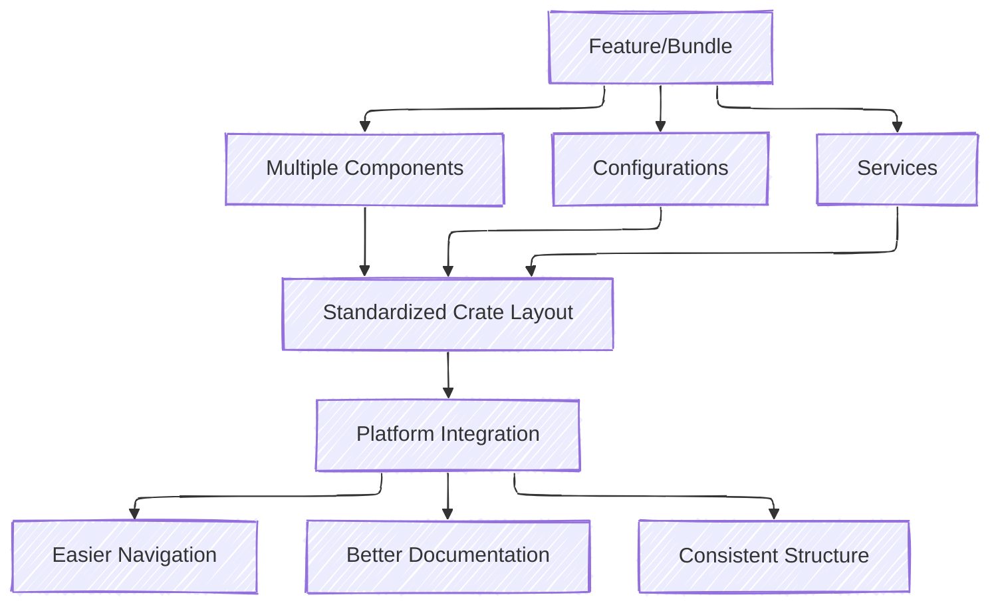
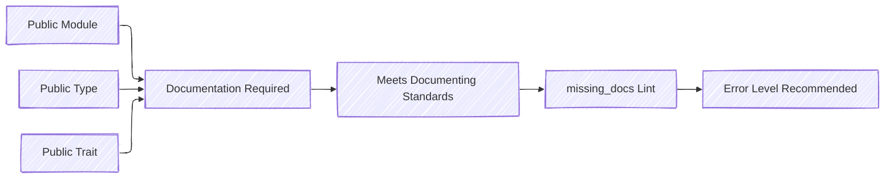
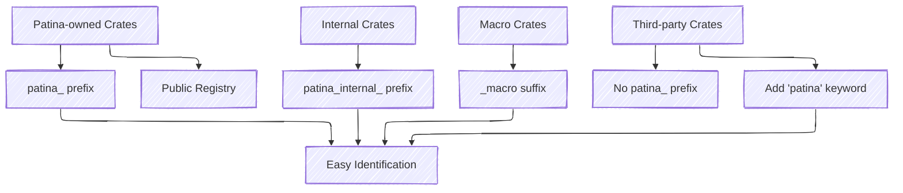
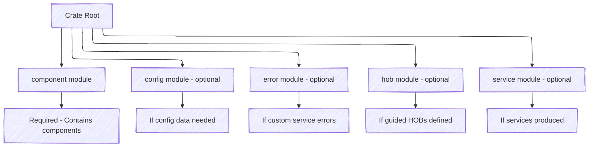

# Component Crate Requirements

Cargo crates are used to bundle like-minded functionality together; this concept also extends to Patina components.

It is common for a "feature" or "bundle" of functionality to utilize multiple components, configurations, services,
etc. to fully define certain functionality while keeping the different areas of concern segregated. The Patina team
found that due to this complexity, these features can become confusing / burdensome for platforms to integrate,
because each feature had its own crate layout which can be difficult to navigate if not documented properly. Due to
this, the Patina team introduced
[RFC #9](https://github.com/OpenDevicePartnership/patina/blob/main/docs/src/rfc/text/0009-standardize-component-crate.md)
to partially standardize a Patina component crate's layout, providing consistency, predictability, and cleanliness for
any Patina component crates that a platform may consume.



## Documentation

Patina requires that all public modules, types, traits, etc. must be documented at a minimum. Documentation must meet
the same requirements as specified in [Documenting](../dev/documenting.md). It is suggested that you set the docs lint
[missing_docs](https://doc.rust-lang.org/rustdoc/lints.html#missing_docs) to error.



## Naming Standards

### Crate naming

It is required that any Patina-owned and maintained crate published to crates.io (or other registry) that produces one
or more components must be prefixed with `patina_` to allow them to be easily identifiable and locatable via normal
searches. Should you maintain crates not meant for public consumption, they should be prefixed with `patina_internal_`.
The one exception are macro crates, which should contain a suffix of `_macro` instead
(e.g. `patina_my_crate` and `patina_my_crate_macro`).

Crates owned and maintained by other entities should not prefix their crate with `patina_`, but should, at a minimum,
add `patina` to the list of keywords for their crate in the Cargo.toml file.

```toml
[package]
keywords = ["patina"]
```



### Test Naming

Test naming should be prefixed depending on what is being tested, to allow for easy filtering of tests on the platform.
If testing a component, the test name should be prefixed with `test_<component_name>_`. If testing a service interface,
the test name should be prefixed with `test_<service_name>_`. In both cases, CamelCase should be converted to snake_case.

Additionally, if the specific functionality being tested is architecture specific, the `cfg_attr` attribute should
be used as seen below:

```rust
#[derive(IntoComponent)]
struct MyComponent(u32);

trait MyService {
   fn do_something(&self) -> u32
}

#[patina_test]
fn test_my_component_name_for_test(...) -> Result<()> {
   Ok(())
}

#[patina_test]
fn test_my_service_name_for_test(...) -> Result<()> {
   Ok(())
}

#[cfg_attr(target_arch = "x64", patina_test)]
fn test_my_service_name_other_test(...) -> Result<()> {
    Ok(())
}
```

## Crate Layout Standards



The below is a list of requirements for the crate, but it does not prevent additional modules from existing.

1. No public definitions are accessible via the top level lib.rs (or equivalent) module, only public modules.
2. `component` module: This module must always exist, and contain the publicly importable component(s) for the crate.
3. `config` module: This module may optionally exist if the component consumes configuration data that is registered
   with the platform via `.with_config` and this config is not accessible via `patina_sdk` or elsewhere.
4. `error` module: This module may optionally exist if a `service` module is present and the public Service's interface
   contains custom errors.
5. `hob` module: This module may optionally exist if a new guided HOB type has been created for this component. The
   HOB module and associated guided HOB(s) should be made public such that it can be consumed by others if the need
   arises. Any common or spec defined HOBs should be added to the associated crates (such as `mu_rust_pi`,
   `patina_sdk`, etc.) rather than this crate. HOBs may become a common interface and should thus be moved to the
   appropriate crate. If the HOB type already exists elsewhere, the crate should consume that definition instead of
   making their own.
6. `service` module: This module may optionally exist if the component produces a service that is not accessible via
   `patina_sdk` or another crate.

**Note**: Type re-exports are allowed, and can be re-exported in the same locations as would a public new type for
your crate.

Below is an example repository that contains all modules defined above, and also contains submodules for each module.

```cmd
src
├── component/*
├── config/*
├── hob/*
├── service/*
├── component.rs
├── config.rs
├── error.rs
├── hob.rs
├── lib.rs
├── service.rs
```

The lib.rs file would look similar to this:

```rust
//! Module Documentation
pub mod component;
pub mod config;
pub mod error;
pub mod hob;
pub mod service;
```
