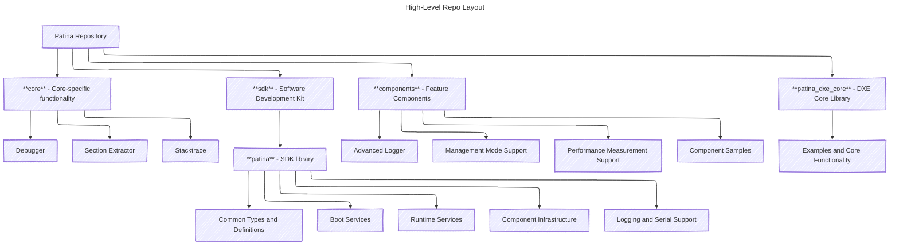

# Code Organization

Patina contains many constituent parts. This document describes the organization of the overall codebase, including the
key dependencies that are shared between the Patina DXE Core and other components. The goal is to provide a high-level
overview of these relationships.

This is meant to be a living document, and as the codebase evolves, this document should be updated to reflect the
current state.

## General Principles

As we build the elements necessary for a functional UEFI firmware, many supporting systems must necessarily be created
along the way. In the end, a set of largely independent software entities are integrated to ultimately fulfill the
dependencies necessary for functional firmware. The fact that code was conceived to support UEFI firmware does not
always mean it is intrinsically coupled with UEFI firmware.

The principles described here are not meant to be more detailed or complex than necessary. Their goal is to support
the organization of Rust code developed in this project in a consistent manner. It is not a goal to describe anything
beyond what is necessary to organize the code per the guidelines given.

### Code Cohesion and Coupling

Cohesion is a popular software concept described in many places including
[Wikipedia](https://en.wikipedia.org/wiki/Cohesion_(computer_science)).

When speaking of cohesion generally, it is a degree to which the elements inside a software container belong together.
In different languages and environments, what is a “container” might vary. But we know that containers with high
cohesion are easier to understand, use, and maintain.

Coupling is another concept commonly covered including its own page on
[Wikipedia](https://en.wikipedia.org/wiki/Coupling_(computer_programming)). This definition is taken directly from
there:

> "In software engineering, coupling is the degree of interdependence between software modules, a measure of how closely
> connected two routines or modules are, and the strength of the relationships between modules. Coupling is not binary
> but multi-dimensional."

Understanding coupling is easy. Minimizing coupling in practice is hard. Coupling is a key driver of technical debt in
code. Having unrelated subsystems tightly coupled will only worsen over time. Developers will use the smallest amount
of coupling as a precedent for further coupling, creating a self-perpetuating cycle. This is a major factor in poor
software design over time. Tight coupling results in:

- **Systems that are difficult to understand and maintain** – If you want to understand how one thing works that is
  coupled, you must now understand how everything else coupled to it works. *They are coupled into one system.*
- **Systems that are difficult to refactor** – To refactor coupled systems, you must refactor all coupled systems.
- **Systems that are difficult to version** – If something is changed in a multi-coupled system, the whole system’s
  version is revised and published. That does not reflect the actual degree of change in the individual elements of
  the system.
- **Systems that are more difficult to test** – A coupled system requires testing layers, dependencies, and interfaces
  irrelevant the interface initially being tested.

This essentially forms "spaghetti code". Spaghetti code is relatively easy to identify in existing code. Spaghetti
code often begins because of a slip in coupling in one part of the system that starts the cycle. In the end, no one is
quite sure who is responsible for the spaghetti code and how it got that way, but it did. Now it's a huge mess to clean
up and many parts of the system must be impacted to do so. Depending on the complexity of the system, now tests,
documentation, repo organization, and public APIs all must change. This is the "ripple" effect coupling has where the
ripple grows larger based on the degree of coupling and size of the system.

Code in the Patina DXE Core should strive to achieve high cohesion and low coupling in the various layers of
"containers". This results in higher quality software.

### SOLID

Certain [SOLID](https://en.wikipedia.org/wiki/SOLID) principles apply more broadly outside of pure object-oriented
design than others.

#### Single Responsibility Principle

The single responsibility principle applies in many situations. When designing a set of code, we should ask, “What is
the responsibility of this code?  Does it make sense that someone here for one responsibility cares about the other
responsibilities?”

Given that we are thinking about responsibility more broadly than individual classes, we will take on multiple
responsibilities at a certain level. For example, a trait might focus on a single responsibility for its interface
but a module that contains that trait might not. It is not so important to literally apply a single responsibility
to each layer of code when thinking about organization, but it is helpful to consider responsibilities and how they
relate to the overall cohesion and coupling of what is being defined.

#### Interface Segregation

Another SOLID principle that has utility outside designing classes is the interface segregation principle, which states
that “no code should be forced to depend on methods it does not use”. That exact definition applies more precisely to
granular interfaces like traits, but the idea is useful to consider in the larger composition of software as well as
it affects the cohesion and coupling of components. We should try to reduce the extraneous detail and functionality in
code, when possible, to make the code more portable, testable, and maintainable.

## Organizational Elements: Crates and Modules

A package is a bundle of one or more crates. A crate is the smallest amount of code the Rust compiler considers at a
time. Code is organized in crates with modules. All of these serve a purpose and must be considered.

For example, modules allow similar code to be grouped, control the visibility of code, and the path of items in the
module hierarchy. Crates support code reuse across projects – ours and others. Crates can be independently versioned.
Crates are published as standalone entities to crates.io. Crates allow us to clearly see external dependencies for
the code in the crate. Packages can be used to build multiple crates in a repo where that makes sense like a library
crate that is available outside the project but also used to build a binary in the package.

When we think about code organization at a high-level, we generally think about crates because those are the units of
reusability across projects. That’s the level where we can clearly see what functionality is being produced and
consumed by a specific set of code. Modules can fall into place within crates as needed.

Therefore, it is recommended to think about organization at the crate level.

- What is the cohesion of the code within this reusable unit of software?
- If a project depends upon this crate for one interface it exposes, is it likely that project will need the other
  interfaces?
- Are the external dependencies (i.e. crate dependencies, feature dependencies) of this crate appropriate for its
  purpose?
- Is the crate easy to understand? Are the interfaces and their purpose well documented? If someone wants to understand
  the core purpose of this crate, is that easy? Is there unrelated content in the way?

### Repo and Packages

All Patina code is placed into the `patina` repo unless it has been carefully designed to be independent of Patina and
serve a Rust audience beyond UEFI.

## Code Organization Guidelines

These guidelines consider the placement and organization of code to support long-term maintenance and usability. In
addition, the goal is to employ the software principles described in the previous section to publish crates to the
wider community.

Note: These categories are an initial proposal based on code trends that have developed over time in our work and
subject to change based on review.

- Core Specific Crate (`core`)
  - Functionality exclusively used in core environment like DXE Core, MM Core, and PEI Core.
  - Examples: DXE Core, Event infrastructure, GCD, memory allocator
- Components (`components`)
  - Functionality for features provided using the Patina component model.
- Module Development (SDK) Crate (`sdk`)
  - Functionality necessary to build UEFI modules.
    - Can be used by core or individual driver components.
  - Examples:
    - Boot Services & Runtime Services
    - Device Path services
    - Logging related (for modules to write to logs; not the adv logger protocol producer code for example)
    - GUID services
    - Performance services
    - TPL services

If a more generic location for crates is needed, a `misc` directory made be created in the `patina` workspace.

This document does not intend to define exact mappings of current code to crates, that is out of scope. Its goal is to
define the guidelines for managing crates.

### Crate Dependencies

The matrix below shows allowed dependencies for each class of crate defined in the previous section.

|            | Core      | SDK       | Components | Feature   | Generic   |
|------------|-----------|-----------|------------|-----------|-----------|
| Core       | x         | Y         | N          | N         | Y         |
| SDK        | N         | x         | N          | N         | Y         |
| Components | N         | Y         | x          | N         | Y         |

**Key**: Y = Allowed, N = Not Allowed, x = Self-dependencies within category

Separating out generic code is beneficial because it allows the code to be reused in the greatest number of places
including outside the UEFI environment in host unit tests.
