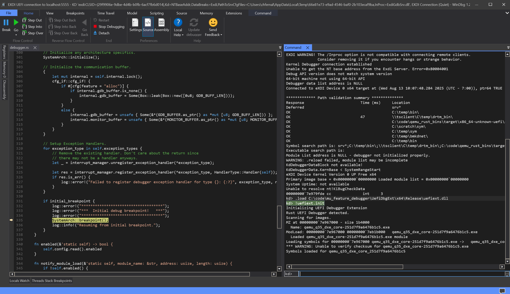
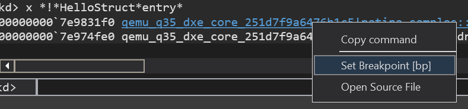

# Debugging Example

This page is intended to show and example of a simple debugging session for reference.

## Debugging a component

First, I will connect to the session. The steps to do this are detailed in [Connection Windbg](./windbg_debugging.md#connecting-windbg).
After connecting, I will run `!uefiext.init` to initialize and load symbols. Additionally,
because I built the image locally, I also see source being resolved.



I want to debug the `HelloStruct` component, but I don't know the exact symbol name.
I use a fuzzy search of symbols to find the entry point using `x *!*HelloStruct*entry*`.

```text
kd> x *!*HelloStruct*entry*
00000000`7e9831f0 qemu_q35_dxe_core_251d7f9a6476b1c5!patina_samples::struct_component::HelloStruct::entry_point (void)
00000000`7e974fe0 qemu_q35_dxe_core_251d7f9a6476b1c5!ZN4core3ptr383drop_in_place$LT$patina_sdk..component..(...)
```

This returns a couple of results, one of which is the entry point. I can then right
click on that routine and set a breakpoint, or copy the name and manually run `bp <symbol>`



After setting the breakpoint, I run `g` to continue execution. After resuming
the debugger will break back in when the breakpoint is hit.

```text
kd> g
Breakpoint 0 hit
qemu_q35_dxe_core_251d7f9a6476b1c5!patina_samples::struct_component::HelloStruct::entry_point:
00000000`7e9831f0 4157            push    r15
```

Now that i'm in the function I want to debug, I can set further breakpoint using the UI
or `bp`, inspect locals with `dv`, check the stack using `k`, inspect globals using
`x` and `dx`, and step using the UI or `p`.

## Debugging a EFI binary

Now, i've changed my mind and now want to debug PcdDxe.efi instead. Because this
is a separate module that has not yet been loaded I cannot set breakpoints on it.
Instead, I must first setup a module break to wait for the module to be loaded.
to do this, I run `!modulebreak pcddxe`

```text
kd> !modulebreak pcddxe
Module breakpoints:
    pcddxe
```

Now, I can continue execution with `g`. On the logging output (if available) I see

```text
ERROR - MODULE BREAKPOINT! PcdDxe.efi - 0x7eb2c000 - 0xc000
```

and the debugger breaks in. However, if I run `lm`, I don't see PcdDxe.

```text
kd> lm
start             end                 module name
00000000`7e967000 00000000`7eb1b000   qemu_q35_dxe_core_251d7f9a6476b1c5 C (private pdb symbols)  C:\ProgramData\Dbg\sym\qemu_q35_dxe_core-251d7f9a6476b1c5.pdb\6601E03A44AB383E4C4C44205044422E1\qemu_q35_dxe_core-251d7f9a6476b1c5.pdb
```

To find symbols that have loaded since the initial break, run `!findall`. Now running
`lm` again shows the PcdDxe module.

```text
kd> !findall
Already loaded module at 7e967000
Symbols already loaded for qemu_q35_dxe_core_251d7f9a6476b1c5
Module at 7e967000 is already loaded
Loading module at 7eb2c000
MZ at 00000000`7eb2c000 - size c000
    Name: PcdDxe.dll
ModLoad: 00000000`7eb2c000 00000000`7eb38000   PcdDxe.dll
    Loaded PcdDxe.dll module
kd> lm
start             end                 module name
00000000`7e967000 00000000`7eb1b000   qemu_q35_dxe_core_251d7f9a6476b1c5 C (private pdb symbols)  C:\ProgramData\Dbg\sym\qemu_q35_dxe_core-251d7f9a6476b1c5.pdb\6601E03A44AB383E4C4C44205044422E1\qemu_q35_dxe_core-251d7f9a6476b1c5.pdb
00000000`7eb2c000 00000000`7eb38000   PcdDxe     (deferred)
```

Now that the module is loaded, I can set a breakpoint on it's entrypoint.

```text
kd> bp PcdDxeInit
kd> g
Breakpoint 0 hit
PcdDxe!PcdDxeInit:
00000000`7eb302f8 4c8bdc          mov     r11,rsp
```

From here I can inspect the state of the binary, set breakpoints on other routines
or step through the functions.
