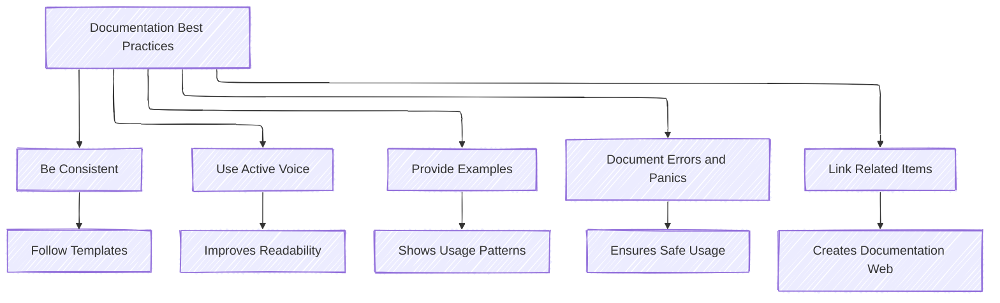

# Quick Reference

- `///` Documents the item following the comment
- `//!` Documents the parent item
- `#[doc(html_playground_url = "https://playground.example.com/")]` to add a Run button to examples
- `#[doc(hidden)]` to hide items
- `#[doc(alias = "alias")]` to make items easier to find via the search index
- `[Bar]`, `[bar](Bar)`, is supported for linking items (i.e. `[String](std::string::String)`)
- Markdown is supported including sections (`#`), footnotes (`[^note]`), tables, tasks, punctuation
- Keep documentation lines to 100 characters
- Codeblock attributes (\`\`\`[attribute]) options: `should_panic`, `no_run`, `compile_fail`

## Templates

These are templates and do not necessarily need to be followed exactly. The goal is to provide great, easy-to-read, and
understandable documentation.

### Crate Template

```rust
//! Summary Line -> what this is
//!
//! Longer description and use of the crate
//!
//! ## Getting Started
//!
//! <any non-code requirements for this library to work (installations, etc.)>
//!
//! ## Examples and Usage
//!
//! <Short examples of using this library or links to where examples can be found>
//! <can use links [`String`](std::string::String) to other places in the library>
//!
//! ## Features
//!
//! <Add this section if this library defines features that can be enabled / disabled>
//!
//! ## <Custom sections>
//!
//! <Common additional sections are described in the Common Sections section or other custom
//! sections>
//!
//! ## License
//!
//! <Add the license type here>
//!
```

### Module Template

```rust
//! Summary Line -> what this is
//!
//! Longer description and use of the module.
//!
//! ## <Custom sections>
//!
//! <Common additional sections are described in the Common Sections section or other custom
//! sections>
//!
```

### Type Template

```rust
/// Summary line -> what this is
///
/// <Optional> longer description and semantics regarding the type. (e.g. how to construct and deconstruct)
///
/// ## <Custom sections>
///
/// <Common additional sections are described in the Common Sections section or other custom
/// sections>
///
/// <for each attribute in the type>
/// A short description of the attribute
///
```

### Function Template

```rust
/// Summary line -> what this is
///
/// <Optional> longer description of what is returned
///
/// ## Errors
///
/// <list of possible raised errors and why. Use doc links>
/// Returns [`NoOptionalHeader`](Pe32Error::NoOptionalHeader) if the optional header is missing
/// in the PE32 image.
///
/// ## Examples
///
/// ```
/// <some-rust-code></some-rust-code>
/// ```
///
/// <Common additional sections are described in the Common Sections section or other custom
/// sections>
///
```

## Documentation Best Practices



### General Guidelines

- **Be comprehensive**: Document all public items, even if their function seems obvious
- **Use examples**: Provide concrete examples for complex functions and types
- **Document safety**: Always document unsafe functions with clear safety requirements
- **Cross-reference**: Link to related items using `[Item]` syntax
- **Stay up-to-date**: Update documentation when code changes
- **Consider the user**: Write documentation from the user's perspective

### Common Pitfalls to Avoid

- **Undocumented assumptions**: Make requirements and preconditions explicit
- **Outdated examples**: Ensure examples still compile and work as expected
- **Focusing on implementation**: Focus on how to use the item, not how it works internally
- **Forgetting edge cases**: Document unusual behaviors and error conditions
