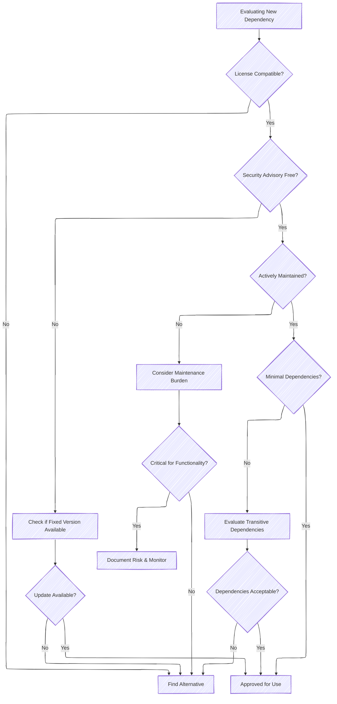

# Dependency Management

The Patina DXE Core is designed to be a monolithic binary, meaning that diverse sets of Rust functionality and the core
are compiled together. This allows for more checks to be performed directly against the overall dependency graph that
composes the Patina DXE Core but also leads to a relatively larger number of dependencies in that graph. This document
describes some of the best practices in place for managing these dependencies.

## Dependency Linting

[cargo-deny](https://embarkstudios.github.io/cargo-deny/) ([repo](https://github.com/EmbarkStudios/cargo-deny)) is a
cargo plugin that lints the dependencies of a Rust project. It can be used to enforce policies on dependencies, such as
banning certain crates or versions, or ensuring that all dependencies are up-to-date. The Patina DXE Core uses
`cargo-deny` to enforce the following policies:

- **Allowed Licenses**: Only certain licenses are allowed to be used in the Patina DXE Core and its dependencies. This
  is done to ensure that the project remains free of dependencies that have been deemed unsuitable.
- **Allowed Sources**: Only crates from expected sources are allowed to be used in the Patina DXE Core.
- **Banned crates**: Certain crates are banned from being used in the Patina DXE Core. This is done to ensure that the
  project remains free of dependencies that have been deemed unsuitable. Crates may be banned only for certain versions
  or for all versions.
- **Security Advisories**: All crates and their respective versions must not have any security advisories. This is
  currently checked against the [RustSec advisory database](https://rustsec.org/).

`cargo-deny` is run in CI and can also be run locally with the `cargo make deny` command. This command will encapsulate
any flags that are required to run `cargo-deny` with the correct configuration for the Patina DXE Core.

The configuration for `cargo-deny` is stored in the `deny.toml` file in the root of the repository.

## Managing Dependencies in Practice

### Choosing Dependencies

When selecting dependencies for Patina components:

- **License compatibility**: Ensure the license is compatible with Patina's licensing requirements
- **Security posture**: Check for known vulnerabilities and active maintenance
- **Dependency footprint**: Prefer crates with minimal transitive dependencies
- **Maintenance status**: Favor actively maintained crates with recent updates
- **Community trust**: Consider the reputation and reliability of the crate maintainers

### Version Management

Patina uses workspace-level dependency management to:

- Ensure consistent versions across all components
- Reduce duplicate dependencies in the final binary
- Simplify dependency updates across the entire project
- Facilitate security patch deployment

## References

- [`deny.toml`](https://github.com/OpenDevicePartnership/patina/blob/main/deny.toml) - Patina's cargo-deny configuration
- [cargo-deny documentation](https://embarkstudios.github.io/cargo-deny/)
- [RustSec Advisory Database](https://rustsec.org/)
- [Cargo Workspace Documentation](https://doc.rust-lang.org/cargo/reference/workspaces.html)
