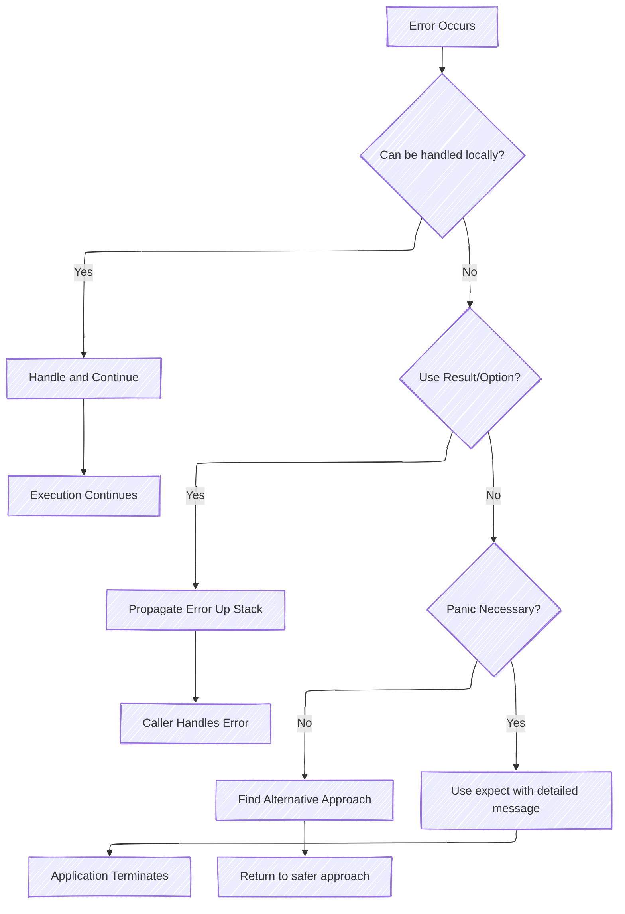
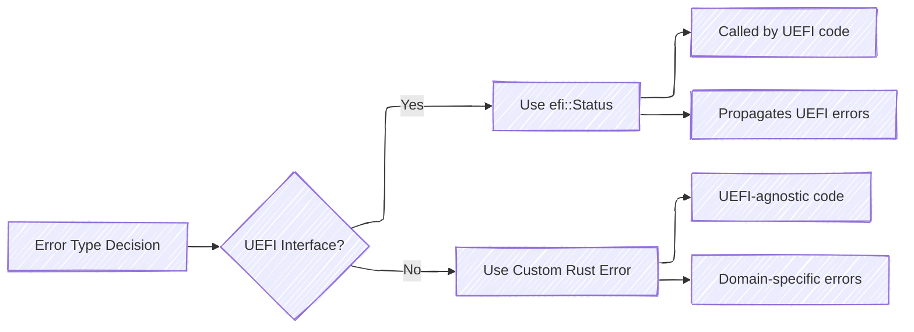

# Error Handling



## Avoiding Panics

Due to the difficulty of recovering from panics in firmware,
it is almost always preferable to return and propagate an error up the call stack rather than panic.

In order of most to least safe, code should:

1. **Propagate errors using `Result` or `Option`** whenever possible.
2. **For panics guarded by existing code** (for example, an `is_null` check before a `.as_ref()` call), provide a
   detailed message on how the existing code should prevent panics. Use `expect`, `log`, or `debug_assert` for such
   cases.
3. **For genuinely unrecoverable errors**, ensure a detailed error message is provided, usually through `expect`.
   Code should avoid `unwrap` except in test scenarios.

### Example

Consider the following example involving the `adv_logger`. Since the logger is not necessarily required to boot drivers
or continue normal execution, we can attempt to continue even if it is not properly initialized.

This code which `unwrap`s on logger initialization panics unnecessarily:

``` rust
let log_info = self.adv_logger.get_log_info().unwrap();
```

Consider replacing it with `match` and returning a `Result`:

``` rust
let log_info = match self.adv_logger.get_log_info() {
    Some(log_info) => log_info,
    None => {
        log::error!("Advanced logger not initialized before component entry point!");
        return Err(EfiError::NotStarted);
    }
};
```

## `efi::Status` vs. Rust Errors



We mostly use two kinds of errors in `Result`s: `efi::Status` and Rust custom errors. Use `efi::Status` when errors
occur in UEFI interfaces (anything that's expected to be called by code across the UEFI spec defined ABI) to propagate
any errors occurring in UEFI internal code. Otherwise, use custom Rust errors in all UEFI-agnostic code. These can be
handled in UEFI interfaces, but should return errors specific to their functionality rather than a general status code.

### Examples

For example, the following excerpt is part of an `extern "efiapi"` function that is called by UEFI code. As such, it
returns an EFI status code, where the status is specific to the error state encountered.

``` rust
extern "efiapi" fn get_memory_map( /* arguments */ ) -> efi::Status {
    if memory_map_size.is_null() {
        return efi::Status::INVALID_PARAMETER;
    }

    // ...

    if map_size < required_map_size {
        return efi::Status::BUFFER_TOO_SMALL;
    }

    // ...

    return efi::Status::SUCCESS;
}
```

In contrast, the following function is internal to the GCD and not directly called by any UEFI code.

As such, we implement a custom error that we can later convert into an `efi::Status`, or otherwise handle as
appropriate.

``` rust
pub enum Error {
    NotInitialized,
    InvalidParameter,
    OutOfResources,
    Unsupported,
    AccessDenied,
    NotFound,
}

impl GCD {

    // ...

    fn allocate_address( /* arguments */ ) -> Result<usize, Error> {
        ensure!(len > 0, Error::InvalidParameter);

        // ...

        let memory_blocks = self.memory_blocks.as_mut().ok_or(Error::NotFound)?;

        let idx = memory_blocks.get_closest_idx(&(address as u64)).ok_or(Error::NotFound)?;
        let block = memory_blocks.get_with_idx(idx).ok_or(Error::NotFound)?;

        ensure!(
            block.as_ref().memory_type == memory_type && address == address & (usize::MAX << alignment),
            Error::NotFound
        );

        match Self::split_state_transition_at_idx(idx) {
            Ok(_) => Ok(address),
            Err(InternalError::MemoryBlock(_)) => error!(Error::NotFound),
            Err(InternalError::Slice(SliceError::OutOfSpace)) => error!(Error::OutOfResources),
        }

        // ...
    }
}
```

## Error Handling Best Practices in Patina

### Custom Error Types

For Patina components, define domain-specific error enums:

```rust
#[derive(Debug, Clone)]
pub enum ComponentError {
    NotInitialized,
    InvalidConfiguration(String),
    ServiceUnavailable,
    HardwareFault { device_id: u32, code: u16 },
    MemoryAllocation,
}

impl std::fmt::Display for ComponentError {
    fn fmt(&self, f: &mut std::fmt::Formatter<'_>) -> std::fmt::Result {
        match self {
            ComponentError::NotInitialized => write!(f, "Component not initialized"),
            ComponentError::InvalidConfiguration(msg) => write!(f, "Invalid configuration: {}", msg),
            ComponentError::ServiceUnavailable => write!(f, "Required service is unavailable"),
            ComponentError::HardwareFault { device_id, code } => {
                write!(f, "Hardware fault on device {}: error code {}", device_id, code)
            }
            ComponentError::MemoryAllocation => write!(f, "Memory allocation failed"),
        }
    }
}

impl std::error::Error for ComponentError {}
```

### Error Conversion Between Layers

When errors cross architectural boundaries in Patina:

- **Component → UEFI ABI**: Convert custom errors to `efi::Status`
- **UEFI ABI → Component**: Wrap `efi::Status` in domain-specific errors
- **Service → Component**: Use specific error types, not generic ones

## References

- [Rust Error Handling Book](https://doc.rust-lang.org/book/ch09-00-error-handling.html)
- [Error Handling Patterns](https://doc.rust-lang.org/rust-by-example/error.html)
