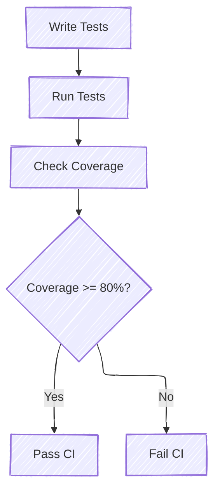

# Writing Tests

One of the benefits of Rust is that testing is "baked-in" and made easy. There is extensive documentation regarding
testing in Rust, so if you are unfamiliar with Rust testing, start with the official documentation and return here
for project-specific details.

Testing in Rust can be broken up into four core categories:

1. **Unit Testing:** The developer has access to the internal, private state of the module to ensure the internals
   work as expected.
2. **Integration Testing:** Tests are written outside of the module and test the code from an external interface
   standpoint.
3. **Platform Testing:** Tests that run on the platform, physical or virtual.
4. **Doc Testing:** Code snippets in inline documentation can be compiled and executed. See
   [Rust Documentation Tests](https://doc.rust-lang.org/rustdoc/write-documentation/documentation-tests.html).

For more, see [Rust Book: Testing](https://doc.rust-lang.org/rust-by-example/testing.html).

## Development Dependencies

Rust supports `dev-dependencies` in a crate's `Cargo.toml` file. These dependencies are only used for writing and
running tests, and are only downloaded and compiled for test execution. One common example is `pretty_assertions`,
which extends standard assertions to create a colorful diff.

## Benchmarks

Benchmarking is another way to write tests. Instead of caring about code passing for failing certain requirements, you
are instead investigating the performance of certain regions of code. Patina uses the [criterion](https://crates.io/crates/criterion)
crate for benchmarking, so one should follow it's documentation when writing benchmarks. Multiple crates (including the
patina and patina_internal_collections crates) also have some benchmark examples to follow.

Benchmark results are shown on the command line, but graphics are available in the `target/criterion` folder.

**Note**: Benchmarks are not run during testing, nor is performance data tracked over time. Benchmarks are there purely
to help developers track local performance changes when making changes during the development lifecycle.

## Code Coverage

Unit tests and code coverage are an important aspect of our project. It is a simple-to-consume statistic that gives us
some limited confidence in the reliability of newly added code. Even more importantly is that it gives us some peace of
mind that future changes will not cause unexpected regressions or breaking changes, as unit tests that exist to uphold
certain interface expectations would begin to fail.

```admonish note
Needing to change a test's output expectation is a good indication that your change will either impact functionality
or be a breaking change. Any submitted PR should be marked as such.
```

Patina's goal is to keep code coverage over 80%. This gives some leniency for code that cannot be tested (e.g. a error
return after a debug assert), or code that does not need to be tested (e.g. `Debug` implementations, wrappers, etc).
If the code is testable, it should have tests. Importantly, however, unit tests should not be written with the intent
to satisfy the 80% rule. They should be written to meaningfully cover critical logic and edge cases.

```admonish warning
Having a hard target of code coverage (e.g. 80%) can lead to tests being written purely to bump up code coverage. If
this is happening, consider disabling code coverage for that section of code (`#[coverage(off)]`) with valid
justification as to why no code coverage is needed.
```

We use [cargo-llvm-cov](https://github.com/taiki-e/cargo-llvm-cov) as our code coverage reporting tool, as it works
well with Windows and Linux, and can generate different report types. All of our repositories have CI that calculates
and uploads code coverage results to [codecov](https://codecov.io) with an expected patch coverage of at least 80%.
Submitting a PR with less than 80% of changed code covered by tests will result in the check failing. It is ultimately
up to the maintainers of Patina whether they will merge the PR as is or require you to meet the 80% goal.

For local development, we provide a cargo make command (`cargo make coverage`) to generate code coverage data. This
command produces two types of output. The first is a viewable HTML report (`target/coverage/html`) while the second is
a lcov report (`target/lcov.info`) which can be easily consumed by various processing tools like
[Coverage Gutters](https://marketplace.visualstudio.com/items?itemName=ryanluker.vscode-coverage-gutters)


