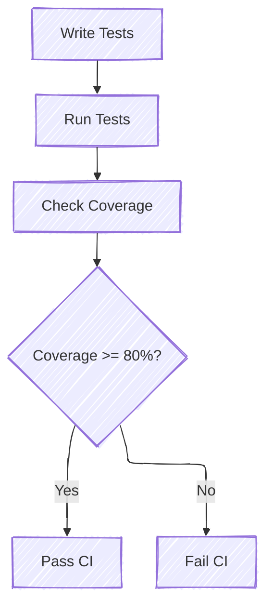

# Writing Tests

One of the benefits of Rust is that testing is "baked-in" and made easy. There is extensive documentation regarding
testing in Rust, so if you are unfamiliar with Rust testing, start with the official documentation and return here
for project-specific details.

Testing in Rust can be broken up into four core categories:

1. **Unit Testing:** The developer has access to the internal, private state of the module to ensure the internals
   work as expected.
2. **Integration Testing:** Tests are written outside of the module and test the code from an external interface
   standpoint.
3. **Platform Testing:** Tests that run on the platform, physical or virtual.
4. **Doc Testing:** Code snippets in inline documentation can be compiled and executed. See
   [Rust Documentation Tests](https://doc.rust-lang.org/rustdoc/write-documentation/documentation-tests.html).

For more, see [Rust Book: Testing](https://doc.rust-lang.org/rust-by-example/testing.html).

## Development Dependencies

Rust supports `dev-dependencies` in a crate's `Cargo.toml` file. These dependencies are only used for writing and
running tests, and are only downloaded and compiled for test execution. One common example is `pretty_assertions`,
which extends standard assertions to create a colorful diff.

## Benchmarks

Benchmarking is another way to write tests. Instead of caring about code passing for failing certain requirements, you
are instead investigating the performance of certain regions of code. Patina uses the [criterion](https://crates.io/crates/criterion)
crate for benchmarking, so one should follow it's documentation when writing benchmarks. Multiple crates (including
patina_sdk and patina_internal_collections) also have some benchmark examples to follow.

Benchmark results are shown on the command line, but graphics are available in the `target/criterion` folder.

**Note**: Benchmarks are not run during testing, nor is performance data tracked over time. Benchmarks are there purely
to help developers track local performance changes when making changes during the development lifecycle.

## Code Coverage

Code coverage is an important aspect of our project. Our intent is to keep above 80% code coverage for all crates
in any given repository. We use [cargo-llvm-cov](https://github.com/taiki-e/cargo-llvm-cov) as our code coverage
reporting tool, as it works well with Windows and Linux, and can generate different report types. Each repository
must have CI that fails if any code added to the repository has less than 80% coverage, or if the repository as a
whole is below 80% coverage.

By default, cargo-llvm-cov will produced an lcov report, which is easily consumable in various processing tools like
[Coverage Gutters](https://marketplace.visualstudio.com/items?itemName=ryanluker.vscode-coverage-gutters). The
`cargo make coverage` command in Patina also produces an HTML report. This is available in the
`target/coverage/html` folder.

