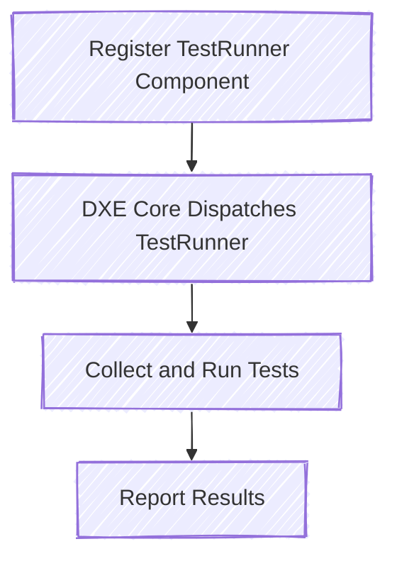

# Platform Testing

Platform testing is supported through the `patina::test` module, which provides a testing framework similar to
the typical Rust testing framework. The key difference is that instead of tests being collected and executed on the
host system, they are collected and executed via a component (`patina::test::TestRunner`) provided by the same
crate. The platform must register this component with the Patina DXE Core, which will then dispatch the component
to run all registered tests.

> **Note:** The most up-to-date documentation on the `patina::test` module can be found on
> [crates.io](https://crates.io/crates/patina). For convenience, some high-level concepts are summarized below.

## Writing On-Platform Tests

Writing a test to be run on-platform is as simple as setting the `patina_test` attribute on a function with the
following interface, where `...` can be any number of parameters that implement the `Param` trait from
`patina::component::*`:

```rust
use patina::test::{Result, patina_test};

#[patina_test]
fn my_test(...) -> Result { todo!() }
```

On-platform tests are not just for component testing; they can also be used for testing general-purpose code on a
platform. Any function tagged with `#[patina_test]` will be collected and executed on a platform. The test runner
can filter out tests, but you should also be conscious of when tests should run. Using `cfg_attr` paired with the
`skip` attribute is a great way to have tests ignored for reasons like host architecture or feature flags.

> **Note:** `patina::test::Result` is simply `core::result::Result<(), &'static str>`, and you can use that
> instead.

This example shows how to use the `skip` attribute paired with `cfg_attr` to skip a test.

```rust
use patina::boot_services::StandardBootServices;

#[patina_test]
#[cfg_attr(target_arch = "aarch64", skip)]
fn my_test(bs: StandardBootServices) -> Result { todo!() }
```

Next is the `should_fail` attribute, which allows you to specify that a test should fail. It can also specify the
expected failure message.

```rust
#[patina_test]
#[should_fail]
fn my_test1() -> Result { todo!() }

#[patina_test]
#[should_fail = "Failed for this reason"]
fn my_test2() -> Result { todo!() }
```

## Running On-Platform Tests

Running all these tests on a platform is as easy as instantiating the test runner component and registering it with
the Patina DXE Core:

```rust
let test_runner = TestRunner::default();

Core::default()
    .init_memory()
    .with_component(test_runner)
    .start()
    .unwrap();
```

This will execute all tests marked with the `patina_test` attribute across all crates used to compile this binary.
Due to this fact, we have some configuration options with the test component. The most important customization is
the `with_filter` function, which allows you to filter down the tests to run. The logic behind this is similar to
the filtering provided by `cargo test`. That is to say, if you pass it a filter of `X64`, it will only run tests
with `X64` in their name. The function name is `<module_path>::<name>`. You can call `with_filter` multiple times.

The next customization is `debug_mode` which enables logging during test execution (false by default). The final
customization is `fail_fast` which will immediately exit the test harness as soon as a single test fails (false by
default). These two customizations can only be called once. Subsequent calls will overwrite the previous value.

```rust
let test_runner = TestRunnerComponent::default()
    .with_filter("X64")
    .debug_mode(true)
    .fail_fast(true);

Core::default()
    .init_memory()
    .with_component(test_runner)
    .start()
    .unwrap();
```


