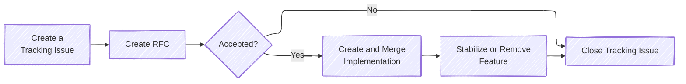

# Use of Unstable Rust Features in Patina

Patina takes a pragmatic approach to using unstable Rust features. These features are allowed under specific
circumstances, balancing the benefits of new capabilities with maintainability.

The general guidance is to avoid using unstable Rust or Cargo features. Unstable features may not become stable or
may change in significant and unpredictable ways, potentially impacting public APIs and critical portions of the
codebase. However, since Patina is firmware code, it has some properties that lead to features being in a proposed
and unstable state, such as: being largely no-std, implementing and using its own allocator, and frequent low-level
and unsafe operations. Below are the guiding principles and practices for working with unstable Rust features in
Patina.

All active rustc feature usage is tracked with the [`state:rustc-feature-gate`](https://github.com/OpenDevicePartnership/patina/issues?q=is%3Aissue%20state%3Aopen%20label%3Astate%3Arustc-feature-gate)
label.

## When Unstable Rust Features May Be Used

Common scenarios for using unstable features:

- **No alternative:** Certain functionalities provided by unstable features may not have stable equivalents.
- **Essential capabilities:** If an unstable feature provides essential capabilities, the project may choose to
  incorporate it to evaluate its suitability for long-term adoption and to provide feedback to the feature owner.
  - The Patina team should carefully consider the value and risks of using the unstable feature and document these
    in the GitHub issue proposing its use.

## Handling the Risks of Instability

Since unstable features come with the risk of API changes or possible removal, maintainers should be ready to
perform the following tasks to mitigate risk:

- **Monitor stability updates:** When an unstable API transitions to stable, the new version of Rust provides
  warnings. The team should use these warnings as cues to update the codebase, aligning it with the stable API.
  These warnings should be addressed when updating the Rust toolchain.
- **Replace code:** If an unstable API is removed, the code must be promptly replaced with functionally equivalent
  stable code.

## Unstable Feature Proposal Process

Below is the flow for introducing unstable rustc features to this codebase. You can review each step in the sections
below. Please note that if you propose the usage of an unstable rustc feature, you become responsible for the entire
process outlined below.



### Create a Tracking Issue

The first step to the unstable rustc feature usage proposal process is to create a tracking issue in patina using the
[rustc feature gate](https://github.com/OpenDevicePartnership/patina/issues/new?template=rustc_feature_gate.yml) issue
template. This will provide some general information regarding the proposal, but most importantly, it will always
reflect the current status of the feature usage.

```admonish important
The tracking issue should be updated at each step in this processes. It should remain open throughout this entire
process and should only to be closed if the RFC proposal is rejected, or the usage of the unstable rustc feature is
removed (either by stabilization, or due to using an alternative).
```

### Create the RFC

The next step is to create the RFC. This will expand on the general information provided in the tracking issue,
including more in-depth reasoning as to why usage of this feature is needed. Ensure that the following information is
provided:

- **Tracking Issue:** A link to the GitHub tracking issue for the feature.
- **Feature Name:** The unstable feature name.
- **Reason:** The reason for using the unstable feature.
- **Alternatives:** What else could be used instead of the feature, and the tradeoffs for different choices.
- **Constraints:** Any scenarios in which the feature should not be used in the project.
- **Risks:** Any special risks the project may incur due to use of this feature.

Once created, the community will review and comment on the RFC, following the RFC process. The RFC will eventually
either be accepted or denied and then merged.

### Create and Merge Implementation

If the RFC is merged, it is now your responsibility to implement it's usage and create a pull-request for review. The
pull-request should reference that this is the implementation for your accepted RFC. Once merged, **you must continue**
**to monitor** the stability of the feature. Notably, if any changes to the feature's API occur, you will be responsible
for adjusting the usage of the feature in the codebase.

### Stabilization

The final step of the process is stabilization (or removal, either from our codebase or from rustc) of the feature. If
the feature is stabilized, then this step is short. The `#![feature(...)]` must be removed on the next rustc version
update in this project that includes the feature stabilization. If any final changes need to be made, they will be made
here.

```admonish warning
Stabilization of a feature also requires an update to the workspace `Cargo.toml`'s `rust-version` value. This is the
declaration of the minimum supported rust version.
```

The other possibility is that feature was removed from rustc, or an alternative is available that better meets the needs
of the project. In this scenario, the project must update all usage of the feature to an alternative.

Finally, once all is said and done, and the `#![feature(...)]` has been removed, the tracking issue can be closed.
