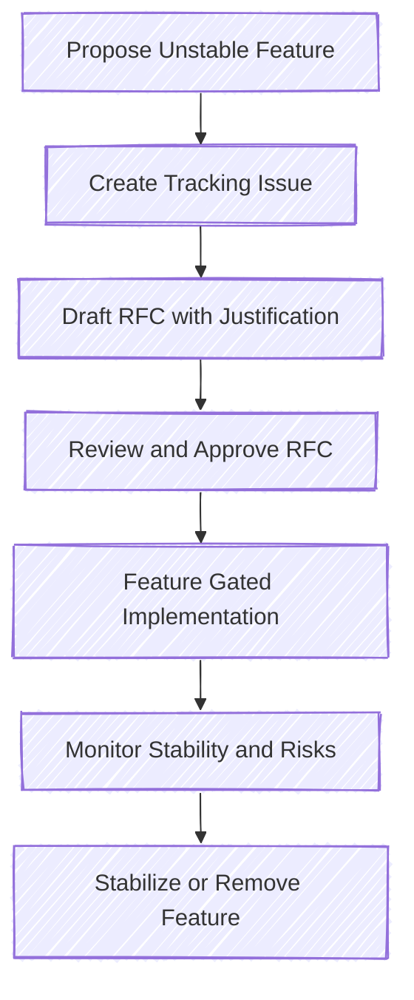

# Use of Unstable Rust Features in Patina

Patina takes a pragmatic approach to using unstable Rust features. These features are allowed under specific
circumstances, balancing the benefits of new capabilities with maintainability.

The general guidance is to avoid using unstable Rust or Cargo features. Unstable features may not become stable or
may change in significant and unpredictable ways, potentially impacting public APIs and critical portions of the
codebase. However, since Patina is firmware code, it has some properties that lead to features being in a proposed
and unstable state, such as: being largely no-std, implementing and using its own allocator, and frequent low-level
and unsafe operations. Below are the guiding principles and practices for working with unstable Rust features in
Patina.

## When Unstable Rust Features May Be Used

Common scenarios for using unstable features:

- **No alternative:** Certain functionalities provided by unstable features may not have stable equivalents.
- **Essential capabilities:** If an unstable feature provides essential capabilities, the project may choose to
  incorporate it to evaluate its suitability for long-term adoption and to provide feedback to the feature owner.
  - The Patina team should carefully consider the value and risks of using the unstable feature and document these
    in the GitHub issue proposing its use.

## Handling the Risks of Instability

Since unstable features come with the risk of API changes or possible removal, maintainers should be ready to
perform the following tasks to mitigate risk:

- **Monitor stability updates:** When an unstable API transitions to stable, the new version of Rust provides
  warnings. The team should use these warnings as cues to update the codebase, aligning it with the stable API.
  These warnings should be addressed when updating the Rust toolchain.
- **Replace code:** If an unstable API is removed, the code must be promptly replaced with functionally equivalent
  stable code.

## Unstable Feature Proposal Process

An RFC should be created with the following information:

1. **Tracking Issue:** A link to the GitHub tracking issue for the feature.
2. **Feature Name:** The unstable feature name.
3. **Reason:** The reason for using the unstable feature.
4. **Alternatives:** What else could be used instead of the feature, and the tradeoffs for different choices.
5. **Constraints:** Any scenarios in which the feature should not be used in the project.
6. **Risks:** Any special risks the project may incur due to use of this feature.

The RFC follows the normal RFC process. If approved, the unstable feature may be added to the codebase, adhering to
any constraints noted in the RFC. Currently, no further process is required, such as a project tracking issue. At
any time, unstable features can be found in the codebase by searching the repository. Their rationale can be found
in the corresponding RFC.

