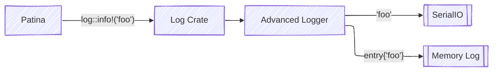
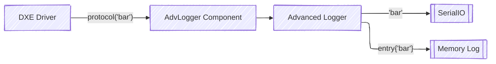

# Advanced Logger

Patina uses the [Log crate](https://docs.rs/log/latest/log/) to facilitate logging
and the platform code is responsible for configuring its desired log implementation
prior to executing the Patina core using the standard `log::set_logger` routine.

The platform may choose any implementation of the `Log` trait it wishes; however,
Patina provides a robust serial and memory logging solution called Advanced Logger, which
is designed to be compatible with the [Project Mu Advanced Logger](https://microsoft.github.io/mu/dyn/mu_plus/AdvLoggerPkg/Docs/ReadMe/).
This compatibility means that Patina Advanced Logger can be used in combination
with Project Mu Advanced Logger to provide a memory log that spans multiple phases
(e.g. PEI and DXE) and can be parsed with existing tools.

Patina Advanced Logger is implemented in two parts: the `log::Log` implementation called
[`AdvancedLogger`](https://github.com/OpenDevicePartnership/patina/blob/main/components/patina_adv_logger/src/logger.rs),
and the component called [`AdvancedLoggerComponent`](https://github.com/OpenDevicePartnership/patina/blob/main/components/patina_adv_logger/src/component.rs).
The former is responsible for handling log messages and forwarding them to both the serial
transport and the memory log as appropriate. The latter is responsible for
implementing the [Advanced Logger Protocol](#advanced-logger-protocol) and configuring
the logger based on HOB input to Patina.

## Logger

The logger is designed to be statically instantiated as required by the log crate
and is responsible for handling the log messages forwarded through the logging interfaces
such as `log::info!()`. Logger initialization acts as the primary interface for platform
configurations such as serial interfaces, log level limits, message filtering,
etc.

The `Log` implementation will send all messages to both the configured serial port
and its memory log to be picked up later by components in DXE or at runtime.
This splits all messages to be both output to the serial console and stored in
the memory log, depending on configuration. More messages that be sent to the memory
log then the serial port depending on the [message filtering](#message-filtering) used.

### Memory Log

Advanced Logger generates a binary format memory log which includes a header,
followed by entries containing the entry metadata and the log string. Entry metadata
includes: timestamp, log level, and the boot phase (e.g., DXE). For the exact format,
see the [memory log implementation](https://github.com/OpenDevicePartnership/patina/blob/main/components/patina_adv_logger/src/memory_log.rs).
The format is subject to change, and the memory log is intended to be accessed and
parsed by tools within Project Mu and this crate. For details on accessing and
parsing the logs, see the [tools](#tools) section.

#### Memory Log Initialization

The memory log will typically be allocated and initialized by an earlier phase of
boot such as PEI or SEC. In this case, Patina will inherit the memory log from this earlier
phase to provide a continuous log of the entire boot sequence. The location of the
memory log provided by a previous phase will be provided through the Advanced Logger
HOB, which simply consists of the physical address of the log. From there, the header,
which is validated by signature, will describe the size and other state of the memory log.

The memory log may also be initialized within Patina. This has some limitations,
as logging is normally initialized prior to memory allocations being available,
and relying on such allocations would mean losing early log events from the memory
log.

#### Memory Log Concurrency

After initialization, the memory log is designed to be altered by multiple
environments at once. To achieve this, all alterations to global metadata used to
allocate blocks in the log and update statistics are done through atomic compare
exchange operations. This allows for multiple components to asynchronously
allocate and fill entries without locking. This also allows for creating
entries in the memory log from interrupts and callbacks without causing torn state,
even if the interrupted code was in the middle of creating a log entry. These compare
exchange operations should be done to reserve the space before any alteration to the log occurs.

### Message Filtering

Log messages going through the advanced logger pipeline have multiple forms of filtering
applied at different levels that may not all have the desired effect.

- __[`Log::set_max_level`](https://docs.rs/log/latest/log/fn.set_max_level.html)__:
This mechanism filters the level of messages that the Log crate will forward to
the Advanced Logger. This will affect all traffic coming from the Patina core and
components, but will have no effect on logging through the Protocol.

- __Target Filters__:
The logger can be instantiated with context-specific level filters that can be used
to control logging from noisy components. This is provided as a tuple of target
string and a level; if the target string matches the log metadata, the level
will be further restricted. This will affect only messages coming from the core
and components and will not affect protocol messages.

- __Advanced Logger HW Port Level__:
The advanced logger will track logging levels that will be sent to the serial port
in its memory log header. This can be used to filter serial usage while still
capturing messages in the memory log. This will affect all log messages, both from
the Log crate and the protocol. This will often be used to prevent serial logging
on systems in production while still allowing for memory logs.

## Component

The component serves as the integration point for the Advanced Logger to interact
with the platform. It is special in that it is intended to be initialized by the platform
code. This is to allow the HOBs and the memory log to be initialized as early as possible.
After this initialization, the component will use its normal execution path
to create the Advanced Logger Protocol.

### Advanced Logger Protocol

The [Advanced Logger Protocol](https://github.com/microsoft/mu_plus/blob/release/202502/AdvLoggerPkg/Include/Protocol/AdvancedLogger.h)
provides UEFI drivers access to the advanced logger, allowing their logs to be centrally
controlled and routed to the serial and memory log as appropriate. EDK II-based drivers
may use the [Project Mu Advanced Logger DebugLib](https://github.com/microsoft/mu_plus/tree/release/202502/AdvLoggerPkg/Library/BaseDebugLibAdvancedLogger)
to forward debug messages to the Advanced Logger.

## Tools

Tools for accessing and parsing the Advanced Logger memory buffer exist both in
the `patina_adv_logger` crate and in Project Mu.

### Access

The memory log, being in memory, is not directly accessible from a user or developer.
There are a few different mechanisms for accessing the log, detailed below. The most
common access mechanism is the [__Advanced File Logger__](https://github.com/microsoft/mu_plus/blob/release/202502/AdvLoggerPkg/Docs/ReadMe.md#advanced-file-logger).
The file logger is a DXE driver that will periodically read, parse, and write the
memory log to a file on the EFI System Partition. For more details, read the link above.

Other access mechanisms can be found in the [Project Mu Advanced Logger readme](https://github.com/microsoft/mu_plus/blob/release/202502/AdvLoggerPkg/Docs/ReadMe.md).

### Parsing

In some access methods, parsing of the buffer may be needed on the raw binary
format log. For this parsing, users may use the [Project Mu script](https://github.com/microsoft/mu_plus/blob/dev/202502/AdvLoggerPkg/Application/DecodeUefiLog/DecodeUefiLog.py),
but there is also a binary parser built from the patina_adv_logger crate. The crate
provided binary is preferable as it is guaranteed to stay in-sync with the implementation
of the memory log. The rust parser wraps generic parsing logic in the library code.
