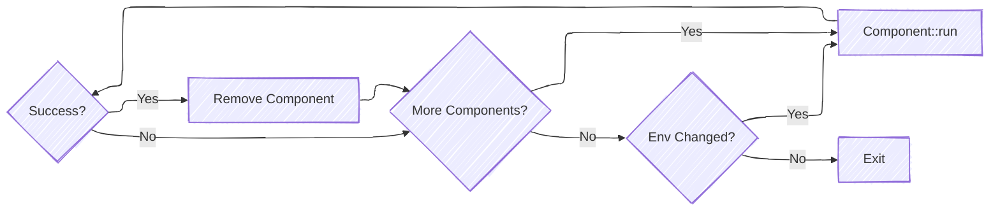
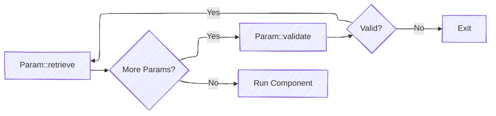

# Monolithically Compiled Component Model

This section covers the design and operations flow of how a monolithically compiled component is dispatched by the pure
Patina DXE Core. That is to say how the component is registered, initialized, validated, and eventually dispatched. This
does not expand any further on [Driver Dispatch](./dispatcher.md) and is distinctly different then the [UEFI Driver Model](./driver_model.md).

See [Quick Reference](#quick-reference) at the bottom of this documentation.

## General Design

There are four main parts to this model: (1) [Filling Storage](#filling-storage)
(2) [Registering Configuration](#registering-configuration), (3) [Registering Components](#registering-components),
and (4) [Executing Components](#executing-components).

### Filling Storage

`Storage` is the single struct that contains all data (or a reference to data) that can be consumed by a
driver. The design point of having a centralized location for all data was chosen because it ensures that adding new
`Param` types does not become a breaking change. This is because the `Component` trait interface consumes
the `Storage` object instead each piece of data individually. When adding a new `Param` type, instead of updating the
`Component` trait interface with this new data, we instead update the `Storage` object, adding the new data to that
instead. This causes the "breaking change" to be internal to the DXE Core, instead of to every driver written.

Due to this, however, `Storage` is the bridge between `Component`s and the rest of the DXE Core. During DXE Core
initialization, `Storage` must also be updated to hold certain important pieces of data. As an example, once the boot
services table has been fully initialized, it must also be registered with `Storage`, otherwise no component that
wishes to use the boot services table will ever be executed. Another example is that `Storage` directly contains the
[HobList] object, and allows for components to have am immutable reference to this. This particular part of the model
is not complex, but it is important because when adding new `Param` types, `Storage` **must** be provided accesses to
the underlying data, provided by the DXE Core.

### Registering Configuration

Configuration is managed by the `Config<T>` and `ConfigMut<T>` `Param` implementations. The inner value, `T` must
implement `Default`, allowing all configuration to always be available. This is important because it allows default
implementation of configuration that platforms can then override with their platform. A platform can easily register
custom configuration, which is cascaded to all components that have `Config<T>` or `ConfigMut<T>` in their function
interface.

```rust
DxeCore::default()
    .init_memory(physical_hob_list)
    .with_config(52_u32)
    .with_config(...)
    .start()
    .unwrap();
```

`Config<T>` and `ConfigMut<T>` are special, as they both reference the same underlying data. As you might expect
`ConfigMut<T>` allows you to mutate configuration. To prevent drivers that rely on `Config<T>` from running with `T`
that has not been finalized, The below rules have been implemented for the interaction between the two.

1. The underlying value `T` has the concept of being "locked" or "unlocked"
1. `Config<T>` is only "retrievable" when the underlying value `T` is "locked"
1. `ConfigMut<T>` is only "retrievable" when the underlying value `T` is "unlocked"
1. All configuration values are "locked" by default.
1. Only the dispatcher is able to "unlock" a component, which occurs prior to any component execution, if a registered
   component is detected to use `ConfigMut<T>`.
1. Configuration can be locked two separate ways: via `ConfigMut<T>::lock()` and automatically by the dispatcher.

In layman's terms, what this means is that all drivers with `ConfigMut<T>` will run first, allowing configuration to be
mutated as needed. Only once the underlying value has been locked, will drivers that require `Config<T>` run. Once a
configuration value has been locked, it cannot be unlocked. The actual flow diagram will be provided in the
[Executing Components](#executing-components) section.

### Registering Components

Registering a component is a fairly simple process. The component is turned into a `Box<dyn Component>`
(using `into_component()`) so that multiple implementations of `Component` can be supported. The cost of this
abstraction and v-table lookup is fairly minimal due to the low number of components as compared to other parts of the
DXE Core. From there, the `Component::initialize` method is called. This is different for each component
implementation, however generically, this method is used to initialize, register, and validate all `Param` usage that
the specific component uses.

In terms of initialization, `Component::initialize` is used to initialize the param and store any immutable state. As an
example, the `Config<T>` and `ConfigMut<T>` params use this to request and store the global registration id of the
underlying `T` value so that when attempting to fetch the value, it does not have to first query the global id before
requesting the type using the id.

In terms of registration, `Component::initialize` is used to register any data accesses the parameter has with the
component's metadata. The scheduler can use the access set of each component for scheduling parallel execution of
components, though this is not yet implemented.

In terms of validation, `Component::initialize` is used to validate no params in the same component conflict with
each other. This is done via the access set mentioned above. As an example, a component that uses `ConfigMut<T>` and
`Config<T>` is invalid. You cannot have mutable and immutable access to the same data.

Once the component and its params are fully registered, the component is stored for dispatch.

### Executing Components

Executing a component is also a fairly simple process. There is an outer process handled by the DXE Core (controlling
_when_ to execute a component), and an inner process handled by the `Component` trait implementation on _how_ to
execute a component.

We will first talk about the logic behind _when_ to execute a component. This processes is straight forward. The
dispatcher attempts to run all components as-is. It does this in a similar fashion as the EDK II dispatcher. That is
to say it will loop through all components, attempting to execute them until either no components are left, or no
change has happened since the previous loop. Whereas EDK II would normally exit dispatch, the component dispatcher
instead will lock all configuration values and restart the process. This is important because it allows any component
that relies on `Config<T>` to execute, even if a driver that needed `ConfigMut<T>` never locked the underlying value.

Below is the flow chart for attempting to dispatch all components:


Below is the flow chart for `DxeCore::dispatch_components`.



Next, we will talk about the logic behind _how_ to execute a component. The process for executing a component will vary
between component implementations, however generically the process is to validate that each component's params are
available. If all are available, we then execute the component. If all params are not available, we exit with a return
value indicating as such. it must be noted that params self-validate, so it is important that each implementation of
`Param` is correct.

Below is the flow chart for `Component::run`



## Quick Reference

### Traits

- `Component`: The trait every component must implement.
- `IntoComponent`: A trait for converting non-components (such as functions) into their expected component struct
  (such as `FunctionComponent`)
- `Param`: A trait implemented on various types that allow them to be used as a function parameter for dependency
  injection

### Default Component Implementations

- `FunctionComponent`: A function whose parameters all implement `Param`. A blanket `IntoComponent` implementation
  allows for converting this type of function into a `FunctionComponent`.

### Default Param implementations

See [Component Interface](../driver/interface.md) for the list of default `Param` implementations.

### Naming Conventions

It is recommended to avoid including "Config", "Component", or "Service" directly in the names of your types unless
it adds value for clarity (such as some of the example names in this document). Otherwise, the fully qualified name
and other code context has been observed to be sufficient for understanding what the type represents while reducing
the amount of repetitive naming across the codebase. This is not a rule, but a recommendation.

### Advantages

- **Non-breaking interface**: `Param` implementations can be added at any time without directly breaking existing
interfaces. This means extending functionality and adding additional abstractions and functionality can be done at
any time without breaking existing drivers. Additionally, new implementations of `Component` can be added that could be
completely different that existing implementations such as `FunctionComponent`. They may not even use dependency
injection!

- **Configuration**: A single location exists for all configuration for the platform. This prevents configuration from
being duplicated across multiple drivers as with Static PCDs. This also allows for configuration to be of any rust
supported type, unlike the limited configuration of EDK II. Finally, any component is able to hook any configuration
value it wants, so long as it is public configuration.

- **Testing**: Testing is made easy, particularly with `FunctionComponent`. Simply create an instance / mock for each
`param` your component expects, and test it! No complex levels of indirection and setup necessary to test the function.

- **Dependency Expression**: No need to define a dependency expression, the interface is the dependency expression!
