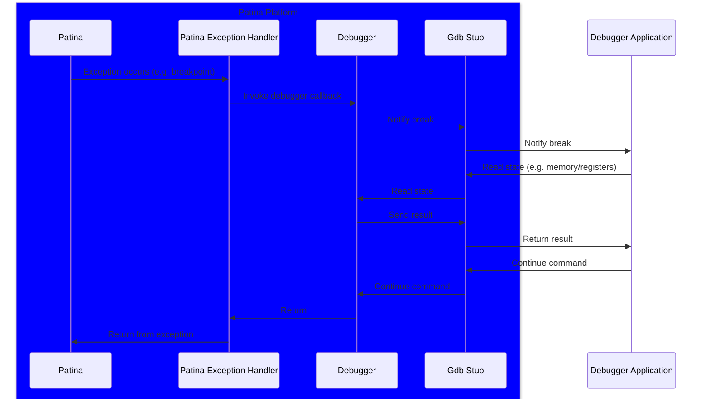

# Debugging

Source debugging in Patina is implemented as a self-hosted or "kernel" debugger
that executes within the exception handlers in the system. These exception handlers
will inspect the state of the system through memory, registers, and exception frames to present
the debugger application with a snapshot of the system at the moment it took the exception.
The communication between the exception handlers and the software debugger is implemented
using the [GDB Remote Protocol](https://sourceware.org/gdb/current/onlinedocs/gdb.html/Remote-Protocol.html)
which is supported by a number of debugger applications.

The Patina debugger is a software debugger which, in contrast to a hardware or JTAG
debugger, is implemented entirely within the patina software stack. This has many
advantages such as being more flexible, accessible, and available but also means
that it will have inherent limitations on its ability to debug all scenarios. Like
with all debugging tools, it is a powerful tool but may not be the correct choice
for all scenarios.

Below is a simplified diagram of the sequence of a debugger interaction, starting
with the exception, continuing with the debugger operations, and ending with
resuming from the exception.



## Structures

The debugger consists of two high-level structures: the debugger struct itself and
the transport. The debugger implements the debugging logic and exception handling
while the transport handles the physical communication to the debugger application.

### Debugger Struct

The debugger is primary implemented through a `'static` struct, `PatinaDebugger`,
which is instantiated and configured by the platform code, but will be initialized by the core.
This allows the platform to setup the appropriate transport and configurations prior
to Patina. However, as Patina will control the exception handlers framework, the debugger
cannot be initialized until that is available during early initialization. This struct must
be `'static` as it will be registered as an exception handler which cannot assume any
ownership or lifetimes as they will occur independent of the previous executing thread.

Because of the need for a `'static` lifetime, global access, and generic implementation
based on the transport, the debugger will be set to a static variable. Access to debugger
functions is done through static routines that will internally access the globally
installed debugger, if it exists. This is a contrasting design to other Patina
services because of the unique integration of the debugger in core initialization.

### Debug Transport

For the self-hosted debugger to communicate with the debugging software, such as
Windbg, there needs to be a physical line of communication between the system under
debug and the host machine. This transport should implement the [SerialIO](https://github.com/OpenDevicePartnership/patina/blob/main/sdk/patina_sdk/src/serial.rs)
trait to provide a simple mechanism to read or write to the bus. This transport may be
the same transport used by the logging console or it may be a dedicated UART or other
serial connection. Most devices should be able to use a standard UART implementation
from the SDK as the transport, providing the correct interface configurations.

## Phases of the Debugger

The debugger has two primary phases of operation: initialization where it prepares
the debugging infrastructure, and exception handling where it will inspect system
state and communicate with the debugger application.

### Initialization

Initialization of the debugger consists of two major operations: allocating resources
and configuration exception handlers.

A number of buffers are required for the debugger to function such as the GDB and
monitor buffers used for parsing input and preparing responses. These buffers are
pre-allocated because memory should not be allocated while actively broken into the debugger
as the state of the system is unknown should be minimally altered by the presence of
the debugger. This ensures a consistent view of the system under debug as well as
prevent debugger instability with reliance on systems in an unknown state.

The exception handlers are where the debugger is "broken-in" and is actively inspecting
system state and communicating with the debugger application. These are configured during
initialization so whenever an exception is taken, such as a breakpoint or an access
violation, it will cause the debugger to be invoked.

#### Initial Breakpoint

If enabled, at the end of initialization the debugger will invoke a hard-coded
breakpoint instruction, causing the CPU to take an exception invoking the debugger
exception handlers. This is referred to as the _Initial Breakpoint_. The initial
breakpoint is intended to give the developer time to connect to the system as early
as possible in order to setup breakpoints or otherwise interact with the debugger before
any further execution takes place.

Support is planned to allow the initial breakpoint to have a timeout such that if
a connection is not established within a configured time, the system will continue
execution. This will allow scenarios where the debugger is enabled but only used occasionally.

### Exception Handling

All actual debugging occurs within the exception handlers installed during initialization.
This will rely on the Patina `InterruptManager` to capture the executing context
during the initial exception, storing register state in a struct, before calling
out to the registered debugger exception handler. At this point, the debugger will
send a message over the transport to notify the debugger application that a break
has occurred. From this point forward, the application will dictate all operations that occur.
The following are the primary operations requested by the application.

- Querying system/architecture information
- Reading/writing registers
- Reading/writing memory
- Executing monitor commands
- Setting/clearing breakpoints
- Continuing or stepping

The self-hosted debugger will perform these operations but does not have the greater
context that the application does. e.g. the self-hosted debugger may be asked
to set memory address to a certain value, but only the application knows the
significance of the memory address - be it a variable, stack, or other structure.
The self-hosted debugger just performs rudimentary inspected/alteration
of system state and is not responsible for understanding why these things are done.

## Operations

While broken-in the Patina debugger is responsible for communicating with the application
and performing various operations to support debugging scenarios. This communication
and the resulting operations are detailed in this section.

### GDB Stub

The [GDB Remote Protocol](https://sourceware.org/gdb/current/onlinedocs/gdb.html/Remote-Protocol.html)
implementation for a debugger is often referred to as the _GDB Stub_. For the Patina
debugger, the [gdbstub](https://crates.io/crates/gdbstub) crate is used. This crate
handles all of the protocol packet interpretation and creation and calls out to
a _target_ structure provided by the Patina debugger to handle the debugging operations
such as reading/writing registers. Additionally a custom gdbstub_arch is used to
align to the [Project MU debugger](https://github.com/microsoft/mu_feature_debugger)
implementation.

The GDB protocol was selected because it is a robust communication standard that
is open and supported by many debug applications, including Windbg, GDB, LLDB, etc.
The GDB protocol is ascii based and so is not as performant as binary protocols
such as those used by Windbg natively. Other protocols may be supported in the future
to accommodate this and other shortcomings.

### Register Access

During the exception, the Patina exception handler will capture the register state
into a stack variable and provide this to the Patina debugger exception handler routines.
This captured state is what will be presented to the application as the current
state of the system, providing a snapshot of the registers at the point of the
exception. Any change to this structure will be restored faithfully by the Patina
exception handler code when the exception stack unwinds so that any change to these
registers while in the debugger will take affect when returning from the exception.

Notably, this does not include most system registers or MSRs. Any alteration to these
registers will take immediate effect (and may impact the debugger operation).

### Memory Access

Unlike register state, memory inspected by the debugger is the actual memory. For
this reason, the debugger should attempt to be minimally invasive or reliant on
other stateful services in the core as it could cause torn state or inconsistent
debugging results. The debugger currently requires that all memory access be mapped,
but it will temporarily fix-up write access to memory as needed.

```admonish important
Alteration to memory used by the debugger while the debugger is broken-in may cause
unexpected behavior.
```

### Breakpoints

There are several types of breakpoints that are configurable on the system.

__Software Breakpoints__ - These are the most common type of dynamic breakpoints
configured by the debugger and are the default for generic breakpoint instructions
sent from the application. Software breakpoints are breakpoint instructions that
the debugger will inject into the instruction stream, directly replacing the original
instruction. For example, on x64 the debugger will replace the instruction with an
`int 3` instruction for the address of the breakpoint. When broken in, the application
will typically temporarily remove the breakpoint so that this behavior is transparent
to the user. Resuming from a software breakpoint must be done with care as a simple
continue would either take the exception again or leave the instruction stream
unaltered preventing the breakpoint from functioning in the future. So the the application
will typically step beyond the broken instruction before setting the breakpoint again.

__Break Instructions__ - These are permanent and compile time breakpoint instructions
in the underlying code. In Patina this will typically be achieved by calling `patina_debugger::breakpoint()`.
When resuming from a breakpoint, the debugger will inspect the exception address to
see if it contains a hardcoded breakpoint, and if so it will increment the program
counter to skip the instruction. Otherwise the system would never be able to make
progress from a breakpoint instruction.

__Data Breakpoints__ - Also known as watchpoints, these are the only supported form
of hardware breakpoint, where debug registers are configured to cause an exception
on access to a specific address. The hardware is responsible for creating the exception in
these cases. These are used to capture reads or write to specific memory.

__Module Breakpoints__ - These are simply break instruction, but can be
conceptually considered their own entity. Module breaks are configured to cause
the debugger to break in when a specific module is loaded. This is achieved through
a callout from the core each time a new module is loaded. This is useful for developers
who want to debug a specific module as it gives them a chance to set breakpoints
prior to the module being executed.

### Monitor Commands

Monitor commands are implementation interpreted commands in the GDB remote protocol
through the [`qRcmd` packet](https://sourceware.org/gdb/current/onlinedocs/gdb.html/General-Query-Packets.html#index-qRcmd-packet).
These locally interpreted commands are useful for operations that do not have standard
or well-supported remote protocol functions but require local code execution on the
system. Some examples for this could be:

- Altering debugger behavior such as mapping checks.
- Querying the state of the debugger.
- Querying arbitrary system registers.
- Configuring module breakpoints.
- Environment specific extensions.

The debugger allows for external code to register for monitor callbacks to allows
for Patina or components to add their own monitor commands through the `add_monitor_command`
routine. As these commands are executed from the exception handler, special care
should be taken to avoid memory allocations or other global state alterations.
It is possible to have commands that alter global state or allocate memory, but
your mileage may vary depending on system state, e.g. the system may hang.

### Continuing execution

When a step or continue instruction is received, the debugger will resume from the
exception. This is done by returning from the exception callback where the generic
Patina exception handling code will then restore register state and return from the
exception.

If the continuing command is a step instruction, the debugger will set debug registers
to indicate to the processor that after a single instruction has been executed, an
exception should be taken. On X64 this is the [Trap Flag](https://en.wikipedia.org/wiki/Trap_flag)
in the RFlags, and on AArch64 this a combination of the SS bit in the
[MDSCR](https://developer.arm.com/documentation/100442/0100/debug-registers/aarch64-debug-registers/mdscr-el1--monitor-debug-system-control-register--el1)
and the SS bit in the [SPSR](https://developer.arm.com/documentation/dui0801/a/Overview-of-AArch64-state/Saved-Program-Status-Registers--SPSRs--in-AArch64-state).
These bits will always be cleared on break to ensure the system doesn't get stuck stepping.

## Configuring the Debugger

Configuring the debugger is left to the platform as the decision on when and how
to enable the debugger has environment, security, and other considerations that
are specific to a platform and its use case. There are two supported methods for
enabling the debugger: hard-coded enablement through use of the enablement routines
in the `PatineDebugger` struct, or through use of the [Debugger Control HOB](https://github.com/microsoft/mu_feature_debugger/blob/main/DebuggerFeaturePkg/Include/DebuggerControlHob.h).

> The Debugger Control HOB is planned support that is not yet available.

Direct configuration through the `PatinaDebugger` initialization can be useful for
quick configuration during development or controlled configuration through a platform
designed mechanism. Thie configuration is done through the `with_default_config`
routine allowing the caller to set enablement, initial breakpoint, and the initial
breakpoint timeout.

```admonish important
Debugger enablement on release platforms can be dangerous. It is critical that
platforms that use the debugger ensure that enablement cannot be done without proper
configuration or authorization.
```

## Debugger Applications

While the GDB remote protocol is supported by other debugger applications, the Patina
development has been primarily focused on Windbg support. This is because Windbg
provides strong support for systems programming concepts as well as strong PDB
support, which patina relies on.

### Windbg Integrations

Windbg supports the GDB interface through an EXDI extension. This implementation
uses a small subset of the full GDB protocol, but is sufficient for most operations.
To supplement this support, the [UefiExt extension](https://github.com/microsoft/mu_feature_debugger/tree/main/UefiDbgExt#readme)
has been modified to support the Patina debugger. The extension is critical for
the developer experience while using Windbg.

## Other Debugger Applications

While the debugger is designed to be compatible with GDB and other debugger applications
that support the GDB protocol, no investment has currently been made into testing and
tooling. Future support here would be welcomed as the need arises.
