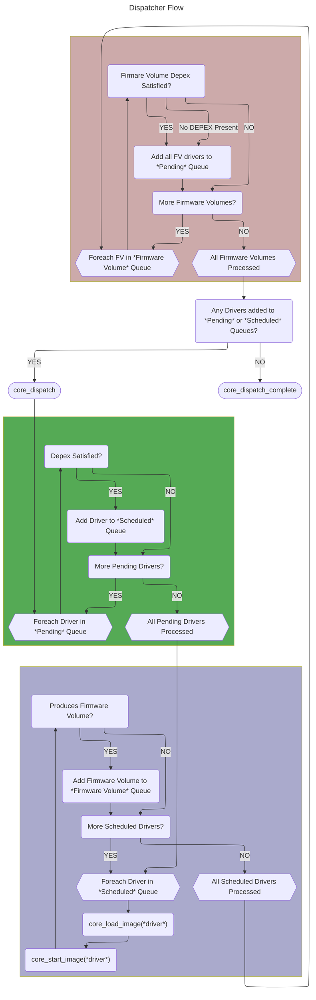

# Dispatcher

This portion of the core deals with discovering and executing drivers found in firmware volumes as ordered by their
dependencies. The Patina DXE Core dispatcher generally aligns with the requirements laid out in the UEFI Platform
Initialization Spec for the [DXE Dispatcher](https://uefi.org/specs/PI/1.8A/V2_DXE_Dispatcher.html), with the exception
of a priori file support.

## Dispatcher Initialization

The dispatcher relies on the Patina DXE Core [Event](events.md) and [Protocol](protocol_database.md) services in order to
locate and execute drivers. On initialization, the dispatcher registers an event notify callback on the
[`EFI_FIRMWARE_VOLUME_BLOCK2_PROTOCOL`](https://uefi.org/specs/PI/1.8A/V3_Code_Definitions.html#firmware-volume-block2-protocol),
which is produced for each firmware volume. This allows the dispatcher to interrogate the firmware volume and add any
new drivers within the volume to the dispatcher queue.

The core also provides an instance of the [`section
extractor`](https://github.com/OpenDevicePartnership/patina/blob/main/sdk/patina_ffs/src/section.rs)
interface, which is used by the dispatcher to process compressed and
[guided](https://uefi.org/specs/PI/1.8A/V3_Code_Definitions.html#guided-section-extraction-protocol)
sections. The reference section extractor provided with the Patina DXE Core can
extract sections compressed with the [UEFI
Compress](https://uefi.org/specs/UEFI/2.10_A/19_Protocols_Compression_Algorithm_Specification.html)
algorithm, as well as sections compressed with the
[Brotli](https://github.com/google/brotli) compression algorithm.

As part of core initialization, any firmware volumes produced by the HOB producer phase (to include at least the
firmware volume containing the Patina DXE Core itself) are added to the dispatcher prior to initial invocation (otherwise,
there would be nothing to dispatch). See [Firmware Volume Processing](dispatcher.md#firmware-volume-processing)
below for details.

## Dispatcher Invocation

After initialization, the dispatcher is invoked by the `core_dispatch` function, which has the same semantics as the
[DXE Services `Dispatch()`](https://uefi.org/specs/PI/1.8A/V2_Services_DXE_Services.html#dispatch) function. This
executes the core dispatcher loop, which is described below.

Once the first execution of `core_dispatch` loop processes and executes all available drivers, it returns control to the
Patina DXE Core, which then transfers control to the "BDS" driver by invoking the
[BDS Architectural Protocol](https://uefi.org/specs/PI/1.8A/V2_DXE_Architectural_Protocols.html#boot-device-selection-bds-architectural-protocol).

The dispatcher may be invoked again (for example, if the BDS phase produces additional firmware volumes) by invoking the
`core_dispatch` function again. This may also be done by applications or drivers outside the core by invoking the
[DXE Services `Dispatch()`](https://uefi.org/specs/PI/1.8A/V2_Services_DXE_Services.html#dispatch) function.

```admonish note
Dispatcher state is preserved between invocations. This means that any pending drivers or firmware volumes which were
not dispatched on prior invocations remain in the dispatcher queues and may be dispatched if their DEPEX expressions
become satisfied on a subsequent invocation of the dispatch loop. This could happen if new firmware volumes are added to
the system between invocations of the dispatcher.
```

## Core Dispatch Loop

Each time the dispatcher is invoked, it performs the following in a loop until no new drivers are dispatched:

1. Evaluates the DEPEX expressions for all "pending" drivers. If the DEPEX expression associated with a driver evaluates
to `TRUE`, that driver is added to the "scheduled" queue. See the [Depex Processing](dispatcher.md#depex-processing)
section below for details on DEPEX processing. This is the green box in the diagram below.
2. Each driver in the "scheduled" queue from the prior step is loaded via [`core_load_image`](images.md#loading-an-image).
3. `core_load_image` returns a security status for the image in addition to loading it. If the security status is
`efi::status::SUCCESS`, then the image will be started. If it is `efi::status::SECURITY_VIOLATION`, that indicates that
the image does not pass authentication at the present time, but may be authorized by the `Trust()` API of DXE Services.
if the security status is some other error status, then the dispatcher will drop that driver from the queue and it will
not be processed further.
4. If the driver passes the security checks, then its entry point is invoked via [`core_start_image`](images.md#executing-an-image).
This is the purple box in the diagram below.
5. If any of the drivers produced new Firmware Volume instances then the DEPEX expressions associated with Firmware
Volume instances (if any) are evaluated. If the DEPEX expression associated with the firmware volume evaluates to true
(or if the Firmware Volume had no associated DEPEX expression), then all the drivers in the firmware volume are added to
the "pending" driver queue to be evaluated in the next pass through the loop. See the
[Firmware Volume Processing](dispatcher.md#firmware-volume-processing) section below for details on Firmware Volume
processing. This is the red box in the diagram below.

```admonish note
On the first pass through the core dispatcher loop, the "Pending" and "Scheduled" driver queues are empty until the set
of Firmware Volumes can be processed to add new drivers to the "Pending" queue.
```



## DEPEX Processing

Dependency Expressions ("DEPEX") are a method to describe the dependencies of a UEFI module so that the dispatcher can
order module execution. In order for the dispatcher to execute a module, the associated DEPEX must evaluate to TRUE. The
DEPEX architecture and details of the various dependency operations are specified in the UEFI Platform Initialization
Spec section on [Dependency Expressions](https://uefi.org/specs/PI/1.8A/V2_DXE_Dispatcher.html#dependency-expressions).

```admonish note
Modules that do not have a DEPEX associated with them will get an implicit DEPEX for "All Architectural Protocols"
installed per the [guidance](https://uefi.org/specs/PI/1.8A/V2_DXE_Drivers.html#dxe-drivers-that-follow-the-uefi-driver-model)
in the UEFI Platform Initialization Spec.
```

DEPEX are also used to determine whether a newly-discovered encapsulated firmware volume is processed. If a nested
firmware volume file is discovered while processing the files in a firmware volume, and if the nested firmware volume
file also has a DEPEX section, then then associated DEPEX must evaluate to TRUE before the modules within the nested
firmware volume will be processed.

The core dispatcher uses the `patina_internal_depex` library crate to support DEPEX parsing and
evaluation, which implements all of the DEPEX operators and capabilities specified in the UEFI
Platform Initialization Spec.

## A Priori File

```admonish warning title="No A Priori Support"
The Patina DXE Core does not presently provide support for a priori file control of dispatch order for drivers.
```

The *a priori* file was introduced in the Platform Initialization (PI) Specification to provide additional flexibility
when designing platform firmware. A single *a priori* file was optionally allowed per firmware volume. The *a priori*
file allowed a list of DXE drivers to be specified by their module GUID that received special treatment from the DXE
dispatcher:

- Drivers listed in the *a priori* file were always dispatched first, regardless of their dependency expressions (DEPEX
  are ignored).
- Drivers listed in the *a priori* file were always dispatched in the order they were listed in the file.

The *a priori* mechanism was envisioned to support two primary use cases:

1. Allow a small set of early drivers to be grouped for early dispatch before the remainder of drivers are evaluated
   via their dependency expressions.
2. Allow a platform to bypass the DEPEX evaluation mechanism entirely in a given platform. This was targeted at
   smaller, embedded projects that wanted to maintain a fixed and predictable dispatch order.

In practice, we have found that an *a priori* file serves neither of these purposes well and makes DXE driver dispatch
error prone and brittle. **(1)** has largely evolved into a code smell that indicates the drivers have not defined
their dependencies correctly and **(2)** has shown to be impractical. Truly embedded projects have opted for boot loader
designs outside of the PI Specification while projects adhering to the PI Specification remain large and complex,
consisting of hundreds of DXE drivers.

### Brittleness of *a priori*

First, an *a priori* file is not reusable. It must be constructed correctly per platform. This alone makes the exercise
of maintaining an *a priori* file error prone. Second, a modern platform constructed with industry standard DXE drivers
and common layers of abstraction will have in excess of 100 DXE drivers which exacerbates the complexity of crafting the
*a priori* file correctly and the maintainability of the file over time.

Of the hundreds of DXE drivers in modern platform firmware, only a very small number are authored by the platform
engineer that will be responsible for constructing an *a priori* file for a given platform.

- It is not practical to expect a platform engineer(s) to understand the dependencies of all the drivers in the system.
  - The dependencies are not fixed per driver but an aggregation of all the dependencies that are in code linked into
    the driver. This means the platform engineer must now account for the dependencies of code within each driver and
    how those dependencies interact with the dependencies of other drivers.
- Even if dependency expressions are ignored entirely, in order for code written by other authors to be portable,
  **dependencies** must be declared and accounted for correctly. There has been no tangible value in bypassing or
  duplicating alternate dependency systems.
- While both a pure *a priori* and a dependency-based dispatch can "appear to work" with room for error in dependencies,
  the *a priori* file is much more brittle. The human responsible for constructing the *a priori* file must get the
  dependencies correct that would already be correct with dependency-based dispatch in addition to those that are not.

### Alternatives

To foster a more maintainable, robust, and correct DXE environment, the Patina DXE Core does not support *a priori* files
and requires that code being dispatched declare its dependencies properly. These are alternatives to maintain some of
the properties in *a priori* without using an *a priori* file:

- **Driver Order**: Files will be dispatched in order of their placement within a firmware volume. If two drivers are
  both eligible for dispatch, the one that appears first in the firmware volume will be dispatched first.
- **Driver vs Code Dependency**: Driver and code dispatch are separate. A driver must establish what dependencies
  are necessary for its entry point. The entry point may install additional notifications and events that will trigger
  specific code on other external events.

### Summary

The Patina DXE Core opts to require a programatically accurate evaluation of author-declared dependencies rather than a
"predictable" order that is more susceptible to error and assumptions built around that order that result in rigid code.
Libraries and drivers should declare their dependencies correctly so that platforms can quickly and easily integrate
their code into larger systems.

## Firmware Volume Processing

The dispatcher is responsible for processing firmware volumes installed in the core and discovering and dispatching
modules within those firmware volumes. The initial set of firmware volumes available to the dispatcher is supplied from
the HOB list and on initialization, the dispatcher will install a notification callback to fire whenever a new instance
of [`EFI_FIRMWARE_VOLUME_BLOCK2_PROTOCOL`](https://uefi.org/specs/PI/1.8A/V3_Code_Definitions.html#firmware-volume-block2-protocol)
is produced.

New firmware volume instances are made available to the core either via installing an instance of
`EFI_FIRMWARE_VOLUME_BLOCK2_PROTOCOL` directly into the protocol database, or calling the `process_firmware_volume()`
routine that is part of the DXE Services interface.

When a new firmware volume is installed in the core, the dispatcher notification will fire to process the contents of
the new firmware volume. Each new firmware volume is processed as follows:

1. The physical base address of the firmware volume in memory is retrieved from the
`EFI_FIRMWARE_VOLUME_BLOCK2_PROTOCOL` instance and used to instantiate a `FirmwareVolume` which allows traversal
of the files within the firmware volume.
2. The new firmware volume is authenticated using the [Security Architectural Protocol](https://uefi.org/specs/PI/1.8A/V2_DXE_Architectural_Protocols.html#security-architectural-protocols).
   If the authentication fails, the the firmware volume is ignored and not processed by the dispatcher.
3. Using the `FirmwareVolume` instance, each file in the firmware volume is inspected.
    - If it has an FFS filetype of "DRIVER", then its sections are inspected to see if there is a PE32 section. If the
    file contains a PE32 section, then it is added to the pending driver queue in the dispatcher, along with a DEPEX
    section if present.
    - If it has an FFS filetype of "FIRMWARE_VOLUME_IMAGE", then its sections  are inspected to see if there is a
    firmware volume section. If the file contains a firmware volume section, then it is added to the pending firmware
    volume queue in the dispatcher, along with a DEPEX section if present.
