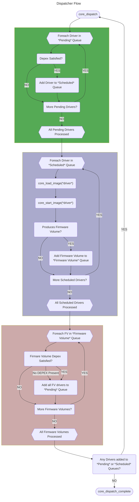

# Dispatcher

This portion of the core deals with discovering and executing drivers found in firmware volumes as ordered by their
dependencies. The Rust DXE Core dispatcher generally aligns with the requirements laid out in the UEFI Platform
Initialization Spec for the [DXE Dispatcher](https://uefi.org/specs/PI/1.8A/V2_DXE_Dispatcher.html), with the exception
of APRIORI file support.

## Dispatcher Initialization

The dispatcher relies on the Rust DXE Core [Event](events.md) and [Protocol](protocol_database.md) services in order to
locate and execute drivers. On initialization, the dispatcher registers an event notify callback on the
[`EFI_FIRMWARE_VOLUME_BLOCK2_PROTOCOL`](https://uefi.org/specs/PI/1.8A/V3_Code_Definitions.html#firmware-volume-block2-protocol),
which is produced for each firmware volume. This allows the dispatcher to interrogate the firmware volume and add any
new drivers within the volume to the dispatcher queue.

The core also provides an instance of the [`section extractor`](tbd) interface, which is used by the dispatcher to
process compressed and [guided](https://uefi.org/specs/PI/1.8A/V3_Code_Definitions.html#guided-section-extraction-protocol)
sections. The reference section extractor provided with the Rust DXE Core can extract sections compressed with the
[UEFI Compress](https://uefi.org/specs/UEFI/2.10_A/19_Protocols_Compression_Algorithm_Specification.html) algorithm, as
well as sections compressed with the [Brotli](https://github.com/google/brotli) compression algorithm.

As part of core initialization, any firmware volumes produced by the HOB producer phase (to include at least the
firmware volume containing the Rust DXE Core itself) are added to the dispatcher prior to initial invocation (otherwise,
there would be nothing to dispatch). See [Firmware Volume Processing](dispatcher.md#firmware-volume-processing)
below for details.

## Dispatcher Invocation

After initialization, the dispatcher is invoked by the `core_dispatch` function, which has the same semantics as the
[DXE Services `Dispatch()`](https://uefi.org/specs/PI/1.8A/V2_Services_DXE_Services.html#dispatch) function. This
executes the core dispatcher loop, which is described below.

Once the first execution of `core_dispatch` loop processes and executes all available drivers, it returns control to the
Rust DXE Core, which then transfers control to the "BDS" driver by invoking the
[BDS Architectural Protocol](https://uefi.org/specs/PI/1.8A/V2_DXE_Architectural_Protocols.html#boot-device-selection-bds-architectural-protocol).

The dispatcher may be invoked again (for example, if the BDS phase produces additional firmware volumes) by invoking the
`core_dispatch` function again. This may also be done by applications or drivers outside the core by invoking the
[DXE Services `Dispatch()`](https://uefi.org/specs/PI/1.8A/V2_Services_DXE_Services.html#dispatch) function.

```admonish note
Dispatcher state is preserved between invocations. This means that any pending drivers or firmware volumes which were
not dispatched on prior invocations remain in the dispatcher queues and may be dispatched if their DEPEX expressions
become satisfied on a subsequent invocation of the dispatch loop. This could happen if new firmware volumes are added to
the system between invocations of the dispatcher.
```

## Core Dispatch Loop

Each time the dispatcher is invoked, it performs the following in a loop until no new drivers are dispatched:

1. Evaluates the DEPEX expressions for all "pending" drivers. If the DEPEX expression associated with a driver evaluates
to `TRUE`, that driver is added to the "scheduled" queue. See the [Depex Processing](dispatcher.md#depex-processing)
section below for details on DEPEX processing. This is the green box in the diagram below.
2. Each driver in the "scheduled" queue from the prior step is loaded via [`core_load_image`](images.md#loading-an-image).
3. `core_load_image` returns a security status for the image in addition to loading it. If the security status is
`efi::status::SUCCESS`, then the image will be started. If it is `efi::status::SECURITY_VIOLATION`, that indicates that
the image does not pass authentication at the present time, but may be authorized by the `Trust()` API of DXE Services.
if the security status is some other error status, then the dispatcher will drop that driver from the queue and it will
not be processed further.
4. If the driver passes the security checks, then its entry point is invoked via [`core_start_image`](images.md#executing-an-image).
This is the purple box in the diagram below.
5. If any of the drivers produced new Firmware Volume instances then the DEPEX expressions associated with Firmware
Volume instances (if any) are evaluated. If the DEPEX expression associated with the firmware volume evaluates to true
(or if the Firmware Volume had no associated DEPEX expression), then all the drivers in the firmware volume are added to
the "pending" driver queue to be evaluated in the next pass through the loop. See the
[Firmware Volume Processing](dispatcher.md#firmware-volume-processing) section below for details on Firmware Volume
processing. This is the red box in the diagram below.

```admonish note
On the first pass through the core dispatcher loop, the "Pending" and "Scheduled" driver queues are empty until the set
of Firmware Volumes can be processed to add new drivers to the "Pending" queue.
```



## DEPEX Processing

Dependency Expressions ("DEPEX") are a method to describe the dependencies of a UEFI module so that the dispatcher can
order module execution. In order for the dispatcher to execute a module, the associated DEPEX must evaluate to TRUE. The
DEPEX architecture and details of the various dependency operations are specified in the UEFI Platform Initialization
Spec section on [Dependency Expressions](https://uefi.org/specs/PI/1.8A/V2_DXE_Dispatcher.html#dependency-expressions).

```admonish note
Modules that do not have a DEPEX associated with them will get an implicit DEPEX for "All Architectural Protocols"
installed per the [guidance](https://uefi.org/specs/PI/1.8A/V2_DXE_Drivers.html#dxe-drivers-that-follow-the-uefi-driver-model)
in the UEFI Platform Initialization Spec.
```

DEPEX are also used to determine whether a newly-discovered encapsulated firmware volume is processed. If a nested
firmware volume file is discovered while processing the files in a firmware volume, and if the nested firmware volume
file also has a DEPEX section, then then associated DEPEX must evaluate to TRUE before the modules within the nested
firmware volume will be processed.

The core dispatcher uses the `uefi_depex` library crate to support DEPEX parsing and evaluation, which implements all of
the DEPEX operators and capabilities specified in the UEFI Platform Initialization Spec.

```admonish warning title="No APRIORI Support"
The Rust DXE Core does not presently provide support for APRIORI file control of dispatch order for drivers.
```

## Firmware Volume Processing

The dispatcher is responsible for processing firmware volumes installed in the core and discovering and dispatching
modules within those firmware volumes. The initial set of firmware volumes available to the dispatcher is supplied from
the HOB list and on initialization, the dispatcher will install a notification callback to fire whenever a new instance
of [`EFI_FIRMWARE_VOLUME_BLOCK2_PROTOCOL`](https://uefi.org/specs/PI/1.8A/V3_Code_Definitions.html#firmware-volume-block2-protocol)
is produced.

New firmware volume instances are made available to the core either via installing an instance of
`EFI_FIRMWARE_VOLUME_BLOCK2_PROTOCOL` directly into the protocol database, or calling the `process_firmware_volume()`
routine that is part of the DXE Services interface.

When a new firmware volume is installed in the core, the dispatcher notification will fire to process the contents of
the new firmware volume. Each new firmware volume is processed as follows:

1. The physical base address of the firmware volume in memory is retrieved from the
`EFI_FIRMWARE_VOLUME_BLOCK2_PROTOCOL` instance and used to instantiate a [`FirmwareVolume`](tbd) which allows traversal
of the files within the firmware volume.
2. The new firmware volume is authenticated using the [Security Architectural Protocol](https://uefi.org/specs/PI/1.8A/V2_DXE_Architectural_Protocols.html#security-architectural-protocols).
   If the authentication fails, the the firmware volume is ignored and not processed by the dispatcher.
3. Using the `FirmwareVolume` instance, each file in the firmware volume is inspected.
    - If it has an FFS filetype of "DRIVER", then its sections are inspected to see if there is a PE32 section. If the
    file contains a PE32 section, then it is added to the pending driver queue in the dispatcher, along with a DEPEX
    section if present.
    - If it has an FFS filetype of "FIRMWARE_VOLUME_IMAGE", then its sections  are inspected to see if there is a
    firmware volume section. If the file contains a firmware volume section, then it is added to the pending firmware
    volume queue in the dispatcher, along with a DEPEX section if present.
