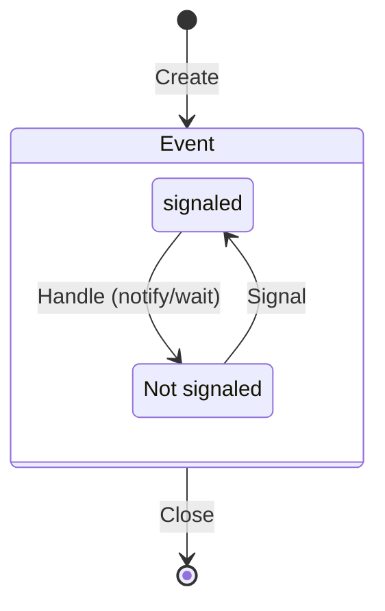
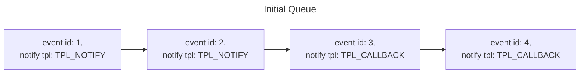
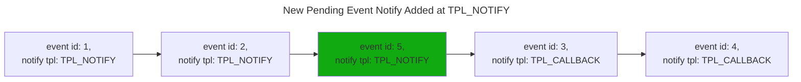
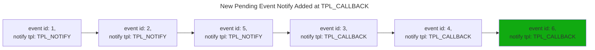
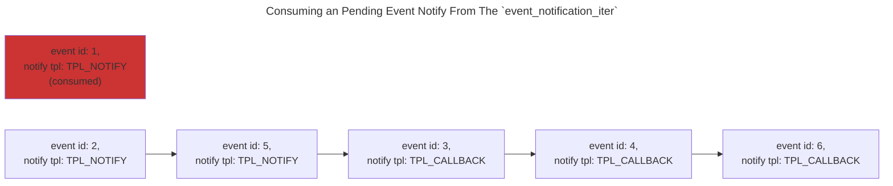
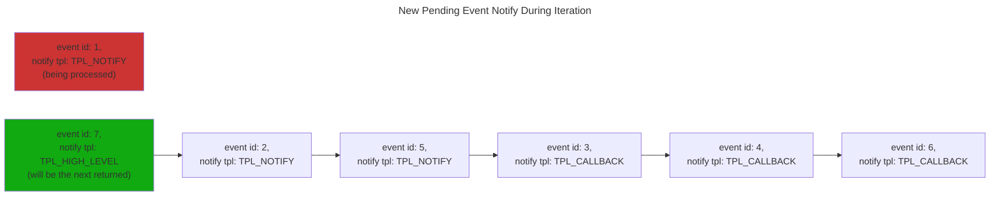

# Event, Timer and Task Priority Services

This portion of the core is concerned with producing the capabilities described in
[Section 7.1](https://uefi.org/specs/UEFI/2.10_A/07_Services_Boot_Services.html#event-timer-and-task-priority-services)
of the UEFI specification to support synchronous and asynchronous eventing within the UEFI context. This section assumes
basic familiarity with UEFI event, timer and task priority services and focuses on how they are implemented in the Rust
DXE Core.

The main implementation for Event, Timer and Task Priority features resides in the Event Database object implemented by
the `patina_dxe_core` crate. The event database is then used to implement the UEFI spec boot services for event, timer and
task priority by the main Rust DXE Core event.rs module.

## Event Database

There are two main data structures tracked within the event database: events themselves, and pending event notifies.

### Event Objects

An "event" is used to track events of interest to the firmware. See:
[Section 7.1.1](https://uefi.org/specs/UEFI/2.10_A/07_Services_Boot_Services.html#efi-boot-services-createevent) of the
UEFI spec for a discussion of what an event is and how it is used in the firmware. In the Rust DXE Core event database,
an event object contains the following data:

| Data       | Purpose                                                    | Applies to                 |
|------------|------------------------------------------------------------|----------------------------|
| id         | Uniquely identify an event                                 | All Event Types            |
| type       | Type of event                                              | All Event Types            |
| group      | Group to which this event belongs                          | All Event Types (Optional) |
| signaled   | Whether the event is currently in the 'signaled' state     | All Event Types            |
| notify data| TPL, notify function, and context for event notifications  | Notify Events              |
| timer data | period/relative offset for timer events                    | Timer Events               |

An event may be of more than one type, (for example, a Timer/Notify event will use both Notify Event and Timer Event
fields).

### Pending Event Notify Objects

A pending notification is used to track an outstanding notification for an event that has been placed in the 'signaled'
state but which has not yet been "delivered" by the core (typically because the firmware is running at a TPL equal to or
higher to the notification TPL of the event). In the Rust DXE Core event database, a pending notify object contains the
following data:

| Field           | Purpose                                                 |
|-----------------|---------------------------------------------------------|
| event           | The `id` of the event for which this notify is pending  |
| notify tpl      | TPL at which the event notification should be delivered |
| notify function | Function to invoke to deliver the notification          |
| notify context  | Context data passed to to the notification function     |

### Database Structure

The event database has two main tracking structures:

1. A map of `event` objects indexed by `id` for fast lookup, and
2. An ordered set of unique `pending event notify` objects ordered by TPL and then by creation time (oldest notifies
first)

In addition, the event database also tracks the next available `id` for assignment to new events, as well as tracking
internal state associated with the proper ordering of `pending event notify` objects.

## Operations

The event database supports a number of operations to support event, timer, and task priority services. These include
event creation and deletion, event signaling, timer creation, timer tick, and notification queue management.

### Event Lifecycle

The lifecycle of an event is as follows:



### Creating an Event

An event is created by calling the `create_event` function on the event database, and specifying the `event_type`,
`notify_tpl` (can be zero for non-notify events), and optional `notify_function`, `notify_context` and `event_group`
parameters. This will create the event object, assign it an `id`, and insert it into the event database. The `id` value
of the created event (of type `efi::Event`) is returned on success.

The type of an event can be queried by calling the `get_event_type` function on the event database and specifying the
`id` of the event. The notification data associated with a given event can be queried by calling the
`get_notification_data` function on the event database and specifying the `id` of the event.

### Closing an Event

An event can be removed from the database by calling the `close_event` function on the event database, and specifying
the `id` of the event to be removed. Closing an event will prevent it from being signaled, and any pending notifies for
that event are
effectively cancelled and will not be delivered once the event is closed.

### Signaling an Event

An event can be explicitly placed in the 'signaled' state by calling the `signal_event` function on the event database
and specifying the `id` of the event to be placed in the 'signaled' state, or by calling the `signal_event_group` and
specifying the event group that an event is a member of (specified on event creation). A timer event may also be
automatically signaled on timer expiration (see [Timers](events.md#timers)).

Signaling an event does the following:

* puts the event in the 'signaled' state.
* signals events with the same `group` as the current event.
* for `notify` events, creates and inserts a `pending event notify` object in the ordered set that tracks pending
events.

Whether an event is in the 'signaled' state can be queried by calling the `is_signaled` function on the event database
and specifying the `id` of the event to query. The 'signaled' state can be cleared by calling the `clear_signal`
function on the event database and specifying the `id` of the event. Note that clearing the 'signaled' state does not
cancel pending notifications of the event - these will still be processed even if the 'signaled' state has ben
independently cleared. The event database also provides a `read_and_clear_signaled` function to allow the signal state
to be read and cleared as a single operation.

### Pending Event Notification Queue

The event database maintains an ordered set of `pending event notify` objects representing queued for notifications for
events.

When an event with a `notify` event type is signaled or explicitly queued for notify (see:
[Queuing an Event without a Signal](events.md#queuing-an-event-without-a-signal)), a new `pending event notify` object
is added to the ordered set of `pending event notify` objects.

**Note:** this is technically an ordered set (not strictly a queue) because only one `pending event notify` may exist in
the set for a given event `id` - no duplicates are permitted. If a `pending event notify` already exists for a given
event and an attempt is made to queue it again, nothing happens.

The `pending event notify` queue is ordered first by the `notify tpl` level of the event, and then by 'arrival time' of
the event notification - earlier `pending event notify` objects will be ordered ahead of later `pending event notify`
objects at the same `notify tpl`.







#### Queuing an Event without a Signal

In some scenarios it may be desirable to invoke the notification callback of the event when it is in the 'Not signaled'
state. This can be done by invoking the `queue_event_notify` function on the event database and specifying the `id` of
the event to queue for notification. This will add a `pending event notify` object to the pending notification queue.

This is useful when the event is a 'Notify Wait' type and is intended to be used by UEFI
[BOOT_SERVICES.WaitForEvent()](https://uefi.org/specs/UEFI/2.10_A/07_Services_Boot_Services.html#efi-boot-services-waitforevent)
or UEFI
[BOOT_SERVICES.CheckEvent()](https://uefi.org/specs/UEFI/2.10_A/07_Services_Boot_Services.html#efi-boot-services-checkevent),
where invocation of the notification function is used to check and potentially transition the event to a 'signaled'
state.

#### Accessing the Pending Event Queue

The pending event queue can be accessed by calling the `event_notification_iter` function on the event database and
specifying the minimum TPL level for which events should be returned. This function returns an iterator that will return
`pending event notify` objects in order until no objects remain in the ordered set of pending notifications at that TPL
 or higher.

Since events may be signaled asynchronously to pending event iteration , events may be added to the ordered sets of
`pending event notify` objects while the iterator is in use; the iterator will continue to return `pending event notify`
objects a the specified TPL even if they were added after the creation of the iterator object.





When an event is consumed through the iterator, it is removed from the `pending event notify` queue, and the
corresponding event in the database will be marked 'not-signaled'.

### Timers

#### Event Database Time

The event database implementation is agnostic to the units for time; as long as the units used in `set_timer` and
`timer_tick` (see following sections) are consistent, the event database will handle timer events as expected. The
standard unit of time used by the [Rust Dxe Core Event Module](events.md#rust-dxe-core-event-module) is 100ns, but
nothing in the event database implementation assumes a particular unit of time.

#### Timer Event Configuration

Timer events are a subset of events that can be associated with a timer. These events have the `EVT_TIMER` flag set as
part of the event type. The `set_timer` function of the event database can be used to configure the timer
characteristics associated with these events.

There are three types of timer operations that can be configured with `set_timer`:

* `TimerCancel` - cancels a currently activated timer. Note that closing an event effectively cancels any running timers
for that event as well.
* `TimerPeriodic` - Configures a periodic timer for an event. The event will be [signaled](events.md#signaling-an-event)
every time the system time advances by the specified period.
* `TimerRelative` - Configures a one-shot timer for an event. The event will be [signaled](events.md#signaling-an-event)
after the system time advances by the specified amount of time.

#### Interaction with the System Timer

The event database itself does not directly interact with the system timer hardware. Instead, the Rust DXE Core will
invoke the `timer_tick` function on the event database to communicate passage of time. The Rust DXE Core will pass the
current system time in `ticks` (see [Event Database Time](events.md#event-database-time)) to the call to indicate how
much time has passed.

When `timer_tick` is called, the event database implementation will inspect each event in the database to see if it is
configured as a timer event. For events configured with an active periodic or one-shot timer, the event database will
calculate whether the timer has expired, and if so, will [signal](events.md#signaling-an-event) the event.

## Rust DXE Core Event Module

The event database described above is consumed by the event module of the Rust DXE Core to provide the actual UEFI Spec
compliant event, timer and task priority services.

```admonish note
In the events.rs module, the naming convention for `pub` functions intended for use by the core is to prefix them with `core_`. Many of the functions described below are for implementing FFI APIs for UEFI spec compliance. These are not usually designed for calling within the core. If calling from elsewhere in the core is required, it is often best to create a Rust-friendly version of the API and prefix the name with `core_` to signify that it is for core usage.
```

### Event Creation and Closure

The two event creation APIs defined in the UEFI spec are:

* [EFI_BOOT_SERVICES.CreateEvent()](https://uefi.org/specs/UEFI/2.10_A/07_Services_Boot_Services.html#efi-boot-services-createevent)
* [EFI_BOOT_SERVICES.CreateEventEx()](https://uefi.org/specs/UEFI/2.10_A/07_Services_Boot_Services.html#efi-boot-services-createeventex)

These are both implemented as simple calls to the event database `create_event` function (see:
[Creating an Event](events.md#creating-an-event)).

The UEFI spec API for removing an event is
[EFI_BOOT_SERVICES.CloseEvent()](https://uefi.org/specs/UEFI/2.10_A/07_Services_Boot_Services.html#efi-boot-services-closeevent)
and is also implemented as a simple call to the `close_event` function in the event database (see:
[Closing an Event](events.md#closing-an-event)).

### Event Signaling

The UEFI spec API for signaling an event is
[EFI_BOOT_SERVICES.SignalEvent()](https://uefi.org/specs/UEFI/2.10_A/07_Services_Boot_Services.html#efi-boot-services-signalevent).
This is implemented as a call to the `signal_event` function in the event database (see:
[signaling an Event](events.md#signaling-an-event)).

When an event is signaled, an immediate dispatch of the pending event notify queue is initiated by raising and restoring
the TPL (see:
[Raising and Restoring the Task Priority Level (TPL)](events.md#raising-and-restoring-the-task-priority-level-tpl)).
This ensures that any event notifications higher than the current TPL are immediately executed before proceeding (but
see [Processing Pending Events](events.md#processing-pending-events)).

### Waiting for an Event List

The UEFI spec API for waiting on an event list is
[EFI_BOOT_SERVICES.WaitForEvent()](https://uefi.org/specs/UEFI/2.10_A/07_Services_Boot_Services.html#efi-boot-services-waitforevent).
This function allows code at TPL_APPLICATION to wait on a set of events, proceeding whenever any of the events in the
set entered the 'signaled' state. The events are polled in a repeated loop. For each event in the list,
[`check_event`](events.md#checking-an-event) is invoked. If `check_event` returns `EFI_SUCCESS`, then the loop is
exited, and the function returns the index of that event.

### Checking an Event

The UEFI spec API for checking an event is
[EFI_BOOT_SERVICES.CheckEvent()](https://uefi.org/specs/UEFI/2.10_A/07_Services_Boot_Services.html#efi-boot-services-checkevent).
This API checks to see whether the specified event is in the 'signaled' state.

* If *Event* is in the 'signaled' state, it is cleared and `EFI_SUCCESS` is returned.
* If *Event* is not in the 'signaled' state and has no notification function, `EFI_NOT_READY` is returned.
* If *Event* is not in the 'signaled' state but does have a notification function, the notification function is queued
at the event’s notification task priority level. If the execution of the notification function causes Event to be
signaled, then the 'signaled' state is cleared and `EFI_SUCCESS` is returned; if the Event is not signaled, then
`EFI_NOT_READY` is returned.

This is implemented via means of the event database API:

1. First [`read_and_clear_signaled`](events.md#signaling-an-event) is used to check and clear the event state. If the
event state was 'signaled' then `EFI_SUCCESS` is returned.
2. Otherwise, [`queue_event_notify`](events.md#queuing-an-event-without-a-signal) is used to schedule the event
notification at the event TPL. Note that this is a no-op for events that do not have notification functions.
3. Then [`read_and_clear_signaled`](events.md#signaling-an-event) is used to check and clear the event state again. If
the event state was 'signaled' then `EFI_SUCCESS` is returned.
4. If the event state was still not 'signaled' after execution of the notification function (if any), then
`EFI_NOT_READY` is returned.

### System Time

The events module of the Rust DXE Core maintains a global `SYSTEM_TIME` variable as an `AtomicU64`. This maintains the
current system time tick count. When the Timer Architectural Protocol is made available part way through boot, the event
module registers a timer handler with the architectural protocol to receive timer ticks callbacks (a tick is 100ns).
When a timer tick occurs, the following actions are taken:

1. Raise the system TPL level to TPL_HIGH_LEVEL (see: [TPL](events.md#task-priority-level-tpl)).
2. Atomic increment `SYSTEM_TIME` by the number of ticks that have passed since the last time the handler was invoked.
3. Call the event database [`timer_tick`](events.md#interaction-with-the-system-timer) routine to inform the event
database of the updated time and signal any expired timer events.
4. Restore the system TPL level to the original TPL level (which will dispatch any pending notifications at higher TPL
levels)

### Timer Event configuration

The UEFI spec API for configuring event timers is
[EFI_BOOT_SERVICES.SetTimer()](https://uefi.org/specs/UEFI/2.10_A/07_Services_Boot_Services.html#efi-boot-services-settimer).
This is implemented as a simple call to the `set_timer` function in the event database (see:
[Timer Event Configuration](events.md#timer-event-configuration)).

### Task Priority Level (TPL)

The event module of the Rust DXE Core maintains a global `CURRENT_TPL` as an `AtomicUsize`. This maintains the current
system Task Priority Level.

Per the UEFI spec,
[Section 7.1.8](https://uefi.org/specs/UEFI/2.10_A/07_Services_Boot_Services.html#efi-boot-services-raisetpl):

> Only three task priority levels are exposed outside of the firmware during boot services execution. The first is
TPL_APPLICATION where all normal execution occurs. That level may be interrupted to perform various asynchronous
interrupt style notifications, which occur at the TPL_CALLBACK or TPL_NOTIFY level. By raising the task priority level
to TPL_NOTIFY such notifications are masked until the task priority level is restored, thereby synchronizing execution
with such notifications. Synchronous blocking I/O functions execute at TPL_NOTIFY . TPL_CALLBACK is the typically used
for application level notification functions. Device drivers will typically use TPL_CALLBACK or TPL_NOTIFY for their
notification functions. Applications and drivers may also use TPL_NOTIFY to protect data structures in critical sections
of code.

### Raising the TPL

The UEFI spec API for raising the Task Priority Level is
[EFI_BOOT_SERVICES.RaiseTPL()](https://uefi.org/specs/UEFI/2.10_A/07_Services_Boot_Services.html#efi-boot-services-raisetpl).

When invoked, the global `CURRENT_TPL` is set to the specified TPL, which must follow the rules given in the
specification (the implementation enforces that the new TPL must be greater than or equal to `CURRENT_TPL`). In
addition, if the current TPL is set to `TPL_HIGH_LEVEL`, then the CPU Architectural Protocol is invoked to disable
hardware interrupts.

### Restoring the TPL

The UEFI spec API for raising the Task Priority Level is
[EFI_BOOT_SERVICES.RestoreTPL()](https://uefi.org/specs/UEFI/2.10_A/07_Services_Boot_Services.html#efi-boot-services-restoretpl).

When invoked, the following sequence of actions are taken:

1. The `CURRENT_TPL` is checked to make sure that it is equal or higher than the TPL being restored.
2. If the TPL being restored is lower than the current TPL, then the pending event queue for TPL greater than the TPL
being restored is processed (see [following section](events.md#processing-pending-events))
3. Once all pending events are processed, if the current TPL is `TPL_HIGH_LEVEL` and the TPL being restored is lower
than `TPL_HIGH_LEVEL`, then the CPU Architectural Protocol is invoked to enable hardware interrupts.

### Processing Pending Events

If `RestoreTPL` is called to change to a lower TPL, then the events module will process and dispatch any notify
functions for any events that are a) in the 'signaled' state, b) have a notification function, and c) have a
notification TPL level above the TPL being restored.

This is done by instantiating an event notification iterator (see:
[Accessing the Pending Event Queue](events.md#accessing-the-pending-event-queue)) for the TPL being restored that will
return all pending event notifications above the TPL being restored. For each event returned by the iterator:

1. The `CURRENT_TPL` will be set to the `notify tpl` for the given pending event. If this is `TPL_HIGH_LEVEL`, the CPU
Architectural Protocol is invoked to disable hardware interrupts. Otherwise, the CPU Architectural Protocol is invoked
to enable hardware interrupts.
2. The `notify function` for the given pending event is executed.

Note that a `notify function` may itself execute `RaiseTPL`/`RestoreTPL`, which means `RestoreTPL` must handle
re-entrant calls. This is done by using an `AtomicBool` `EVENTS_IN_PROGRESS` static flag to skip processing of pending
events if there is already an event notification iterator active.

```admonish warning
This approach to handling re-entrant `RestoreTPL` calls may introduce a subtle ordering difference with respect to event
notify function execution relative to the standard EDK2 reference implementation in C.

This is because `EFI_BOOT_SERVICES.SignalEvent()` invoked within a notify function at a given TPL will not invoke an
event notify function for a signaled event at a higher TPL before `SignalEvent()` returns; instead the event notify will
be inserted in the event notify queue and invoked after the return of the notify function that called `SignalEvent()`.
The EDK2 reference implementation in C would dispatch the notify function immediately on the `SignalEvent()` call,
effectively interrupting the notify function running at the lower TPL.

The UEFI spec does not explicitly prescribe the ordering behavior in this scenario; but it is possible that some code
may make assumptions about this ordering, resulting in unexpected behavior.
```
