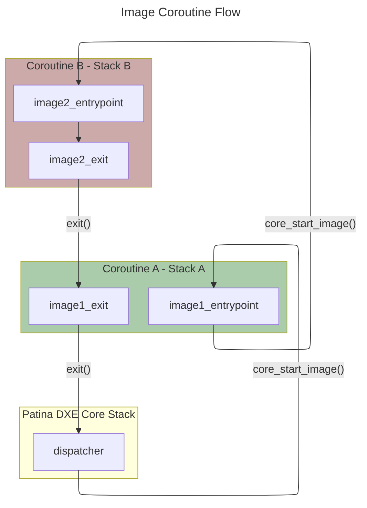

# Image Loading and Execution

This portion of the core deals with loading images from media (such firmware volumes or the EFI System Partiion) into
RAM as well as setting up image execution context and executing images.

## Loading an Image

Images are loaded by the core through the `core_load_image` function, which has the same semantics as the [EFI_BOOT_SERVICES.LoadImage()](https://uefi.org/specs/UEFI/2.10_A/07_Services_Boot_Services.html#efi-boot-services-loadimage)
in the UEFI spec. This routine takes as input the image source, in the form of either a `device_path` that describes
where to load the image from, or a `image` source buffer. This routine also takes as input the `parent_image_handle`
(which is typically the well-known Patina DXE Core handle), but can be used in some scenarios where another agent is
loading the image (for example, UEFI Shell), as well as a 'boot_policy' flag that has meaning when `device_path` is used
to source the image (see [Loading an Image from a Device Path](images.md#sourcing-an-image-from-a-device-path), below).

### Image Security

As part of the loading process, the security of the image is checked using the [Security Architectural Protocols](https://uefi.org/specs/PI/1.8A/V2_DXE_Architectural_Protocols.html#security-architectural-protocols).
The security status of the image is returned from `core_load_image`. Platforms use the Security Architectural Protocol
hooks to allow different security elements to be added per platform-specific requirements. Examples of such elements
implemented through the Security Architectural Protocols include measurement into the TPM per
[TCG EFI Protocol Specification](https://trustedcomputinggroup.org/resource/tcg-efi-protocol-specification/) and
[UEFI Secure Boot](https://uefi.org/specs/UEFI/2.10_A/32_Secure_Boot_and_Driver_Signing.html).

### Sourcing an Image from a Device Path

If the `image` parameter is provided to this function, then it contains a byte buffer containing the image data.
Otherwise, this function will attempt to load the image based on the provided `device_path` parameter.

```admonish note
The `device_path` parameter should still be provided even if the `image` buffer is used since the `device_path` will
still be used when creating the image handle, and other portions of the firmware may use it.
```

If the `image` parameter is not provided, then this function will attempt to read the image based on the `device_path`
parameter:

1. If there is an instance of the [`EFI_SIMPLE_FILE_SYSTEM_PROTOCOL`](https://uefi.org/specs/UEFI/2.10_A/13_Protocols_Media_Access.html#efi-simple-file-system-protocol)
that corresponds to the given `device_path`, then the file is read from the SFS instance.
2. If there is no instance of `EFI_SIMPLE_FILE_SYSTEM_PROTOCOL` that matches `device_path`, then this function will
attempt to read the image from based on the `boot_policy` flag:
    - if `boot_policy` is true, then [`EFI_LOAD_FILE_PROTOCOL`](https://uefi.org/specs/UEFI/2.10_A/13_Protocols_Media_Access.html#efi-load-file-protocol)
    is used to read the file.
    - if `boot_policy` is false, then  [`EFI_LOAD_FILE2_PROTOCOL`](https://uefi.org/specs/UEFI/2.10_A/13_Protocols_Media_Access.html#load-file-2-protocol)
    is used to read the file, and if that fails, then the function will attempt to use [`EFI_LOAD_FILE_PROTOCOL`](https://uefi.org/specs/UEFI/2.10_A/13_Protocols_Media_Access.html#efi-load-file-protocol)
    as a fallback.

### Processing an Image into RAM

Once the source image buffer is available (either having been directly passed in the `image` parameter or read from
somewhere identified by the `device_path` parameter), it must be loaded into memory and processed so that it can be
executed.

The Patina DXE Core supports images in the [`PE32+`](https://uefi.org/specs/UEFI/2.10_A/02_Overview.html#uefi-images)
format as required by the UEFI spec. In addition, the Patina DXE Core also supports the [`Terse Executable (TE)`](https://uefi.org/specs/PI/1.8A/V1_TE_Image.html)
format as specified in the UEFI Platform Initialization Spec.

To parse these image formats, the Patina DXE Core uses the [goblin](https://docs.rs/goblin/latest/goblin/) crate which
supports parsing both formats. Interactions with Goblin to support image parsing are implemented in the `patina_dxe_core`
crate.

To load an image, the Patina DXE Core does the following:

1. Parse the PE32+ or TE header to extract information about the image.
2. Allocate a destination buffer of the appropriate type to hold the loaded image.
3. Load the image from the source image buffer into the destination buffer section by section.
4. Apply relocation fixups to the image (see [PE Format](https://learn.microsoft.com/en-us/windows/win32/debug/pe-format#the-reloc-section-image-only)
documentation for details on the `.reloc` Section) to match the destination buffer where it is loaded.
5. Calculates the new entry point for the image in the destination buffer.
6. If the image contains a custom PE/COFF resource with type `HII` a buffer is allocated to contain that resource data.
7. Memory protections are applied to the image so that code sections are marked `efi::MEMORY_RO` and other sections of
the image are marked `efi::MEMORY_XP`.

### Information Associated with the Image

Once the image has been loaded, an `efi::Handle` is created and instances of [`EFI_LOADED_IMAGE_PROTOCOL`](https://uefi.org/specs/UEFI/2.10_A/09_Protocols_EFI_Loaded_Image.html#efi-loaded-image-protocol)
and [`EFI_LOADED_IMAGE_DEVICE_PATH_PROTOCOL`](https://uefi.org/specs/UEFI/2.10_A/09_Protocols_EFI_Loaded_Image.html#efi-loaded-image-device-path-protocol)
are installed on this handle to expose information about the image to the rest of the system. This becomes the "image
handle" of the newly loaded image.

In addition, if the image contained an `HII` resource section, an instance of [`EFI_HII_PACKAGE_LIST_PROTOCOL`](https://uefi.org/specs/UEFI/2.10_A/07_Services_Boot_Services.html#efi-boot-services-loadimage)
(which is an alias of [`EFI_HII_PACKAGE_LIST_HEADER`](https://uefi.org/specs/UEFI/2.10_A/33_Human_Interface_Infrastructure.html#efi-hii-package-list-header))
is also installed on the image handle.

## Executing an Image

Once an image is loaded, it may be executed with a call to `core_start_image`. To manage the execution context of the
new image, the Patina DXE Core uses a modified version of the [corosensei](https://github.com/Amanieu/corosensei) crate to
run the entry point as a "coroutine". The main extension to corosensei is the definition of a "UEFI" target to match UEFI
stack conventions - which is basically a "windows" target without [TEB](https://learn.microsoft.com/en-us/windows/win32/debug/thread-environment-block--debugging-notes-).
The primary rationale for using a coroutine-based approach to image execution is to simplify and generalize the ability
to "exit" an image, which would otherwise require architecture-specific processor context save/and restore operations
(i.e. "SetJump" and "LongJump"). In addition, the coroutine approach allows for better isolation of the image stack from
the Patina DXE Core stack.

When `core_start_image` is called, it first allocates a stack for the new image context, and then constructs a
corosensei [`Coroutine`](https://docs.rs/corosensei/latest/corosensei/struct.Coroutine.html) structure. The coroutine is
initialized with a closure that is used to invoke the image entry point.

Once the `Coroutine` has been constructed, `core_start_image` passes control to it via the [`resume()`](https://docs.rs/corosensei/latest/corosensei/struct.Coroutine.html#method.resume)
method. Control then passes to the coroutine closure, which stores the coroutine [`Yielder`](https://docs.rs/corosensei/latest/corosensei/struct.Yielder.html)
that serves as the context for the coroutine and then calls the `entry_point` of the image. Once the image entry point
completes and returns, the coroutine calls the `exit()` method, which uses the coroutine yielder to pass control back to
the point in `core_start_image` immediately following the point where `resume()` was invoked to start the co-routine.

Note that this process can be recursive - for example, `core_start_image` can be invoked to start execution of UEFI
Shell, which may in turn call `core_start_image` to invoke an application. Storing the `Yielder` context for each image
start allows calls to `exit()` to properly resume into the previous context.



## Exiting an Image

The `exit()` routine is used to transfer control from the image execution context back to the `core_start_image` context
that started the image in question. `exit()` may be invoked at any point in the callstack below the entry point of the
image, and will return control to the context from which the image was started.

`exit()` functions by reclaiming hte `Yielder` context that was saved prior to the entry point of the image and invoking
the [`suspend`](https://docs.rs/corosensei/latest/corosensei/struct.Yielder.html#method.suspend) function on it. This
will switch control back to the original point at which [`Coroutine::resume()`](https://docs.rs/corosensei/latest/corosensei/struct.Coroutine.html#method.resume)
was called to start the image.

## Unloading an Image

If the entry point for an image returns an error status, or if an other agent wishes to unload an image (e.g. to remove
a driver so that it can be replaced with a different driver for testing), the `core_unload_image` function can be
invoked to unload the image. It takes the image `handle` of the image to unload, along with a `force_unload` flag that
controls whether the image should be forcibly unloaded. This routine has the same semantics as [`EFI_BOOT_SERVICES.UnloadImage()`](https://uefi.org/specs/UEFI/2.10_A/07_Services_Boot_Services.html#efi-boot-services-unloadimage).

If the image has been started with `core_start_image`, and an `unload` function has been installed into the
`EFI_LOADED_IMAGE_PROTOCOL` instance for this image in question by the entry point, then the `unload()` function is
invoked to allow the image to execute any logic necessary to prepare for being unloaded (such as uninstalling global
state it may have produced). If an `unload` function was not installed by the entry point then `core_unload_image` will
return "unsupported" unless the `force_unload` flag is set to true.

Any protocols that were opened with [`EFI_BOOT_SERVICES.OpenProtocol()`](https://uefi.org/specs/UEFI/2.10_A/07_Services_Boot_Services.html#efi-boot-services-openprotocol)
with the current image as the `agent` opening the protocol are automatically closed as if [`EFI_BOOT_SERVICES.CloseProtocol()`](https://uefi.org/specs/UEFI/2.10_A/07_Services_Boot_Services.html#efi-boot-services-closeprotocol)
had been invoked to do so. Next, the `EFI_LOADED_IMAGE_PROTOCOL` and `EFI_LOADED_IMAGE_DEVICE_PATH` instances on the
image handle are uninstalled.

Finally, the memory protections applied to the image are reset, and the global private data corresponding to the image
is dropped and any resources associated with it (including the buffer containing the loaded image) are released.

## Executing a Component

The Patina DXE Core also supports dispatching Rust [`Components`](../driver/interface.md#component-interface). A
`component` can be started by invoking `core_start_local_image`. The usage model is much simpler since `exit()` is not
supported and neither are nested calls to `core_start_local_image`. A `Coroutine` is still instantiated with a separate
stack for each component invocation, but the coroutine simply runs until the `Component` entry point returns at which
point it resumes back to the the `core_start_local_image` context.

## Image Module Global Private Data

The Patina DXE Core image module maintains a global database of private data associated with each image that has been
loaded, indexed by the image handle. This data contains some data that is published on the handle (e.g., data in the
`EFI_LOADED_IMAGE_PROTOCOL`), as well as private data required to maintain the image and support public operations on it
(such as relocation of runtime images, whether the image has been "started", a copy of the PE/COFF header information
etc). The particular contents of the private image data are implementation details beyond the scope of this document. In
addition to the private image database, the core also maintains global state tracking which image is currently executing
as well as a list of "start contexts" to handle scenarios where the core starts an image that then starts another nested
image (such as can occur with the UEFI shell).
