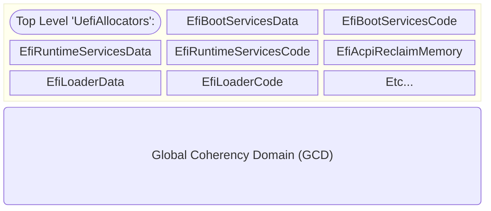
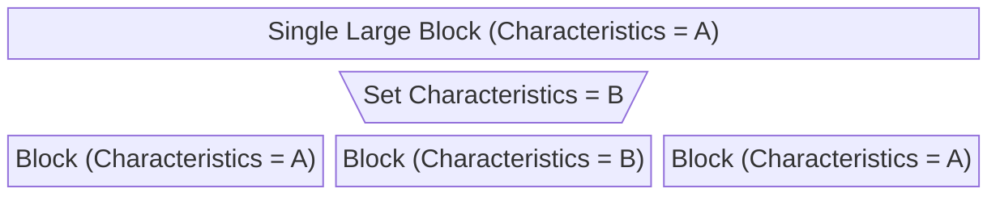

# Memory Management

This portion of the core is responsible for producing the capabilities described in [Section 7.2](https://uefi.org/specs/UEFI/2.10_A/07_Services_Boot_Services.html#memory-allocation-services)
of the UEFI specification to support memory allocation and tracking within the UEFI environment and to track and report
the system memory map. In addition to UEFI spec APIs, the memory management module also implements the
["Global Coherency Domain(GCD)"](https://uefi.org/specs/PI/1.9/V2_Services_DXE_Services.html#global-coherency-domain-services)
APIs from the Platform Initialization (PI) spec. The memory management subsystem also produces a Global System Allocator
implementation for Rust Heap allocations that is used throughout the rest of the core.

## General Architecture

The memory management architecture of the Rust DXE core is split into two main layers - an upper [`UefiAllocator`](memory_management.md#uefiallocator)
layer consisting of discrete allocators for each EFI memory type that are designed to service general heap allocations
in a performant manner, and a lower layer consisting of a single large (and relatively slower) allocator that tracks the
global system memory map at page-level granularity and enforces memory attributes (such as `Execute Protect`) on memory
ranges. This lower layer is called the [`GCD`](memory_management.md#global-coherency-domain-gcd) since it deals with
memory at the level of the overall global system memory map.



UEFI Spec APIs that track specific memory types such as [AllocatePool](https://uefi.org/specs/UEFI/2.10_A/07_Services_Boot_Services.html#efi-boot-services-allocatepool)
and [AllocatePages](https://uefi.org/specs/UEFI/2.10_A/07_Services_Boot_Services.html#efi-boot-services-allocatepages)
are typically implemented by the `UefiAllocator` layer (sometimes as just a passthru for tracking the memory type). APIs
that are more general such as [GetMemoryMap](https://uefi.org/specs/UEFI/2.10_A/07_Services_Boot_Services.html#efi-boot-services-getmemorymap)
as well as the [GCD APIs](https://uefi.org/specs/PI/1.9/V2_Services_DXE_Services.html#global-coherency-domain-services)
from the PI spec interact directly with the lower-layer GCD allocator.

## UefiAllocator

### UefiAllocator - General Architecture and Performance

The `UefiAllocator` impelements a general purpose [slab allocator](https://en.wikipedia.org/wiki/Slab_allocation) based
on the [Fixed-Size Block Allocator](https://os.phil-opp.com/allocator-designs/#fixed-size-block-allocator) that is
presented as part of the excellent [Writing an OS in Rust](https://os.phil-opp.com/) series by Philipp Oppermann.

Each allocator tracks "free" blocks of fixed sizes that are used to satisfy allocation requests. These lists are backed
up by a linked list allocator to satisfy allocations in the event that a fixed-sized block list doesn't exist (in the
case of very large allcoations) or does not have a free block.

This allows for a very efficient allocation procedure:

1. Round up requested allocation size to next block size.
2. Remove the first block from the corresponding "free-list" and return it.

If there are free blocks of the required size available this operation is constant-time. This should be the expected
normal case after the allocators have run for a while and have built up a set of free blocks.

Freeing a block (except for very large blocks) is also constant-time, since the procedure is the reverse of the above:

1. Round up the freed allocation size to the next block size.
2. Push the block on the front of the corresponding "free-list."

If the fixed-block size list corresponding to the requested block size is empty or if the requested size is larger than
any fixed-block size, then the allocation falls back to a linked-list based allocator. This is also typically constant-
time, since the first block in the linked-list backing allocator is larger than all the free-list block sizes (because
blocks are only freed back to the fallback allocator if they are larger than the all free-list block sizes). This means
that allocation typically consists of simply splitting the required block off the front of the first free block in the
list.

If the fallback linked-list allocator is _also_ not able to satisfy the request, then a new large block is fetched from
the GCD and inserted into the fallback linked-list allocator. This is a slower operation and its performance is a
function of how fragmented the GCD has become - on a typical boot this can extend to a search through hundreds of nodes.
This is a relatively rare event and the impact on overall allocator performance is negligible.

### Allocation "Buckets"

In order to ensure that the OS sees a generally stable memory map boot-to-boot, the UefiAllocator implementation can be
seeded with an initial "bucket" of memory that is statically assigned to the allocator at startup in a deterministic
fashion. This allows a platform integrator to specify (via means of a "Memory Type Info" HOB) a set of pre-determined
minimum sizes for each allocator. All memory associated with an `UefiAllocator` instance is reported to the OS as that
memory type (for example, all memory associated with the `EfiRuntimeServicesData` allocator in the GCD will be reported
to the OS as `EfiRuntimeServicesData`, even if it is not actually allocated). If the platform seeds the bucket with a
large enough initial allocation such that all memory requests of that type can be satisfied during boot without a
further call to the GCD for more memory, then all the memory of that type will be reported in a single contiguous block
to the OS that is stable from boot-to-boot. This facility is important for enabling certain use cases (such as
hibernate) where the OS assumes a stable boot-to-boot memory map.

### UefiAllocator Operations

The UefiAllocator supports the following operations:

* Creating a new allocator for arbitrary memory types. A subset of well-known allocators are provided by the core to
support UEFI spec standard memory types, but the spec also allows for arbitrary OEM-defined memory types. If a caller
makes an allocation request to a previously unused OEM-defined memory type, a new allocator instance is dynamically
instantiated to track memory for the new memory type.
* Retrieving the `EfiMemoryType` associated with the allocator. All allocations done with this allocator instance will
be of this type.
* Reserving pages for the allocator. This is used to seed the allocator with an initial [bucket](memory_management.md#allocation-buckets)
of memory.
* Ensuring that the allocator has capacity for satisfying a request (or set of requests) of a given size. This allows a
caller to prime the allocator with a single large GCD call if it knows in advance that it is going to be doing a lot of
allocations to avoid multiple potentially costly searches from the GCD (and avoid memory map fragmentation).
* APIs for allocate and free operations of arbitrary sizes, including `impl` for [`Allocator`](https://doc.rust-lang.org/std/alloc/trait.Allocator.html)
and [`GloballAlloc`](https://doc.rust-lang.org/std/alloc/trait.GlobalAlloc.html)
traits. See [Rust `Allocator` and `GlobalAlloc` Implementations](memory_management.md#rust-allocator-and-globalalloc-implementations)
below.
* APIs for allocating and freeing pages (as distinct from arbitrary sizes). These are pass-throughs to the
underlying [GCD operations](memory_management.md#gcd-operations) with some logic to handle preserving ownership for
allocation buckets.
* Expanding the allocator by making a call to the GCD to acquire more memory if the allocator does not have enough
memory to satisfy a request.
* Locking the allocator to support exclusive access for allocation (see [Concurrency](memory_management.md#concurrency)).

## Global Coherency Domain (GCD)

### GCD - General Architecture and Performance

The GCD tracks memory allocations at the system level to provide a global view of the memory map. In addition, this is
level at which memory attributes (such as `Execute Protect` or `Read Protect`) are tracked.

The Rust DXE core implements the GCD using a Red-Black Tree to track the memory regions within the GCD. This gives the
best expected performance when the number of elements in the GCD is expected to be large. There are alternative storage
implementations in the `uefi_collections` crate within the core that implement the same interface that provide different
performance characteristics (which may be desirable if different assumptions are used - for example if the number of map
entries is expected to be small), but the RBT-based implementation is expected to give the best performance in the
general case.

### GCD Data Model

The GCD tracks both memory address space and I/O address space. Each node in the data structure tracks a region of the
address space and includes characteristics such as the memory or I/O type of the region, capabilities and attributes of
the region, as well as ownership information. Regions of the space can be split or merged as appropriate to maintain a
consistent view of the address space.

A sample memory GCD might look like the following:

```text
GCDMemType Range                             Capabilities     Attributes       ImageHandle      DeviceHandle
========== ================================= ================ ================ ================ ================
NonExist   0000000000000000-00000000000fffff 0000000000000000 0000000000000000 0x00000000000000 0x00000000000000
MMIO       0000000000100000-000000004fffffff c700000000027001 0000000000000001 0x00000000000000 0x00000000000000
NonExist   0000000050000000-0000000053ffffff 0000000000000000 0000000000000000 0x00000000000000 0x00000000000000
MMIO       0000000054000000-000000007fffffff c700000000027001 0000000000000001 0x00000000000000 0x00000000000000
SystemMem  0000000080000000-0000000080000fff 800000000002700f 0000000000002008 0x00000000000000 0x00000000000000
SystemMem  0000000080001000-0000000080002fff 800000000002700f 0000000000004008 0x00000000000002 0x00000000000000
SystemMem  0000000080003000-0000000081805fff 800000000002700f 0000000000002008 0x00000000000000 0x00000000000000
```

### GCD Operations

The GCD supports the following operations:

* Adding, Removing, and Allocating and Freeing regions within the address space. The semantics for these operations
largely follow the Platform Initialization spec [APIs](https://uefi.org/specs/PI/1.9/V2_Services_DXE_Services.html#gcd-memory-resources)
for manipulating address spaces.
* Configuring the capabilities and attributes of the memory space. The GCD uses CPU memory management hardware to
enforce these attributes where supported. See [Paging](cpu.md#paging-implementation) for details on how this hardware is
configured.
* Retrieving the current address space map as a list of descriptors containing details about each memory region.
* Locking the memory space to disallow modifications to the GCD. This allows the GCD to be protected in certain
sensitive scenarios (such as during [Exit Boot Services](memory_management.md#exit-boot-services-handlers)) where
modifications to the GCD are not permitted.
* Obtaining a locked instance of the GCD instance to allow for concurrency-safe modification of the memory map. (see
[Concurrency](memory_management.md#concurrency)).

The internal GCD implementation will ensure that a consistent map is maintained as various operations are performed to
transform the memory space. In general, all modifications of the GCD can result in adding, removing, splitting, or
merging GCD data nodes within the GCD data structure. For example, if some characteristic (such as attributes,
capabilities, memory type, etc.) is modified on a region of memory that is within a larger block of memory, that will
result in a split of the larger block into smaller blocks so that the region with new characteristic is carved out of
the larger block:



Similarly, if characteristics are modified on adjacent regions of memory such that the blocks are identical except for
the start and end of the address range, they will be merged into a single larger block:


## Concurrency

UefiAllocator and GCD operations require taking a lock on the associated data structure to prevent concurrent
modifications to internal allocation tracking structures by operations taking place at different TPL levels (for
example, allocating memory in an event callback that interrupts a lower TPL). This is accomplished by using a
[`TplMutex`](synchronization.md#tplmutex) that switches to the highest TPL level (uninterruptible) before executing the
requested operation. One consequence of this is that care must be taken in the memory subsystem implementation that
no explicit allocations or [implicit Rust heap allocations](memory_management.md#rust-allocator-and-globalalloc-implementations)
occur in the course of servicing an allocation.

In general, the entire memory management subsystem is designed to avoid implicit allocations while servicing allocation
calls to avoid re-entrancy. If an attempt is made to re-acquire the lock (indicating an unexpected re-entrancy bug has
occurred) then a panic will be generated.

## Rust `Allocator` and `GlobalAlloc` Implementations

In addition to producing the memory allocation APIs required by the UEFI spec, the memory allocation subsystem also
produces implementations of the [`Allocator`](https://doc.rust-lang.org/std/alloc/trait.Allocator.html) and
[`GloballAlloc`](https://doc.rust-lang.org/std/alloc/trait.GlobalAlloc.html) traits.

These implementations are used within the core for two purposes:

1. The `GlobalAlloc` implementation allows one of the `UefiAllocator` instances to be designated as the Rust Global
Allocator. This permits use of the standard Rust [`alloc`](https://doc.rust-lang.org/alloc) smart pointers (e.g. [Box](https://doc.rust-lang.org/alloc/boxed/index.html))
and collections (e.g. [Vec](https://doc.rust-lang.org/std/vec/struct.Vec.html), [BTreeMap](https://doc.rust-lang.org/std/collections/struct.BTreeMap.html)).
The `EfiBootServicesData` UefiAllocator instance is designated as the default global allocator for the Rust DXE core.
2. UEFI requires being able to manage many different memory regions with different characteristics. As such, it may
require heap allocations that are not in the default `EfiBootServicesData` allocator. For example, the EFI System Tables
need to be allocated in `EfiRuntimeServicesData`. To facilitate this in a natural way, the [`Allocator`](https://doc.rust-lang.org/std/alloc/trait.Allocator.html)
is implemented on all the `UefiAllocators`. This is a [nightly-only experimental API](https://github.com/rust-lang/rust/issues/32838),
but aligning on this implementation and tracking it as it stabilizes provides a natural way to handle multiple
allocators in a manner consistent with the design point that the broader Rust community is working towards.

An example of how the `Allocator` trait can be used in the core to allocate memory in a different region:

```rust
let mut table = EfiRuntimeServicesTable {
  runtime_services: Box::new_in(rt, &EFI_RUNTIME_SERVICES_DATA_ALLOCATOR)
};
```

## Exit Boot Services Handlers

Platforms should ensure that when handling an `EXIT_BOOT_SERVICES` signal (and `PRE_EXIT_BOOT_SERVICES_SIGNAL`),
they do not change the memory map. This means allocating and freeing are disallowed once
`EFI_BOOT_SERVICES.ExitBootServices()` (`exit_boot_services()`) is invoked.

In the Rust DXE core in release mode, allocating and freeing within the GCD (which changes the memory map and its key)
will return an error that can be handled by the corresponding driver.
In debug builds, any changes to the memory map following `exit_boot_services` will panic due to an assertion.
