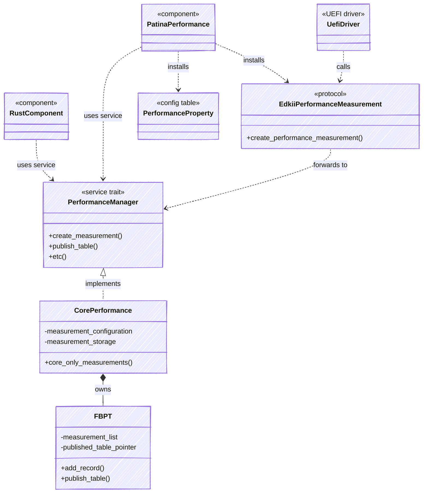

# Performance

The performance subsystem records firmware boot performance measurements and publishes them for
consumption by the operating system through the ACPI Firmware Performance Data Table (FPDT). The
records themselves live in the Firmware Basic Boot Performance Table (FBPT), which the DXE Core
builds during boot and the `patina_performance` component publishes at End of DXE.

This document details the performance system is implemented accross it's multiple crates, modules,
and implementations.

## Layers

- **SDK** - Shared types and the service contract. It defines the interfaces and common structures used by all layers.
- **DXE Core** - The measurement engine. `CorePerformance` implements `PerformanceManager` and owns all
  global state and will process new performance records. This is implemented in the core to ensure early
  availability of performance data.
- **Component** - The DXE integration and interoperability layer. It consumes the service and, at boot,
  publishes the FBPT for the ACPI FPDT, installs the `EdkiiPerformanceMeasurement` protocol for C drivers,
  installs the `PerformanceProperty` configuration table, and optionally merges Management Mode (MM) performance
  records.
- **UEFI** - Traditional UEFI drivers, boot loaders, and protocols. These will consume the traditional UEFI
  or EDKII interfaces.

## Interfaces

`CorePerformance` is the single implementation of the `PerformanceManager` service. All other
external callers reach the implementation through one of three interfaces:

1. `PerformanceManager` service (used by components)
2. `EdkiiPerformanceMeasurement` protocol (used by drivers)
3. Published ACPI tables (read by applications & OS)

The core will be responsible for exposing #1, while the component will expose #2 and #3. The class diagram
below demonstrates this.



## Configuration

Whether performance measurement is enabled is decided by the DXE Core. The Core resolves a `PerformanceConfig` and,
when enabled, registers the `PerformanceManager` service. When disabled the service is absent, so the
`patina_performance` component's service dependency is unsatisfied and it never dispatches.

```rust
pub struct PerformanceConfig {
    pub enabled: u8,               // ENABLED / DISABLED
    pub enabled_measurements: u32, // bitmask of `Measurement`
}
```

The configuration is resolved in priority order:

1. A `PerformanceConfig` guided HOB produced before the DXE Core runs.
2. Otherwise, the platform's `PlatformInfo::DEFAULT_PERFORMANCE_CONFIG`. If not overridden, this will
   default to disabled.

`enabled_measurements` is a bitmask of the `Measurement` values that gate the Core's boot
instrumentation: `StartImage`, `LoadImage`, `DriverBindingSupport`, `DriverBindingStart`, and
`DriverBindingStop`. Measurements requested through the service or the EDK II protocol are recorded
whenever performance is enabled.
