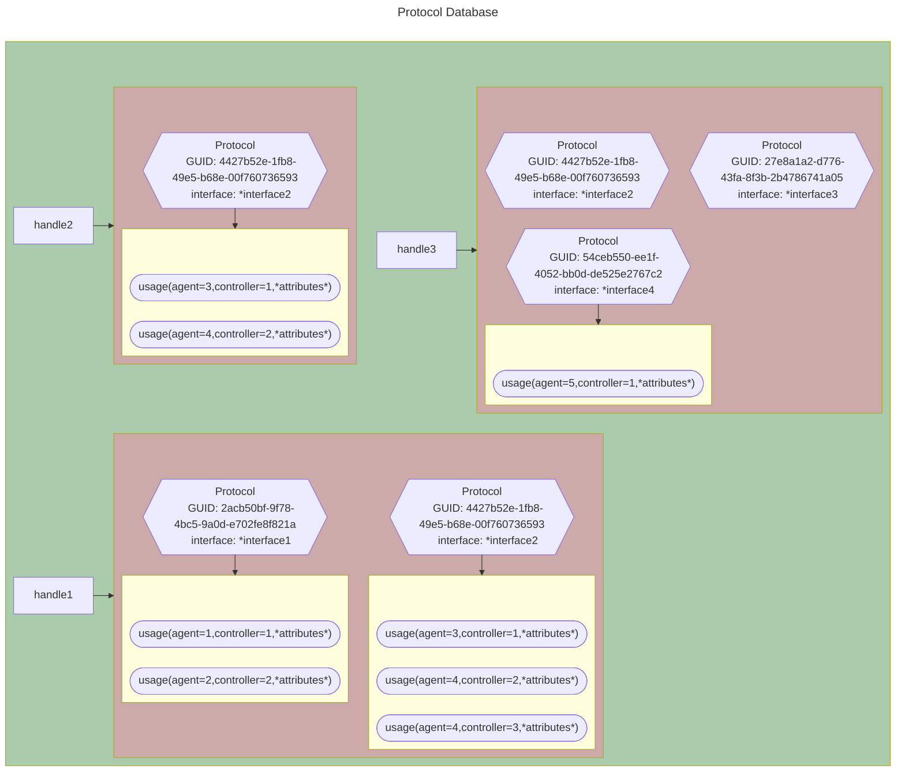

# Protocol Database

This portion of the core is concerned with producing UEFI protocol handler services as described in
[Section 7.3](https://uefi.org/specs/UEFI/2.10_A/07_Services_Boot_Services.html#protocol-handler-services) of the UEFI
specification. This section assumes basic familiarity with the protocol services as described in the UEFI Spec, and
focuses on how they are implemented in the Patina DXE Core.

The main implementation for protocol services in the Patina DXE Core resides in the protocol database object implemented
by the `patina_dxe_core` crate. The protocol database implemented by that crate is used to implement the UEFI protocol
handler services by the main Patina DXE Core protocol.rs module.

## High-level Architectural Elements in the Protocol Database

### Protocols

The fundamental data unit for the protocol database is the `Protocol`:

>In the abstract, a protocol consists of a 128-bit globally unique identifier (GUID) and a Protocol Interface structure.
The structure contains the functions and instance data that are used to access a device.[^reference]

[^reference]: [UEFI Spec Section 7.3](https://uefi.org/specs/UEFI/2.10_A/07_Services_Boot_Services.html#protocol-handler-services)

### Handles

`Protocol` instances are attached to a `handle`. A given `handle` may have many `protocol` instances installed on it,
but each `protocol` instance must be unique - a `handle` may not have two instances of a `protocol` that have the same
GUID. A `handle` can be conceptually thought of as representing a "device" - such as a PCIe endpoint.  It can also
represent a software abstraction. For example, the UEFI ConSplitter is an abstraction that supports multiplexing to
multiple consoles - its handle can be thought of as a "device" handle, even though it isn't an actual hardware device.
Another example of an abstract handle is the `image_handle` that represents a loaded image (such as a driver or
application).

### Agents

The protocol database also tracks the usage of `protocol` instances by `agents`. An `agent` consists of an
`image_handle` that identifies a driver, and a `controller_handle` that represents a device that the driver is managing.
A driver may manage more than one controller, and will have an `agent` (i.e. a `image_handle`/`controller_handle` pair)
for each controller it manages. For each agent that is using a protocol, the database tracks how the agent is using the
protocol. This allows the enforcement of certain constraints on protocol usage which are used to implement features such
as drivers being able to guarantee exclusive usage of a given protocol.

### Protocol Installation Notifications

In addition to tracking `protocol` instances, the database also allows for drivers to register for a notification
callback on installation of particular protocol GUID and return the handles associated with freshly installed `protocol`
instances. The database implements logic to track these registrations and the corresponding list of newly installed
handles.

## Protocol Database Organization

This section describes the underlying data objects and data structure of the protocol database.

### Handle Objects

The protocol database generates opaque `handle` values for any new protocols installed in the protocol database. For
compatibility with UEFI `EFI_HANDLE` type, these `handles` are `usize`. `Handles` have two interesting properties:

1. They are opaque and arbitrary values of `usize` - with the exception of some "well-known" handles (see next section).
While it is possible to guess the value of a newly-created handle beforehand, handles are deliberately scrambled with a
hash function.

2. They are guaranteed to be unique. The protocol database implementation will ensure that two identical handle values
will not simultaneously exist in the database. It is possible, (though very unlikely), that a handle value could be
"re-used" after being deleted.

```admonish title="Why Hashed?", collapsible=true
This is primarily done as a debug aid to ensure that no users of the Patina DXE Core are relying on invalid assumptions
that `EFI_HANDLE` is a pointer. The UEFI specification forbids this, but in the C EDK2 reference implementation,
`EFI_HANDLE` is internally implemented as a pointer type, so external modules could (in theory) attempt to obtain access
to the private `EFI_HANDLE` structure. Treating `EFI_HANDLE` from the Patina DXE Core as a pointer and de-referencing
it would result in a bad memory access, and ensuring that handles are at a wide range of values makes it more likely
that such behavior would be caught by memory protections and fault. It also makes it more obvious on inspection that
they are _not_ pointers.
```

### Well-Known Handles

The protocol database supports a number of "well-known" handles that permit commonly-used handles to be used without
needing to execute a lookup in the protocol database to determine their value. The well defined handles are as follows:

| Handle | Purpose                         |
|--------|---------------------------------|
| 0      | Invalid Handle                  |
| 1      | DXE Core Handle                 |
| 2      | Reserved Memory Allocator       |
| 3      | Loader Code Allocator           |
| 4      | Loader Data Allocator           |
| 5      | Boot Services Code Allocator    |
| 6      | Boot Services Data Allocator    |
| 7      | Runtime Services Code Allocator |
| 8      | Runtime Services Data Allocator |
| 9      | ACPI Reclaim Allocator          |
| 10     | ACPI NVS Allocator              |

Each well-know handle has a marker protocol instance installed on it to ensure it stays resident in the protocol
database (this is because a handle with no protocols on it will be deleted).

### Protocol Instances

A `protocol` instance consists of a raw `interface` pointer that points to the protocol interface structure. This
pointer may be null in situations where the `protocol` is used as a marker rather than providing an interface. The
`protocol` instance also has a `usage` list which contains `open protocol information` objects describing the current
tracked usages of the protocol by various drivers and the attributes associated with each `usage`. `Usages` are
described in greater detail in the next section.

### Usages (Open Protocol Information)

A `usage` or `open protocol information` structure is used to track what `agents` are presently using a given protocol
instance and how they are using it.  A `usage` has the following information:

| Data       | Purpose                                                                                     |
|------------|---------------------------------------------------------------------------------------------|
| agent      | tracks the `image_handle` of the driver that is using the protocol                          |
| controller | tracks the `controller_handle` of the controller associated with this usage of the protocol |
| attributes | tracks the attributes of the usage (`exclusive`, `by_driver`, etc.)                         |
| open_count | how many times this `usage` has been opened (if the attribute permits multiple openings)    |

Only certain types of `usages` are permitted by the UEFI spec[^permitted_attributes], and the protocol database will
enforce proper attribute usage; attempts to create usages that are not permitted when opening an event will result in an
error.

[^permitted_attributes]: [EFI_BOOT_SERVICES.OpenProtocol()](https://uefi.org/specs/UEFI/2.10_A/07_Services_Boot_Services.html#efi-boot-services-openprotocol).

### Protocol Data Relationships

At the top level, the protocol database is organized as set of `handles` elements indexed by the `handle` value, each of
which contain a set of `protocol` elements, indexed by the `protocol` GUID, each of which in turn contains a vector of
active `usages` of the protocol:



## Protocol Database Operations

This section describes the operations supported by the protocol database.

### Initialization

The database must be initialized with well-known handles after creation. This is done by invoking the `init_protocol_db`
function on the event database. Once the well-known handles are installed, hashing is enabled for subsequent handle
creation (see [Handle Objects](protocol_database.md#handle-objects)).

### Protocol Installation

Call the `install_protocol_interface` function to install protocol instances into the protocol database on an existing
handle or on a freshly created handle. This function takes an optional `handle` argument as well as required `guid` and
`interface` arguments. If a handle is provided, the new protocol is installed on that handle, otherwise a new handle is
created and the protocol is installed on the new handle. The behavior of this function closely matches the semantics of
[EFI_BOOT_SERVICES.InstallProtocolInterface()](https://uefi.org/specs/UEFI/2.10_A/07_Services_Boot_Services.html#efi-boot-services-installprotocolinterface).

If the installation succeeds, a vector of `ProtocolNotify` objects is returned, and these objects contain the `events`
that should be signalled to notify registered listeners that a new protocol has arrived (see:
[Signaling an Event](events.md#signaling-an-event)). The protocol database manages the set of registered listeners and
constructs the vector so that only those events that match a registered notification listener matching the installed
`guid` are returned.

### Protocol Removal

Remove protocol instances from the protocol database by invoking the `uninstall_protocol_interface` function. This takes
 `handle`, `guid`, and `interface` arguments. The database checks for the existence of the protocol on the given
 `handle` identified by the given (`guid`,`interface`) pair, and if found, attempt to remove it. If the `usages`
 associated with a discovered protocol instance indicate that it is `in use`, then `ACCESS_DENIED` status is returned.

```admonish important
If the last protocol interface on a handle is removed, then the handle is removed from the protocol database and is no
longer valid.
```

The behavior of this function closely matches the semantics of
[EFI_BOOT_SERVICES.UninstallProtocolInterface()](https://uefi.org/specs/UEFI/2.10_A/07_Services_Boot_Services.html#efi-boot-services-uninstallprotocolinterface).

```admonish note
The EFI 1.10 behavior extension of calling
[EFI_BOOT_SERVICES.DisconnectController()](https://uefi.org/specs/UEFI/2.10_A/07_Services_Boot_Services.html#efi-boot-services-disconnectcontroller)
to attempt to remove `usages` that prevent the protocol from being closed is implemented outside the protocol database
in the Patina DXE Core protocol module (see:
[Patina DXE Core Protocol Module::Uninstall Protocol Interface](protocol_database.md#uninstall-protocol-interface)).
```

### Retrieving and Validating Handles

Retrieve a list of all `handles` that have a specified `protocol` instance from the database by invoking the
`locate_handles` function. This takes an optional `guid` parameter. If not specified, then all handles in the database
are returned. If specified, then only handles containing a `protocol` instance with the matching GUID are returned.

Check whether a `handle` is valid by invoking the `validate_handle` function. This function will return `Ok` if the
`handle` is a valid handle in the database, and `Err` otherwise.

### Retrieving Protocol Instances

In many cases, there is only a single instance of a protocol in a system, or the calling code does not care which
instance is returned. In this case, use the `locate_protocol` function to retrieve a `protocol` instance. This takes a
`protocol` GUID parameter, and returns an interface pointer associated with the the specified `protocol` from the
database. If more than one handle has a matching `protocol` instance, then no guarantees are made about which `handle`
the `protocol` interface pointer comes from, nor are any guarantees that the same interface pointer would be returned
from different calls to `locate_protocol` for the same `protocol`.

In other cases, it is desirable to locate an instance of a `protocol` associated with a particular `handle`. Call the
`get_interface_for_handle` function to retrive the desired instance. This function takes as input a `handle` parameter
as well as a `protocol` parameter that specifies the GUID for the desired protocol. If the specified `handle` exists in
the database and has an instance of `protocol` associated with it, the interface pointer for that instance is returned.
[^locate_protocol]

To retrieve all protocol instances associated with a particular handle, call `get_protocols_on_handle` and specify the
`handle` in question. This function will return a list of all the protocol `guid` values for protocol instances
currently installed on the specified handle.[^protocols_per_handle]

[^locate_protocol]: [EFI_BOOT_SERVICE.LocateProtocol()](https://uefi.org/specs/UEFI/2.10_A/07_Services_Boot_Services.html#efi-boot-services-locateprotocol)
[^protocols_per_handle]: [EFI_BOOT_SERVICE.ProtocolsPerHandle()](https://uefi.org/specs/UEFI/2.10_A/07_Services_Boot_Services.html#efi-boot-services-protocolsperhandle)

### Managing Protocol Usages

To add a `protocol` usage, call the `add_protocol_usage` function and supply the `handle`, `protocol`, `agent_handle`
(optional), `controller_handle` (optional) and `attrbiutes` arguments. This will apply the corresponding usage to the
protocol instance on the given handle if it exists. See
[EFI_BOOT_SERVICE.OpenProtocol()](https://uefi.org/specs/UEFI/2.10_A/07_Services_Boot_Services.html#efi-boot-services-openprotocol)
for a description of the usage attributes and the constraints on their usage. The protocol database will enforce these
constraints.

To remove a `protocol` usage, call the `remove_protocol_usage` function and supply the `handle`, `protocol`,
`agent_handle` (optional), and `controller_handle` (optional) arguments. This will remove the corresponding usage from
the protocol instance on the given handle if it exists[^close_protocol].

```admonish note
Some of the behavior specified by the UEFI spec for OpenProtocol and CloseProtocol require access to driver model APIs
that are not available to the protocol database crate. These behaviors are implemented outside the protocol database in
the Patina DXE Core protocol module (see:
[Patina DXE Core Protocol Module::Open Protocol Interface](protocol_database.md#open-protocol-interface)).
```

To query what usages are active on a protocol for a given `handle`, call the `get_open_protocol_information` and specify
the `handle`  for which to retrieve the usages. The function will return a list of `OpenProtocolInformation` structures
corresponding to the active usages indexed by the `protocol` each ie associated with. To query the usages for a
particular `protocol`, call `get_open_protocol_information_by_protocol` instead. This function takes an additional
`protocol` parameter and returns the list of `OpenProtocolInformation` structures corresponding to only that protocol
[^open_protocol_information].

One special use case for usages is retriveing the set of "child handles" for a given "parent handle". A full discussion
of where this is useful is deferred to documentation on the UEFI Driver Model[^driver_model]. In terms of the protocol
database mechanics, what is required is the ability to return the list of `controller_handles` that are part of a
`usage` on the parent handle where the `usage` has an attribute of `BY_CHILD_HANDLE`. To retrieve such a list, call
`get_child_handles` on the protocol database and specify the desired parent handle; the function will return all the
"child" `controller_handles`.

[^close_protocol]: [EFI_BOOT_SERVICE.CloseProtocol()](https://uefi.org/specs/UEFI/2.10_A/07_Services_Boot_Services.html#efi-boot-services-closeprotocol).
[^open_protocol_information]: [EFI_BOOT_SERVICES.OpenProtocolInformation()](https://uefi.org/specs/UEFI/2.10_A/07_Services_Boot_Services.html#efi-boot-services-openprotocolinformation).
[^driver_model]: [UEFI Driver Model](https://uefi.org/specs/UEFI/2.10_A/02_Overview.html#uefi-driver-model) - and in
particular [Bus Drivers](https://uefi.org/specs/UEFI/2.10_A/02_Overview.html#bus-drivers)

### Registering for Protocol Notifications

To register for notification on protocol installation, call the `register_protocol_notify` function and pass the
`protocol` GUID and an `event` to be signaled. The protocol database will track registered listeners, and when a new
protocol is installed that matches the `protocol` GUID that was registered is installed via
[`install_protocol`](protocol_database.md#protocol-installation),  `install_protocol` will return the corresponding
event that can be signalled to indicate that the protocol has been installed. Any number of separate registrations may
be added to the protocol database, and all events matching a given installation event will be returned whenever an
installation occurs. `register_protocol_notify` will return a `registration key` which can be used to identify the
registration. [^register_protocol_notify]

```admonish note
The protocol database implementation does not actually signal the `event` when a protocol installation occurs when a
registration is matched. Instead, the `event` is returned to the caller. This allows the protocol database to avoid
taking a direct dependency on the event subsystem. The event will be signaled by the Patina DXE Core
[protocol module](protocol_database.md#protocol-notification) as needed.
```

To unregister a protocol notification, call the `unregister_protocol_notify_events` function and pass a list of events
that correspond to the registered notifies to remove. The protocol database will remove any registrations that match the
corresponding
event id.

If a registration has been created for a `protocol` instance, the protocol database will track all new instances of that
protocol as they are installed. To retrieve new protocols (in the order they are added), call
`next_handle_for_registration` and pass the `registration key` that was returned from `register_protocol_notify`. The
call will return the next newly installed `protocol` instance, or `None` if there are no fresh protocol installations.
This can be used to iterate through any newly created handles and is particularly intended for use in registration event
notification functions.[^locate_protocol_notify]

[^register_protocol_notify]: [EFI_BOOT_SERVICE.RegisterProtocolNotify()](https://uefi.org/specs/UEFI/2.10_A/07_Services_Boot_Services.html#efi-boot-services-registerprotocolnotify)
[^locate_protocol_notify]: [EFI_BOOT_SERVICE.LocateProtocol()](https://uefi.org/specs/UEFI/2.10_A/07_Services_Boot_Services.html#efi-boot-services-locateprotocol),
in particular, see the description of the `Registration` parameter.

## Patina DXE Core Protocol Module

The protocol database described above is consumed by the protocol module of the Patina DXE Core to provide the actual UEFI
Spec compliant protocol services. The Patina DXE Core protocol module translates the UEFI Boot Services Protocol
API[^boot_services_protocol_api] calls into interactions with the protocol database, and handles elements of the
implementation that require interaction with other Patina DXE Core subsystems such as [eventing](events.md) or
[driver model](driver_model.md).

[^boot_services_protocol_api]: UEFI Spec [Protocol Handler Services](https://uefi.org/specs/UEFI/2.10_A/07_Services_Boot_Services.html#protocol-handler-services)

```admonish note
In the protocol.rs module, the naming convention for `pub` functions intended for use by the core is to prefix them with
`core_`. Many of the functions described below are for implementing FFI APIs for UEFI spec compliance. These are not
usually designed for calling within the core. If calling from elsewhere in the core is required, it is often best to
create a Rust-friendly version of the API and prefix the name with `core_` to signify that it is for core usage.
```

### Install Protocol Interface

There are three functions that provide protocol installation services:

* `core_install_protocol_interface` - main business logic, intended to be used as the main interface for any calls
within the Patina DXE Core.
* `install_protocol_interface` - implements the UEFI Spec
[EFI_BOOT_SERVICES.InstallProtocolInterface()](https://uefi.org/specs/UEFI/2.10_A/07_Services_Boot_Services.html#efi-boot-services-installprotocolinterface)
API. A simple wrapper around `core_install_protocol_interface`. Not intended for direct usage in the core, call
 `core_install_protocol_interface` instead.
* `install_multiple_protocol_interfaces` - implements the UEFI Spec
[EFI_BOOT_SERVICES.InstallMultipleProtocolInterfaces()](https://uefi.org/specs/UEFI/2.10_A/07_Services_Boot_Services.html#efi-boot-services-installmultipleprotocolinterfaces)
API. A wrapper around `install_protocol_interface` which also calls `uninstall_protocol_interface` as needed in error
scenarios.

The `core_install_protocol_interface` function will do the following:

1. Install the protocol interface into the protocol database (see
[Protocol Installation](protocol_database.md#protocol-installation)). The protocol database will return the list of
events for notification registration (if any).
2. [Signal Event](events.md#signaling-an-event) for each of the events returned.
3. If signaling any of the events returns an `INVALID_PARAMETER` error, it means that the event has been closed. If any
such events exist, then the corresponding registration is removed from the protocol database (see
[Registering for Protocol Notifications](protocol_database.md#registering-for-protocol-notifications)).

The `install_protocol_interface` function is a simple wrapper around `core_install_protocol_interface` that handles the
raw pointers required the UEFI SPEC API.

The `install_multiple_protocol_interfaces` function installs a NULL-terminated list of protocols into the database. The
main difference between this routine and simply calling `install_protocol_interface` in a loop is that this function
handles uninstalling any previously installed protocols (from the same call) if one of the protocol installation
operations fails. This attempts to ensure that either all the given protocols are installed, or none of them are.

### Uninstall Protocol Interface

There are two functions that provide protocol removal from the protocol database:

* `uninstall_protocol_interface` - implements the UEFI Spec
[EFI_BOOT_SERVICES.UninstallProtocolInterface()](https://uefi.org/specs/UEFI/2.10_A/07_Services_Boot_Services.html#efi-boot-services-uninstallprotocolinterface)
API.
* `uninstall_multiple_protocol_interfaces` - implements the UEFI Spec
[EFI_BOOT_SERVICES.UninstallMultipleProtocolInterfaces()](https://uefi.org/specs/UEFI/2.10_A/07_Services_Boot_Services.html#efi-boot-services-uninstallmultipleprotocolinterfaces)
API.

The `uninstall_protocol_interface` function will do the following:

1. Retrieve a list of all `usages` on the `handle` specified in the call.
2. If any `usages` indicate that the protocol is in use `BY_DRIVER`, then
[`core_disconnect_controller`](driver_model.md#disconnecting-a-controller) is called to attempt to release the protocol
usage.
3. If any `usages` indicate that the protocol is opened `BY_HANDLE_PROTOCOL`, `GET_PROTOCOL`, or `TEST_PROTOCOL`, those
usages are removed.
4. If any `usages` remain for the specified `protocol` after the above steps, then the protocol interface is not removed
from the protocol database and `ACCESS_DENIED` status is returned. In addition, in this case any drivers that were
disconnected in step 2 above are re-connected by calling
[`core_connect_controller`](driver_model.md#connecting-a-controller).
5. Otherwise, if no `usages` remain on the handle for the specified `protocol` after the above steps, then the handle is
removed from the protocol database (see: [Protocol Removal](protocol_database.md#protocol-removal)).

The `uninstall_multiple_protocol_interfaces` function removes a NULL-terminated list of protocols from the database. The
main difference between this routine and simply calling `uninstall_protocol_interface` in a loop is that this function
handles re-installing any previously removed protocols (from the same call) if one of the protocol removal operations
fail. This attempts to ensure that either all the given protocols are removed, or none of them are.

```admonish note
There is presently no `core_uninstall_protocol_interface` because no elements of the core require it outside of the the
protocol module. Should a general requirement for this API materialize in the core, a `core_uninstall_protocol` function
should be added with Rust-style semantics instead of calling `uninstall_protocol_interface` which is primarily intended
for FFI usage.
```

### Reinstall Protocol Interface

The `reinstall_protocol_interface` function replaces an `old` protocol interface on a handle with a `new` one. It may
also be called with the same interface for `old` and `new` which will\ trigger notifications for a registration on a
protocol interface without actually modifying the interface. This implements the UEFI Spec
[EFI_BOOT_SERVICES.ReinstallProtocolInterface()](https://uefi.org/specs/UEFI/2.10_A/07_Services_Boot_Services.html#efi-boot-services-reinstallprotocolinterface).

The there are two main difference between calling this function and simply calling back-to-back
`uninstall_protocol_interface`/`install_protocol_interface`:

* If the given interface is the only protocol interface on the `handle`, then calling `uninstall_protocol_interface` on
it would result in the `handle` being removed from the database, and the subsequent `install_protocol_interface` would
fail because the handle would no longer exist. This function avoids that issue.
* `uninstall_protocol_interface` will disconnect any drivers that have the protocol open `BY_DRIVER` (see
[Uninstall Protocol Interface](protocol_database.md#uninstall-protocol-interface)). This function will call
[`core_connect_controller`](driver_model.md#connecting-a-controller) on the `handle` so that any disconnected drivers
are re-connected to the controller.

### Protocol Notification

The `register_protocol_notify` function registers an event to be signalled on installation of a new protocol. This
function implements the
[EFI_BOOT_SERVICES.RegisterProtocolNotify()](https://uefi.org/specs/UEFI/2.10_A/07_Services_Boot_Services.html#efi-boot-services-registerprotocolnotify)
API. It is a simple wrapper around the protocol database
[`register_protocol_notify`](protocol_database.md#registering-for-protocol-notifications)
function. The function returns a registration key that is used as an input to
[`locate_handle`](protocol_database.md#locating-a-handle) or
[`locate_protocol`](protocol_database.md#locating-a-protocol).

### Locating a Handle

The `locate_handle` function returns a list of handles that support a specified protocol. This function implements the
[EFI_BOOT_SERVICES.LocateHandle()](https://uefi.org/specs/UEFI/2.10_A/07_Services_Boot_Services.html#efi-boot-services-locatehandle)
API.

There are several different `search_type` options that can be specified which control the behavior of the function:

* `AllHandles` - returns all the handles in the database. For this search type, the `protocol` and `search_key`
arguments are ignored.
* `ByRegisterNotify` - returns the next `handle` that has a fresh instance of a protocol installed on it for the given
`search_key`. See ([Registering for Protocol Notifications](protocol_database.md#registering-for-protocol-notifications)
and [Protocol Notification](protocol_database.md#protocol-notification)). Note that only one protocol instance at a time
is returned for this search type.
`ByProtocol` - Returns all `handles` in the database that have a protocol instance of the type specified in the
`protocol` argument.

The related `locate_handle_buffer` function implements the same logic as `locate_handle`, except that the memory to
contain the resulting handle list is pool-allocated by `locate_handle_buffer` (to be freed by caller), rather than
taking a caller-allocated buffer like `locate_handle` does. `locate_handle_buffer` implements the
[EFI_BOOT_SERVICES.LocateHandleBuffer()](https://uefi.org/specs/UEFI/2.10_A/07_Services_Boot_Services.html#efi-boot-services-locatehandlebuffer)
function.

A specialized form of handle location is provided by the `locate_device_path` function, which implements the
[EFI_BOOT_SERVICES.LocateDevicePath()](https://uefi.org/specs/UEFI/2.10_A/07_Services_Boot_Services.html#efi-boot-services-locatedevicepath).
Call this function to locate the handle to a decvice on the specified `device_path` that supports the specified
`protocol`. This is useful in scenarios where a logical child driver needs to invoke services on a logical parent
driver.

### Locating a Protocol

The `handle_protocol` retrieves a particular `protocol` interface from a `particular` handle. This function implements
the [EFI_BOOT_SERVICES.HandleProtocol()](https://uefi.org/specs/UEFI/2.10_A/07_Services_Boot_Services.html#efi-boot-services-handleprotocol)
API. Note that while this function is available for historical purposes, new applications and drivers should prefer the
[Open Protocol Interface](protocol_database.md#open-protocol-interface) instead.

The `protocols_per_handle` function queries the list of protocols that are supported on the specified `handle`. This
function implements the
[EFI_BOOT_SERVICES.ProtocolsPerHandle()](https://uefi.org/specs/UEFI/2.10_A/07_Services_Boot_Services.html#efi-boot-services-protocolsperhandle)
API. Note that this function a) returns a list of GUIDs, but not the associated interface pointers, and b) creates a
pool-allocated buffer to hold the result that the caller must free.

The `locate_protocol` function is used in simple scenarios where only a single instance of a the protocol is expected to
exist, it does not matter which of multiple instances of a protocol is returned, or the requirement is to return the
next protocol that triggered a notification event for a given protocol. This function implements the
[EFI_BOOT_SERVICES.LocateProtocol()](https://uefi.org/specs/UEFI/2.10_A/07_Services_Boot_Services.html#efi-boot-services-locateprotocol)
API.

### Open Protocol Interface

The `open_protocol` function queries the protocol database for a given `protocol` on a given `handle`, and if present,
adds a `usage` (see: [Managing Protocol Usages](protocol_database.md#managing-protocol-usages)) for the protocol
instance according to the `attributes` specified to the call. This function implements the
[EFI_BOOT_SERVICE.OpenProtocol()](https://uefi.org/specs/UEFI/2.10_A/07_Services_Boot_Services.html#efi-boot-services-openprotocol)
API.

There are a number of spec-defined interactions between different agents opening the protocol - for example, an agent
may request exclusive access to a protocol instance on a given handle. These rules are largely enforced by the protocol
database implementation, the `add_protocol_usage` will return an appropriate error if an attempt is made to add a usage
that would cause a conflict. Interactions with the driver model are implemented in the protocol module since the
database does not have access to these APIs.

The `open_protocol` function executes the following logic:

1. Validate inputs: `protocol` and `interface` pointers must not be null (null `interface` is permitted for
`TEST_PROTOCOL` attribute), `agent` and `controller` handles must be valid.
2. If the `EXCLUSIVE` flag is set in the attributes, retrive all current usages for the `handle` and if any of those
usages indicate that the `protocol` is open `BY_DRIVER`, then execute
[`core_disconnect_controller`](driver_model.md#disconnecting-a-controller) to close the protocol usage.
3. Call `add_protocol_usage` to insert a new usage representing this open operation into the protocol database. Note: in
most cases where there is an error returned from `add_protocol_usage`, the error is simply returned. but in the special
case of `ALREADY_STARTED` with a requested attribute containing `BY_DRIVER`, the interface pointer is also returned.
Also, if the requested attribute contained `TEST_PROTOCOL`, then the interface is not returned on success.

### Close Protocol Interface

The `close_protocol` function removes a `usage` from a protocol on a handle. This function implements the
[EFI_BOOT_SERVICE.CloseProtocol()](https://uefi.org/specs/UEFI/2.10_A/07_Services_Boot_Services.html#efi-boot-services-closeprotocol)
API.

The `close_protocol` function is a simple passthrough to `remove_protocol_usage` (see:
[Managing Protocol Usages](protocol_database.md#managing-protocol-usages)).

### Querying Protocol Usages Information

The `open_protocol_information` function queries the protocol database for the usage information on the given `handle`
for the given `protocol`. This function implements the
[EFI_BOOT_SERVICE.OpenProtocolInformation()](https://uefi.org/specs/UEFI/2.10_A/07_Services_Boot_Services.html#efi-boot-services-openprotocolinformation)
API. This is a simple wrapper around the underlying protocol database `get_open_protocol_information_by_protocol`
function (see: [Managing Protocol Usages](protocol_database.md#managing-protocol-usages)).

### Driver Model Services

In the UEFI spec,
[EFI_BOOT_SERVICES.ConnectController()](https://uefi.org/specs/UEFI/2.10_A/07_Services_Boot_Services.html#efi-boot-services-connectcontroller)
and
[EFI_BOOT_SERVICES.DisconnectController()](https://uefi.org/specs/UEFI/2.10_A/07_Services_Boot_Services.html#efi-boot-services-disconnectcontroller)
are part of the Protocol Handler Services section of the specification, however, in the Patina DXE Core, these services
are implemented in the driver_services.rs module, and have their own section in this book on their theory of operation -
see [UEFI Driver Model](driver_model.md).
