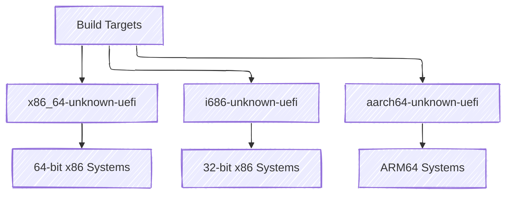
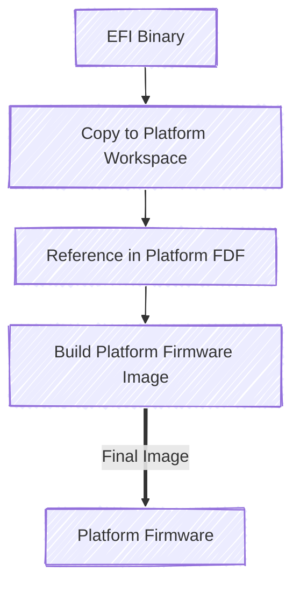

# Standalone Compilation

This section will walk you through setting up a new repository so that you
can build a standalone binary using only the Rust ecosystem and later provide
it to the EDK II build system and your platform.`

## Create the repository

Start by creating a new Rust crate. In the following example, we will call the crate
`PlatformDxeCore`, however please substitute it with a name meeting your needs.

From the terminal, in the directory you wish to generate a crate, execute the following command:

```txt
> cargo new PlatformDxeCore
> cd PlatformDxeCore
```

You should see the following folder structure:

```txt
├── src
|    └── main.rs
├── .gitignore
└── Cargo.toml
```

## Makefile.toml

As mentioned in the [Introduction](../introduction.md), `cargo-make` is used to help simplify the
user experience by automatically providing the command line arguments necessary to build for a
UEFI target. From the root of your platform repository, run the following command:

```txt
> touch Makefile.toml
```

Finally, add the following contents to the file:

```toml
{{#include ../files/Makefile.toml}}
```

Okay! That is a lot! So let's talk about it. This is a bare-bones makefile whose only command is
`cargo make build`, which will build `main.rs` as an EFI binary. The default architecture target is
`X64`, as specified by the `--target x86_64-unknown-uefi` flag in the `NO_STD_FLAGS` variable.
You can change that to meet your platform needs.

Rust supports building for the following UEFI target triples:

1. `x86_64-unknown-uefi`
1. `i686-unknown-uefi`
1. `aarch64-unknown-uefi`

## rust-toolchain.toml

While this file is not strictly necessary, it is highly recommended. It is used to control the tool
chain version that your binary is compiled with, helping to ensure reproducible builds across
developers. From the root of your platform repository, run the following command:

```txt
> touch rust-toolchain.toml
```

Add the following contents to the file, substituting the version with your expected version.

```toml
{{#include ../files/rust-toolchain.toml}}
```

## Final Workspace

While there are additional files you could add, such as a rustfmt.toml, this is the bare minimum
workspace you need to build an EFI binary for a single architecture:

```txt
├── src
|    └── main.rs
├── .gitignore
├── Cargo.toml
├── Makefile.toml
└── rust-toolchain.toml
```

## Building Your Binary

With your workspace configured, you can now build your EFI binary:

Run the build command:

```txt
> cargo make build
```

This will produce an EFI binary in the `target/x86_64-unknown-uefi/debug/` directory (or the appropriate
architecture directory based on your target configuration).

### Build Variations

You can build for different architectures by modifying the target in your `Makefile.toml`:



For release builds with optimizations:

```txt
> cargo make build --release
```

## Integration with EDK II

Once you have your EFI binary, you can integrate it with your EDK II platform:



1. **Copy the binary** to your platform workspace
2. **Update your platform FDF file** to include the binary in the firmware volume
3. **Build your platform** using the EDK II build system

### Example Platform Integration

Add the EFI binary to your platform FDF file:

```ini
[FV.DXEFV]
  # ... other files ...
  FILE DXE_CORE = 23C9322F-2AF2-476A-BC4C-26BC88266C71 {
    SECTION PE32 = YourPlatformWorkspaceDir/Binaries/PlatformDxeCore.efi
    SECTION UI = "DxeCore"
  }
```
