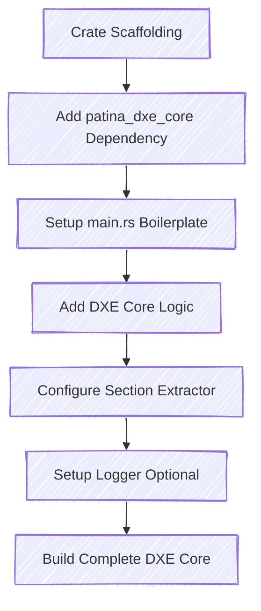

# Setting up the DXE Core

Now that we have the scaffolding up for our crate, let's actually set up the crate to compile a Patina DXE Core binary.
For this section, we will be working out of the crate directory, and all steps will be the same, regardless of whether you
are compiling locally or externally to the platform.



## Add the patina_dxe_core dependency

Inside your crate's Cargo.toml file, add the following, where `$(VERSION)` is replaced with the version of the
`patina_dxe_core` you wish to use.


```toml
[dependencies]
patina_dxe_core = "$(VERSION)"
```

````admonish note
If you want the latest and greatest, you can simply specify the crate. It is currently provided via
the public [`patina-fw`](https://dev.azure.com/patina-fw/artifacts/_artifacts/feed/temporary) registry.

```toml
patina_dxe_core = { registry = "patina-fw" }
```
````

## main.rs Boilerplate

The next step is to add the following boilerplate to the `main.rs` file. This sets up the necessary scaffolding such
that the only step the platform needs to do is select its dependencies and configurations. As stated in the
[Introduction](../introduction.md), dependency and configuration are done in code, rather than through configuration
files like the INF, DSC, FDF, and DEC file.

``` rust
#![cfg(all(target_os = "uefi"))]
#![no_std]
#![no_main]

use core::{ffi::c_void, panic::PanicInfo};

#[panic_handler]
fn panic(info: &PanicInfo) -> ! {
    log::error!("{}", info);
    loop {}
}

#[cfg_attr(target_os = "uefi", export_name = "efi_main")]
pub extern "efiapi" fn _start(physical_hob_list: *const c_void) -> ! {
    loop {}
}
```

At this point, you can execute `cargo make build` and successfully build an EFI image for the DXE Core. You could even
skip the rest of this section, going straight to adding it to your platform. It would build and execute. But by
execute, I mean it would just dead-loop!

Let's talk about each of these sections real quick. Since we are in a `no_std` environment (as specified by
`#![no_std]`), we must define our own panic handler. For now, we will just log the error and dead-loop. If you wish,
you could write something more sophisticated.

Next, we have to tell `rustc` to use the `efiapi` ABI, and to export this function as `efi_main`, which is exactly what
the line `#[cfg_attr(target_os = "uefi", export_name = "efi_main")]` is doing. We then describe the function interface
as consuming a pointer to the `physical_hob_list`, which is the definition for the DXE Core.

## Patina DXE Core Boilerplate

Now that we are to the point where you can compile a binary that the pre-DXE phase can locate and execute, let's
actually add the DXE Core logic. In this section, you will also need to make some decisions on trait implementations,
which are used as abstraction points for the platform to add architecture or platform-specific logic. This section is
not meant to be exhaustive, but rather a starting example for showing how to set up the Patina DXE Core.

`SectionExtractor` is an abstraction point that allows a platform to specify the specific section extraction methods it
supports. As an example, a platform may only compress its sections with brotli, so it only needs to support brotli
extractions. A platform may create their own extractor; it only needs to implement the
[SectionExtractor](https://docs.rs/mu_pi/latest/mu_pi/fw_fs/trait.SectionExtractor.html) trait. However, multiple
implementations are provided via [patina_ffs_extractors](https://github.com/OpenDevicePartnership/patina/tree/main/core/patina_ffs_extractors)
such as brotli, crc32, etc.

```admonish note
If there are any new traits added, please submit a PR to update this documentation.
```

With all of that said, you can add the following code to `main.rs`, replacing the implementations in this example with
your platform-specific implementations:

```rust
use patina_dxe_core::Core;
use patina_ffs_extractors::CompositeSectionExtractor;

#[cfg_attr(target_os = "uefi", export_name = "efi_main")]
pub extern "efiapi" fn _start(physical_hob_list: *const c_void) -> ! {
    Core::default()
        .init_memory(physical_hob_list)
        .with_service(CompositeSectionExtractor::default())
        .start()
        .unwrap();
    loop {}
}
```

```admonish note
If you copy + paste this directly, the compiler will not know what `patina_ffs_extractors` is. You will have to add
that crate to your platform's `Cargo.toml` file. Additionally, where the `Default::default()` option is, this is where
you would provide any configuration to the Patina DXE Core, similar to a PCD value.
```

At this point, you could skip the rest of this section and move on to compiling it into the platform firmware, and it
would run! However, you would not get any logs! So let's set up a logger.

### Setting up a logger

We will start simple by configuring and initializing a logger that is used throughout the execution of the Patina DXE
Core. If you add any `Components` (we will get to that soon), then this same logger will also be used by those too!

The DXE Core uses the same logger interface as [log](https://crates.io/crates/log), so if you wish to create your own
logger, follow those steps. We currently provide two loggers:

- [patina_adv_logger](https://github.com/OpenDevicePartnership/patina/tree/main/components/patina_adv_logger)
- [serial_logger](https://github.com/OpenDevicePartnership/patina/blob/main/sdk/patina_sdk/src/log/serial_logger.rs)

For this tutorial, we will use the more complex `patina_adv_logger` as it will show you how to add a `Component` to the
Patina DXE Core.

First, add `patina_adv_logger` to your Cargo.toml file in the crate:

```toml
patina_adv_logger = "$(VERSION)"
```

Next, update main.rs with the following:

```rust
use patina_dxe_core::Core;
use patina_ffs_extractors::CompositeSectionExtractor;
use patina_adv_logger::{component::AdvancedLoggerComponent, logger::AdvancedLogger};

static LOGGER: AdvancedLogger<Uart16550> = AdvancedLogger::new(
    patina_sdk::log::Format::Standard,
    &[
        ("goblin", log::LevelFilter::Off),
        ("gcd_measure", log::LevelFilter::Off),
        ("allocations", log::LevelFilter::Off),
        ("efi_memory_map", log::LevelFilter::Off),
    ],
    log::LevelFilter::Info,
    Uart16550::Io { base: 0x402 },
);

#[cfg_attr(target_os = "uefi", export_name = "efi_main")]
pub extern "efiapi" fn _start(physical_hob_list: *const c_void) -> ! {
    log::set_logger(&LOGGER).map(|()| log::set_max_level(log::LevelFilter::Trace)).unwrap();
    let adv_logger_component = AdvancedLoggerComponent::<Uart16550>::new(&LOGGER);
    adv_logger_component.init_advanced_logger(physical_hob_list).unwrap();

    Core::default()
        .init_memory(physical_hob_list)
        .with_service(CompositeSectionExtractor::default())
        .with_component(adv_logger_component)
        .start()
        .unwrap();
    loop {}
}
```

This does a few things. The first is it creates our actual logger (as a static), with some configuration settings.
Specifically it sets the log message format, disables logging for a few modules, sets the minimum log type allowed,
then specifies the Writer that we want to write to. In this case we are writing to port `0x402` via `Uart16550`. Your
platform may require a different writer.

Next, inside `efi_main` we instantiate the advanced logger component, which will be executed by the core at runtime.
Among other things, this component produces the Advanced Logger Protocol, so that other standard UEFI drivers may
consume and use it.

Finally, we set the global logger to our static logger with the `log` crate and then register the component instance
with the core, so that it knows to execute it.

## Final main.rs

In this final example, we add the ability to stack trace to the panic handler, which is useful for debugging.

```rust
#![cfg(all(target_os = "uefi", feature = "x64"))]
#![no_std]
#![no_main]

use core::{ffi::c_void, panic::PanicInfo};
use patina_adv_logger::{component::AdvancedLoggerComponent, logger::AdvancedLogger};
use patina_dxe_core::Core;
use patina_ffs_extractors::CompositeSectionExtractor;
use patina_sdk::{log::Format, serial::uart::Uart16550};
use patina_stacktrace::StackTrace;
extern crate alloc;

#[panic_handler]
fn panic(info: &PanicInfo) -> ! {
    log::error!("{}", info);

    if let Err(err) = unsafe { StackTrace::dump() } {
        log::error!("StackTrace: {}", err);
    }

    if patina_debugger::enabled() {
        patina_debugger::breakpoint();
    }

    loop {}
}

static LOGGER: AdvancedLogger<Uart16550> = AdvancedLogger::new(
    patina_sdk::log::Format::Standard,
    &[
        ("goblin", log::LevelFilter::Off),
        ("gcd_measure", log::LevelFilter::Off),
        ("allocations", log::LevelFilter::Off),
        ("efi_memory_map", log::LevelFilter::Off),
    ],
    log::LevelFilter::Info,
    Uart16550::Io { base: 0x402 },
);

#[cfg_attr(target_os = "uefi", export_name = "efi_main")]
pub extern "efiapi" fn _start(physical_hob_list: *const c_void) -> ! {
    log::set_logger(&LOGGER).map(|()| log::set_max_level(log::LevelFilter::Trace)).unwrap();
    let adv_logger_component = AdvancedLoggerComponent::<Uart16550>::new(&LOGGER);
    adv_logger_component.init_advanced_logger(physical_hob_list).unwrap();

    Core::default()
        .init_memory(physical_hob_list)
        .with_service(CompositeSectionExtractor::default())
        .with_component(adv_logger_component)
        .start()
        .unwrap();

    log::info!("Dead Loop Time");
    loop {}
}
```

### Compatibility Mode

The Patina DXE Core supports Compatibility Mode, the ability to launch bootloaders that do not support memory
protections, most notably most shipping versions of Linux distros. By default the `compatibility_mode_allowed` feature
flag is disabled. If a platform wishes to build with it, they must include it in their Cargo.toml as such:

```toml
[dependencies]
patina_dxe_core = { features = ["compatibility_mode_allowed"] }
```

With the flag disabled, the Patina DXE Core will not launch any EFI_APPLICATIONs that do not have the NX_COMPAT
DLL Characteristics set. With the flag enabled, the Patina DXE Core will enable
[compatibility mode](../dxe_core/memory_management.md).

---

> Note: The Patina QEMU documentation provides an overview of where binary size comes from, and how to reduce it using the
Patina QEMU DXE Core binary as an example. You can find those details in
[Patina DXE Core Release Binary Composition and Size Optimization](https://github.com/OpenDevicePartnership/patina-qemu/blob/main/Platforms/Docs/Common/patina_dxe_core_release_binary_size.md).
