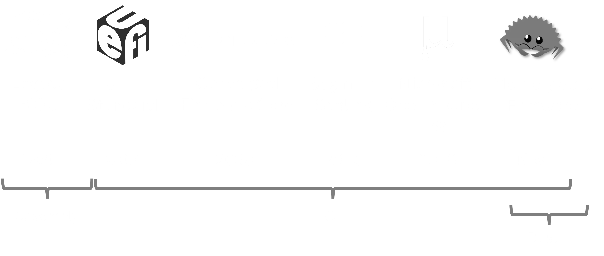
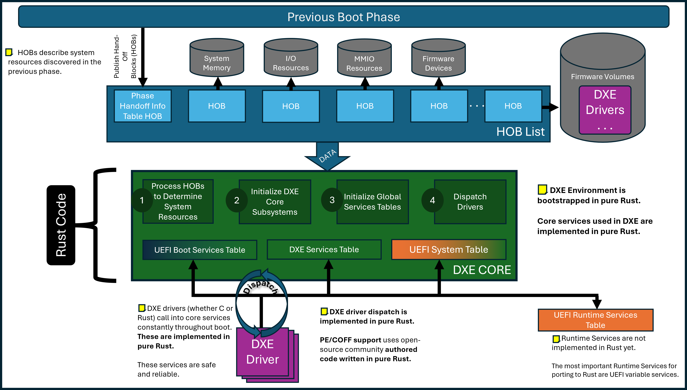
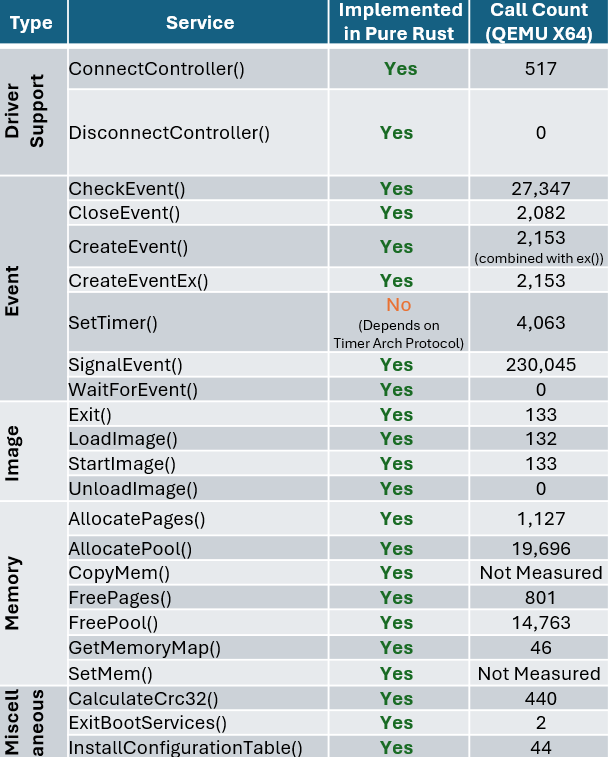
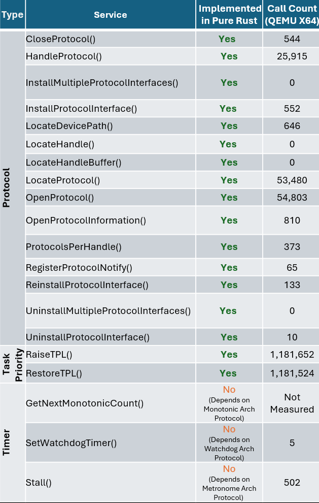

# Patina Background

## Overview

Firmware and UEFI firmware in particular has long been written in C. Firmware operates in a unique environment compared
to other system software. It is written to bootstrap a system often at the host CPU reset vector and as part of a chain
of trust established by a hardware rooted immutable root of trust. Modern PC and server firmware is extraordinarily
complex with little room for error.

We call the effort to evolve and modernize UEFI firmware in the Open Device Partnership (ODP) project "Patina". The
remainder of this document will discuss the motivation for this effort, a high-level overview of the current state of
Patina, and the current state of Rust in UEFI firmware.

### Firmware Evolution

From a functional perspective, firmware must initialize the operating environment of a device. To do so involves
integrating vendor code for dedicated microcontrollers, security engines, individual peripherals, System-on-Chip (SOC)
initialization, and so on. Individual firmware blobs may be located on a number of non-volatile media with very limited
capacity. The firmware must perform its functional tasks successfully or risk difficult to diagnose errors in higher
levels of the software stack that may impede overall device usability and debuggability.

These properties have led to slow but incremental expansion of host firmware advancements over time.



### Firmware Security

From a security perspective, firmware is an important component in the overall system Trusted Computing Base (TCB).
Fundamental security features taken for granted in later system software such as kernels and hypervisors are often
based on secure establishment in a lower layer of firmware. At the root is a concept of "trust".

While operating systems are attractive targets due to their ubiquity across devices and scale, attackers are
beginning to shift more focus to firmware as an attack surface in response to increasingly effective security measures
being applied in modern operating systems. Securing the early boot process revolves around key inflection points and
protections applied between those points. The earliest point is the device "root of trust", where the system needs to
ensure it begins operating in a trusted state. This is often performed by code in immutable Read-Only Memory ROM
located in a SOC. Since size is extremely limited, this logic typically hands off quickly to code of larger size on
some mutable storage such as SPI flash that is first verified by a key stored in the SOC. In general, this handoff
process continues throughout the boot process as hardware capabilities come online enabling larger and more complex
code to be loaded forming what is referred to as a "chain of trust". Eventually some code must execute on the host CPU,
that code is often UEFI based firmware. While significant research has been devoted across the entire boot process,
UEFI firmware on the host CPU presents a unique opportunity to gain more visibility into early code execution details
and intercept the boot process before essential activities take place such as application of important security
register locks, cache/memory/DMA protections, isolated memory regions, etc. The result is code executed in this
timeframe must carry forward proper verification and measurement of future code while also ensuring it does not
introduce a vulnerability in its own execution.

### Performant and Reliable

From a performance perspective, firmware code is often expected to execute exceedingly fast. The ultimate goal is for
an end user to not even be aware such code is present. In a consumer device scenario, a user expects to press a power
button and immediately receive confirmation their system is working properly. At the minimum, a logo is often shown to
assure the user something happened and they will be able to interact with the system soon. In a server scenario,
fleet uptime is paramount. Poorly written firmware can lead to long boot times that impact virtual machine
responsiveness and workload scaling or, even worse, Denial of Service if the system fails to boot entirely. In an
embedded scenario, government regulations may require firmware to execute fast enough to show a backup camera within a
fixed amount of time.

All of this is to illustrate that firmware must perform important work in a diverse set of hardware states with code
that is as small as possible and do so quickly and securely. In order to transition implementation spanning millions of
lines of code written in a language developed over 50 years ago requires a unique and compelling alternative.

## Rust and Firmware

As previously stated, modern systems necessitate a powerful language that can support low-level programming with
maximum performance, reliability, and safety. While C has provided the flexibility needed to implement relatively
efficient firmware code, it has failed to prevent recurring problems around memory safety.

### Stringent Safety

Common pitfalls in C such as null pointer dereferences, buffer and stack overflows, and pointer mismanagement continue
to be at the root of high impact firmware vulnerabilities. These issues are especially impactful if they compromise
the system TCB. Rust is compelling for UEFI firmware development because it is designed around strong memory safety
without the usual overhead of a garbage collector. In addition, it enforces stringent type safety and concurrency rules
that prevent the types of issues that often lead to subtle bugs in low-level software development.

Languages aside, UEFI firmware has greatly fallen behind other system software in its adoption of basic memory
vulnerability mitigation techniques. For example, data execution protection, heap and stack guards, stack cookies,
and null pointer dereference detection is not present in the vast majority of UEFI firmware today. More advanced
(but long time) techniques such as Address Space Layout Randomization (ASLR), forward-edge control flow integrity
technologies such as x86 Control Flow Enforcement (CET) Indirect Branch Tracking (IBT) or Arm Branch Target
Identification (BTI) instructions, structured exception handling, and similar technologies are completely absent in
most UEFI firmware today. This of course exacerbates errors commonly made as a result of poor language safety.

Given firmware code also runs in contexts with high privilege level such as System Management Mode (SMM) in x86,
implementation errors can be elevated by attackers to gain further control over the system and subvert other
protections.

### Developer Productivity

The Rust ecosystem brings more than just safety. As a modern language firmware development can now participate
in concepts and communities typically closed to firmware developers. For example:

- Higher level multi-paradigm programming concepts such as those borrowed from functional programming in addition to
  productive polymorphism features such as generics and traits.

- Safety guarantees that prevent errors and reduce the need for a myriad of static analysis tools with flexibility to
  still work around restrictions when needed in an organized and well understood way (unsafe code).

### Modern Tooling

Rust includes a modern toolchain that is well integrated with the language and ecosystem. This standardizes tooling
fragmented across vendors today and lends more time to firmware development. Examples of tools and community support:

- An official package management system with useful tools such as first-class formatters and linters that reduce
  project-specific implementations and focus discussion on functional code changes.

- High quality reusable bundles of code in the form of crates that increase development velocity and engagement with
  other domain experts.

- Useful compilation messages and excellent documentation that can assist during code development.

- A modern testing framework that allows for unit, integration, and on-platform tests to be written in a consistent
  way. Code coverage tools that are readily available and integrate seamlessly with modern IDEs.

Rust's interoperability with C code is also useful. This enables a phased adoption pathway where codebases can start
incorporating Rust while still relying upon its extensive pre-existing code. At the same time, Rust has been conscious
of low-level needs and can precisely structure data for C compatibility.

## Patina in ODP

The Patina team in ODP plans to participate within the open Rust development community by:

1. Engaging with the broader Rust community to learn best practices and share low-level system programming knowledge.
2. Leveraging and contributing back to popular crates and publishing new crates that may be useful to other projects.
   - A general design strategy is to solve common problems in a generic crate that can be shared and then integrate it
     back into firmware.
3. Collaborating with other firmware vendors and the UEFI Forum to share knowledge and best practices and
   incorporate elements of memory safety languages like Rust into industry standard specifications where appropriate.
   Some specifications have interfaces defined around concepts and practices common in unsafe languages that could
   be improved for safety and reliability.

Looking forward, we're continuing to expand the coverage of our firmware code written in Rust. We are excited to
continue learning more about Rust in collaboration with the community and our partners.

## Current State

We began our journey with Rust in UEFI firmware by adding support for building Rust code in the edk2 build system
used for C code. We still have this support and it worked well for integrating smaller pieces of Rust code into the
larger, conventional C codebase. We wrote a few EFI modules with this approach including USB and HID DXE drivers
written in Rust.

However, to truly realize our vision of the benefits gained from Rust in firmware, we needed to shift our primary
work environment to a pure Rust workspace. Further, we chose to build an entire execution environment from the ground
up in pure Rust. When surveying what environment this should be, we noted that PEI is very divergent across
architectures and silicon vendors, while DXE operates in a more standardized environment with well defined entry
criteria and an overall larger share of functionality and drivers. This led to writing a DXE Core entirely in Rust.

In the course of developing the Rust DXE Core, supporting functionality was needed that led to the some new crates
being spun off from the work that will be published individually for reuse in other core environments or drivers. All
of this work is part of the Patina project.

Right now, those include:

- An "advanced logger" crate for UEFI debug output.
- A Platform Initialization (PI) crate that provides a Rust interface and implemention for the UEFI PI specification.
- A Rust UEFI SDK crate that contains Rust implementation of common interfaces and code needed in both UEFI drivers
  and core environments like the Rust DXE Core.
- A generic paging crate that implements the functionality needed to manage page tables and memory mappings in x86/64
  and AArch64 environments.
- A generic Memory Type Range Register (MTRR) crate that implements the functionality needed to manage memory type
  ranges in x86/64 environments.

### Rust DXE Core



In the above high-level diagram, the Rust DXE Core takes system data input in the form of HOBs in the same way as the
C DXE Core. The green box indicates that the core is written in Rust, while purple indicates that DXE drivers may be
written either in C or Rust. Orange indicates code that is still written in C. For example, the UEFI Boot Services
table and services themselves are largely written in pure Rust. The UEFI Runtime Services table itself has a Rust
definition but many of the services are still implemented in C so it is orange.

#### Notable DXE Core Features

- AARCH64 and x86/64 support.
  - Support for QEMU (Q35 and SBSA).
  - Tested and developed on physical Intel and Arm hardware.
  - Boots to Windows and Linux on these platforms.
- Performance record (FBPT) support.
- Page table management.
- A pure Rust dispatch system in addition to support for [PI compatible FV/FFS dispatch](./dxe_core/dispatcher.md).
- Parity with the C DXE Core in UEFI Self-Certification Test (SCT) results.
- ~70% unit test coverage in the Rust DXE Core (with a goal of >80% coverage).
- Support for [Enhanced Memory Protections](https://microsoft.github.io/mu/WhatAndWhy/enhancedmemoryprotection/).
- Source-level debugging support.
- Built-in Brotli and EFI decompression support.
- Infrastructure (in the `patina_sdk::test` module) for on-platform execution of unit tests.

``` admonish important
The Rust DXE Core otherwise supports the normal responsibilities of a DXE Core except for the design restrictions
described in the "Compatibility" section.
```

To illustrate why we believe the DXE Core is an ideal starting point, the following table summarizes the number of
calls into boot services which are implemented in the DXE Core on a Q35 QEMU platform for reference. This is meant
to show that while DXE drivers written in C are still dispatched and used during boot, the core services invoked
and depended on by those drivers are written in Rust.

|  |   |
|---|---|

#### Rust DXE Scaling Plan

While the Rust DXE Core is mostly a drop-in replacement for the C DXE Core, it does differ in terms of design to
accommodate the Rust language, its safety guarantees, and more modern software practices that contribute to higher
quality interfaces and testing.

While more detailed design documents will be available in the Rust DXE Core codebase, a key design goal to call out
now is support to transition to a larger share of Rust code in DXE. To best take advantage of Rust's static safety
guarantees and to avoid the need for unsafe code in interfacing between components (e.g. protocol database), we have
implemented the ability for the Rust DXE Core dispatch process to dispatch platform defined static components called
["components"](./dxe_core/component_model.md). Components are selected for dispatch by the platform and can share data
and services with each other but through Rust interfaces that are safe and statically checked versus the dynamic and
disjoint nature of the protocol database in the C DXE Core.

This snippet shows a simple example of how the Rust DXE core is instantiated and customized in a simple platform
binary crate:

```rust
#[cfg_attr(target_os = "uefi", export_name = "efi_main")]
pub extern "efiapi" fn _start(physical_hob_list: *const c_void) -> ! {
    log::set_logger(&LOGGER).map(|()| log::set_max_level(log::LevelFilter::Trace)).unwrap();
    let adv_logger_component = AdvancedLoggerComponent::<Uart16550>::new(&LOGGER);
    adv_logger_component.init_advanced_logger(physical_hob_list).unwrap();

    patina_debugger::set_debugger(&DEBUGGER);

    Core::default()
        .with_section_extractor(patina_section_extractor::CompositeSectionExtractor::default()) // Section extractor can be customized or use default
        .init_memory(physical_hob_list)                                                  // DXE Core initializes GCD with the HOB list
        .with_component(adv_logger_component)                                            // The "advanced logger" Rust component is added for dispatch
        .start()
        .unwrap();
```

``` admonish note
Rust is an exciting new next step and there is more to share about the Rust DXE Core in future documentation.
```

---

#### Integration

This section is not meant to be a comprehensive guide to integrating Rust into UEFI firmware and more detailed
information is available. This section is meant to share a high-level sense of how the Rust DXE Core is integrated
into a platform.

The following integration documents might be helpful if you're beginning to work with the Rust DXE Core:

- [Patina Requirements](./integrate/patina_requirements.md)
- [How to Setup a Platform-Specific Rust DXE Core Build](./integrate/dxe_core.md)
- [Platform Integration of a Rust DXE Core Binary](./integrate/platform.md)

##### `patina_dxe_core` as a Library Crate

The Rust DXE Core itself is a library crate. This means a single set of common DXE Core is provided that can be linked
into a binary crate. The binary crate is owned by the platform. The purpose of this separation is to allow the DXE Core
to be reused across multiple platforms and to allow the platform to provide the necessary configuration and platform
specific code to the DXE Core when it uses the DXE Core interface. The binary crate built by the platform is what
produces the .efi DXE Core binary.

This separation also means that a Rust DXE Core can simply be swapped with the C DXE Core in an existing platform.
The Rust DXE Core .efi file produced by the pure Rust platform binary crate can be placed into the flash map of the
firmware volume that contains the DXE Core.

##### Platform Customization

The platform binary crate is where platform-specific customization is done. For example, the Rust DXE Core depends on
a UART. However, the platform can configure the UART passed to the DXE Core to be either an I/O or MMIO UART and
configure the UART base address, baud rate, stride size, and other parameters. The platform can specify pure Rust
components to dispatch in the Rust DXE Core as well.

##### Transition Tooling

We plan to provide a "DXE Readiness" tool that will help test the input data (e.g. HOBs) and other system state to
determine any compatibility issues and provide guidance where possible. We're hoping this will make the Rust DXE Core
onboarding experience easier but also provide more visibility into the DXE Core's requirements and operating state in
general.

#### Testing

Three main types of testing are currently supported.

- **Unit tests** are written in the exact file that you are working in. Tests are written in a conditionally compiled
  sub-module and any tests should be tagged with `#[test]`.
- **Integration tests** are very similar to unit testing, however, the developer does not have access to the internal
  state of the module. Only the external interfaces are being tested. Cargo will detect and run these tests with the
  same command as for unit tests. More information about integration tests are available in the
  [cargo book entry](https://doc.rust-lang.org/rust-by-example/testing/integration_testing.html).
- **On-platform tests** are supported with code in a module called `patina_sdk::test` that provides a testing framework
  similar to the typical rust testing framework. The key difference is that instead of tests being collected and
  executed on the host system, they are instead collected and executed via a component (`patina_sdk::test::TestRunner`)
  provided by the same crate. The platform must register this component with the `DXE core`. The DXE core will then
  dispatch this component, which will run all registered tests.

#### Compatibility

The Rust DXE Core is not only written in a newer, safer language but it is also designed for modern, more secure
software practices. This means not everything that worked in the C DXE Core will work in the Rust DXE Core.

The main areas at this time that are not supported are:

- A priori dispatch of drivers.
- Traditional SMM support.
- "Dual Mode" drivers. For example, a driver that can run in both PEI and DXE (rarely used).

The Rust DXE Core also sets up memory protections and requires a more accurately and comprehensively defined memory
map. The platform will likely need to describe more resources than before (via resource descriptor HOBs) so pages
can be mapped correctly and UEFI code that violates memory protections will need to be fixed. For example, null pointer
dereference detection and stack guard are active so code (C DXE driver or a third-party option ROM) will have memory
protection violations caught at runtime.

For more details about mememory management in Patina see [Memory Management](./dxe_core/memory_management.md).
