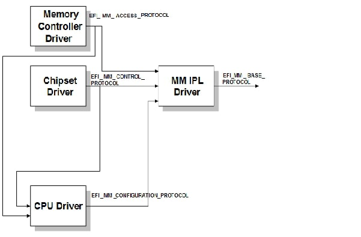
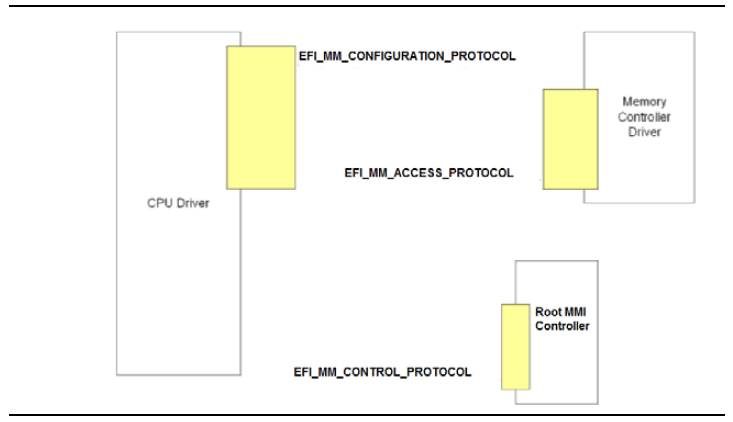
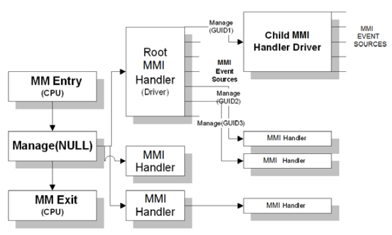

# RFC: MM Communicate Service

This document outlines the requirements and design for the **Communicate Service**. This service is responsible for
allowing non-Management Mode (MM) components to communicate with MMI handlers in MM.

## Change Log

This text can be modified over time. Add a change log entry for every change made to the RFC.

- 2025-04-09: Initial draft of RFC.
- 2025-04-10: Add note on motivation for the `SwMmiManager` & `SwMmiTrigger` abstraction level.
- 2025-04-24: Updated some interface definitions with and added relevant doc comments in examples.

## Motivation

"Communicate" is a simple name historically used to describe the service that allows non-MM components to communicate
with MM. This RFC proposes a new service implemented purely in Rust that provides this capability. It should also
allow the MM Communicate Protocol to be produced from the Rust implementation so that it can replace equivalent C-based
implementations that produce the protocol today allowing the platform to carry a single implementation of the
communicate code.

## Technology Background

### System Management Mode (SMM)

System Management Mode (SMM) or Management Mode (MM) is a special-purpose operating mode in x86 architecture with high
execution privilege that is used to monitor and manage various system resources. MM code executes in a special region
of memory that is isolated from the rest of the system, and it is not directly accessible to the operating system or
other software running on the system. This region is called System Management RAM (SMRAM) or Management Mode RAM
(MMRAM).

MM is entered by triggering a System Management Interrupt (SMI) also called a Management Mode Interrupt (MMI). The MMI
may be either triggered by software (synchronous) or a hardware (asynchronous) event. A MMI is a high priority,
non-maskable interrupt. On receipt of the interrupt, the processor saves the current state of the system and switches
to MM. Within MM, the code must set up its own execution environment such as applying an interupt descriptor table
(IDT), creating page tables, etc. It must also identify the source of the MMI to determine what MMI handler to invoke
in response.

---

Note: ARM platforms typically implement a MM environment using TrustZone (TZ). ARM platforms are not considered in this
current RFC.

---

**More details:**

- [Intel 64 and IA-32 Architectures Software Developer's Manual](https://www.intel.com/content/www/us/en/developer/articles/technical/intel-sdm.html)
- [Platform Initialization (PI) Specification](https://uefi.org/specifications)

### MM Communication

The *Communicate Protocol* is defined in the PI Specification as a service to allow non-MM components to communicate
(exchange data) with registered MM handlers. The `EFI_MM_COMMUNICATION_PROTOCOL` is responsible for performing any
copies of data such that the data resides in boot-services accessible memory.

## Goals

1. Provide a service to send arbitrary data contents to a targeted MMI handler.
2. Be compatible with the existing MM Communication implementations in MM code.
3. Provide a service that is usable in both boot and runtime environments.
   1. Usable in both virtual and physical address space.
   2. Resides in runtime code memory.

## Requirements

### Summary of Requirements

1. Must be able to be used in both boot and runtime environments.
2. Must be able to be used in both virtual and physical address space.
3. Must be able to be used in both 32-bit and 64-bit environments.

### Detailed Requirements

- The MM communication implementation must have the ability to perform a mode transition to MM.
  - Note: This is often implemented in C code using the `EFI_MM_CONTROL_PROTOCOL`.
- The implementation must be in runtime code memory so that it can perform communication at runtime.
- The implementation must account for an arbitrary number of communication buffers to be defined that may be specified
  during MM Communication calls. For example, in an MM implementation with privilege separation, a "user" mode and
  "supervisor" mode communicate buffer may be defined.
- The communication implementation must account for being executed at runtime and/or being virtually mapped. The MM
  infrastructure must be assumed to be executing in physical mode. As a result, the non-MM agent which may be executing
  in virtual-mode OS context as a result of an OS invocation of the UEFI `SetVirtualAddressMap()` service, should use
  a contiguous memory buffer with a known physical address before invoking this service. The caller to the service must
  pass both the physical and virtual address of the buffer. They may be the same in case of identity mapping.
  - Note: If only the virtual address of the buffer is used, the MM agent may not be able to appropriately translate
    the virtual address to a physical address.
- The communicate buffer must always begin with a MM Communicate header per existing MM PI Specification
  requirements.
  - **COMPATIBILITY NOTE**: Although a V3 of the MM Communication Protocol is defined in the PI Specification, it has
    been very slowly adopted or not used at all. All upstream C-based modules are currently using *V2* with the
    exception of `Tcg2Acpi` and `UefiHandleParsingLib`. Therefore, the service must provide the flexibility to
    communicate to an MM implementation using the V1, V2, or V3 MM communication messaging format.

    - **V1 and V2** used the `EFI_MM_COMMUNICATE_HEADER` defined in the PI Specification as:

      ```c
      typedef struct {
        EFI_GUID                    HeaderGuid;
        UINTN                       MessageLength;
        UINT8                       Data[ANYSIZE_ARRAY];
      } EFI_MM_COMMUNICATE_HEADER;
      ```

      - `COMMUNICATE_HEADER_GUID` is defined in  the PI Specification as (`COMMUNICATE_HEADER_GUID`):

        `{0x99be0d8f, 0x3548, 0x48aa, {0xb5, 0x77, 0xfc, 0xfb, 0xa5, 0x6a, 0x67, 0xf7}}`

      - `HeaderGuid`
        - Allows for disambiguation of the message format. Used to identify the registered MM handlers that should
          be given the message.

      - `MessageLength`
        - Describes the size of Data (in bytes) and does not include the size of the header.

      - `Data`
        - Designates an array of bytes that is MessageLength in size.

    - **V3** uses `EFI_MM_COMMUNICATE_HEADER_V3`, defined in the PI Specification as:

      ```c
      typedef struct {
        EFI_GUID  HeaderGuid;
        UINT64    BufferSize;
        UINT64    Reserved;
        EFI_GUID  MessageGuid;
        UINT64    MessageSize;
        UINT8     MessageData[];
      } EFI_MM_COMMUNICATE_HEADER_V3;
      ```

      - `HeaderGuid`
        - Indicator GUID for MM core that the communication buffer is compliant with this v3 header. Defined in the
          Specification as (`COMMUNICATE_HEADER_V3_GUID`):

          `{0x68e8c853, 0x2ba9, 0x4dd7, {0x9a, 0xc0, 0x91, 0xe1, 0x61, 0x55, 0xc9, 0x35}}`

      - `BufferSize`
        - Technically a read-only field, which is described by the caller to indicate the size of the entire
          buffer (in bytes) available for this communication transaction, including this communication header.

      - `Reserved`
        - Reserved for future use.

      - `MessageGuid`
        - Allows for disambiguation of the message format.

      - `MessageSize`
        - Describes the size of MessageData (in bytes) and does not include the size of the header.

      - `MessageData`
        - Designates an array of bytes that is MessageSize in size.

## Unresolved Questions

- Platform will need to provide a way to disable all pending SMIs that may be active when MM control is established.
  This usually depends on chipset-specific bits set in the GPE registers. These bit definitions could be provided via
  config. However, the platform may also need chipset-specific GPIO controller logic to clear and disable SMIs in
  GPIO configuration registers not covered by the GPE registers (unaffected by `SCI_EN`). Current proposal, is to
  allow an optional platform service to "clear and quiesce platform SMIs" that, if present, will be invoked upon
  the `MmConfigurationProvider`'s entry point.
- What should the interface look like to support periodic SMIs? It is not needed for the communicate service and rarely
  used in modern platforms. Current proposal is to add a periodic API to the `SwMmiTrigger` service interface.
- This communication service cannot entirely replace the existing MM Communication Protocol as this service must
  persist into runtime and participate in virtual address mapping events for the non-MM comm buffer. This is considered
  outside the scope of this RFC and will be handled in a separate RFC dedicated to component/service runtime support.

## Prior Art (Existing PI C Implementation)

In order to communicate with MM, the platform DXE environment must produce a number of MM related protocols that
abstract certain platform-specific details for MM.



- A DXE driver produces the `EFI_MM_ACCESS_PROTOCOL`, which describes the different MMRAM regions available in the
  system.
- A DXE driver produces the `EFI_MM_CONTROL_PROTOCOL`, which allows synchronous MMIs to be generated.
- A DXE driver may produce the `EFI_MM_CONFIGURATION_PROTOCOL` if MM is not loaded yet (known by examining the
  `MM_CORE_LOADED` flag in the `EFI_PEI_MM_CORE_HOB_GUID` HOB). If produced, this protocol describes areas of MMRAM
  that should be excluded from the memory map.
- As shown, the MM IPL (dependent on `EFI_MM_CONTROL_PROTOCOL`), registers for notification of `EFI_MM_ACCESS_PROTOCOL`
  (and `EFI_MM_CONFIGURATION_PROTOCOL`). The IPL will eventually set up the MM environment and register the MM entry
  point with `EFI_MM_CONFIGURATION_PROTOCOL.RegistryMmEntry()`. Once `EFI_MM_BASE_PROTOCOL` is produced in the DXE
  protocol database, initial configuration of MM is and MMIs can be generated.
- The MM Base Protocol is produce by the MM IPL to indicate that the MM environment is ready to accept MMIs from DXE
  drivers.
- As a consequence, the `EFI_MM_COMMUNICATION_PROTOCOL` can now be used. Typically around this point, the MM Supervisor
  will verify communication with the supervisor via its comm buffer and the Traditional MM implementation will give
  the MM Core access to UEFI Boot Services.

The protocols are typically produced by the following types of modules:



- `EFI_MM_ACCESS_PROTOCOL` describes the visibility of MMRAM on the platform. Since MMRAM is configured by the memory
  reference code (MRC), this information is dependent upon runtime platform reporting of active MMRAM regions.
  - Note the "open" and "close" mechansism to expose MMRAM to non-MM agents is considered insecure and a similar
    concept will not be provided in the Rust implementation.
- `EFI_MM_CONTROL_PROTOCOL` is used to triggers MMIs and this is core requirement for the Rust implementation to be
   perform MM communication. `EFI_MM_CONTROL_PROTOCOL.Trigger()` provides a periodic capability that is not included
   in this RFC but may be added in the future.



## Rust Code Design

The design assumes Standalone MM with a pre-DXE launch so MM is already present at DXE invocation and involves the
following main elements:

- `MmConfigurationConfig` - A mutable configuration that describes the MMRAM information.
  - **Note:** All Rust components that need this information are expected to establish a dependency on this
    configuration.
  - For X64 platforms, includes the MMI command and data ports, the ACPI fixed-hardware base address, MMRAM regions,
    and MM communication buffers.
    - **MMI command and data port**: Necessary to trigger the SW MMI via HW on the I/O bus.
    - **ACPI fixed-hardware base address**: Necessary to set `ACPI_IO_SMI_EN_APMC_EN` (`BIT5`) and
      `ACPI_IO_SMI_EN_GBL_SMI_EN` (`BIT0`) in the `ACPI_IO_SMI_EN` (ACPI Base + `0x30`) register on trigger. Also
      needed to set `B_ACPI_IO_SMI_EN_EOS` (End of SMI) on MMI exit. The ACPI base address may be I/O or MMIO.
      Also needed to interact with `ACPI_IO_PM_STS` and `ACPI_IO_SMI_STS` registers for reading and clearing MMI
      status from individual sources.

### Components and Services

- `PlatformMmControl` - This service is responsible for providing any additional platform-specific MM functionality
  needed to prepare the platform to enter MM and set up MMI support.

  ---

- `MmConfigurationProvider` - This component is responsible for providing MM configuration information to other
  components. All other MM related components should be abstracted from MM details by the configuration produced here.
  - Populates and locks `MmConfigurationConfig` gathering information from implementation-defined sources. This may
    include pre-existing HOBs and/or HW registers.
- `SwMmiManager` - This component is responsible for providing the `SwMmiTrigger` service that is used to trigger
  MMIs.
  - Consumes Configuration: `MmConfigurationConfig`
  - Optionally Consumes Service: `PlatformMmControl`
  - Produces Service: `SwMmiTrigger`
    - Note: This service is meant to be a primary abstraction for other components to trigger MMIs across architectures
      and platforms. Within x86, it is expected that a very small number of trigger services will be necessary that
      will mostly operate on ACPI fixed hardware registers given the ACPI PM base.
- `MmCommunicator` - This component is responsible for providing the `MmCommunication` service. It is a service that
  can be used by other components to send data to MM handlers.
  - Consumes Configuration: `MmConfigurationConfig`
  - Consumes Service: `SwMmiTrigger`
  - Produces Service: `MmCommunication`

### MM Communication Service

```rust
pub trait MmCommunication {
    fn communicate(&self, id: u8, data_buffer: &[u8], recipient: efi::Guid) -> Result<&'static [u8], Status>
}
```

```rust
//// MM Communicator Service
///
/// This service provides a mechanism for components to communicate with MM handlers.
///
/// It allows sending messages via a communication ("comm") buffer and receiving responses from the MM handler where
/// the response is stored in the same buffer.
///
/// #
#[derive(IntoComponent, IntoService)]
#[service(dyn MmCommunication)]
pub struct MmCommunicator {
    comm_buffers: RefCell<Vec<CommunicateBuffer>>,
    sw_mmi_trigger_service: Option<Service<dyn SwMmiTrigger>>,
}
```

### Software MMI Trigger Service

```rust
/// Software Memory Management (MM) Interrupt Trigger Service
///
/// Provides a mechanism to trigger software memory management interrupts (MMIs) in the MM environment. These are
/// synchronous interrupts that can be used to signal MM handlers to perform specific tasks or operations usually
/// invoking a specific MM handler registered to handle MMI requests from a correspnding driver or component outside
/// of the MM environment.
///
/// ## Safety
///
/// This trait is unsafe because an implementation needs to ensure that the service is only invoked after hardware
/// initialization for MMIs is complete and that the system is in a safe state to handle MMIs.
#[cfg_attr(any(test, feature = "mockall"), automock)]
#[allow(clippy::needless_lifetimes)]
pub unsafe trait SwMmiTrigger {
    /// Triggers a software Memory Management Interrupt (MMI).
    ///
    /// ## Safety
    ///
    /// This function is unsafe because it may cause the system to enter a state where MMIs are not handled correctly.
    /// It is the caller's responsibility to ensure that the system is in a safe state before calling this function.
    unsafe fn trigger_sw_mmi(&self, cmd_port_value: u8, data_port_value: u8) -> patina_sdk::error::Result<()>;
}
```

```rust
#[derive(IntoComponent, IntoService, Default)]
#[service(dyn SwMmiTrigger)]
pub struct SwMmiManager {
    mm_config: MmConfigurationConfig,
}
```

### MM Configuration Provider

```rust
/// Management Mode (MM) Communicate Buffer
///
/// A buffer used for communication between the MM handler and the caller.
#[derive(Clone)]
pub struct CommunicateBuffer {
    /// Pointer to the buffer in memory.
    buffer: NonNull<u8>,
    /// Length of the buffer in bytes.
    length: usize,
    /// ID of the buffer.
    pub id: u8,
}
```

```rust
#[derive(Copy, Clone)]
pub struct SmiPort(u8);

#[derive(Copy, Clone)]
pub enum AcpiBase {
    Mmio(usize),
    Io(u16),
}
```

```rust
#[derive(Debug, Clone)]
pub struct MmConfigurationConfig {
    acpi_base: AcpiBase,
    cmd_port: SmiPort,
    data_port: SmiPort,
    comm_buffers: Vec<CommunicateBuffer>,
}

impl Default for MmConfigurationConfig {
    fn default() -> Self {
        MmConfigurationConfig {
            acpi_base: AcpiBase::Mmio(0),
            cmd_port: SmiPort(0xFF),
            data_port: SmiPort(0x00),
            comm_buffers: Vec::new(),
        }
    }
}
```

```rust
/// Responsible for providing MM configuration information to other components. All other MM related components
/// should be abstracted from MM details by the configuration produced by this component.
#[derive(IntoComponent)]
pub struct MmConfigurationProvider;
```

### Platform MM Control Service

```rust
/// Platform Memory Management (MM) Control Service
///
/// A platform may optionally produce this seervice if it needs to perform any platform-specific initialization of the
/// MM environment.
pub trait PlatformMmControl {
    /// Platform-specific initialization of the MM environment.
    fn init(&self) -> crate::error::Result<()>;
}
```
