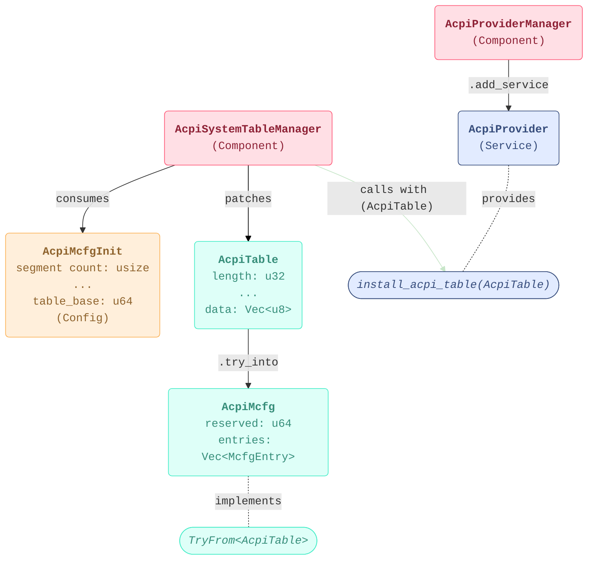

# RFC: `ACPI`

This RFC proposes a Rust-based interface for ACPI table management providing the functionality described in the
`EFI_ACPI_TABLE_PROTOCOL` and `EFI_ACPI_SDT_PROTOCOL` services defined respectively in the UEFI Specification and PI Specification.
It introduces an AcpiProvider trait to manage installation, uninstallation, and retrieval of ACPI tables,
encapsulating both the ACPI Table and SDT protocols behind a safe, idiomatic Rust API.
The goal is to maintain compatibility with the UEFI specification
while improving memory safety and simplifying integration for components.

## Change Log

- 2025-04-17: Initial RFC created.
- 2025-04-22: Add iteration for `AcpiProvider`. Add `RegisterNotify` functionality.
- 2025-04-23: Add `From`/`Into` between specific ACPI tables and the general `AcpiTable` type.
Remove `Component` and `Config` suffixes from types.
- 2025-04-24: Add example for initializing a MCFG table with the new interface.
- 2025-04-25: Add note on C protocol dependencies.
- 2025-04-27: Add details on installing EDKII protocols from Rust.
- 2025-04-30: Rework diagram in `mermaid`. Rename some components from the MCFG example.

## Motivation

The Advanced Configuration and Power Interface (ACPI)
provides information about device topology, configuration, and power management.
This RFC proposes a pure Rust interface for existing ACPI capabilities, replacing the C-based implementations
while producing protocols that align with the UEFI specification. This provides a simpler, safer Rust-based interface
while maintaining required ACPI functionality.

### Scope

The `AcpiProvider` service implements equivalent functionality for the following protocols:

- `EFI_ACPI_TABLE_PROTOCOL`
  - `InstallAcpiTable`
  - `UninstallAcpiTable`
- `EFI_ACPI_SDT_PROTOCOL`
  - `GetAcpiTable`
  - `RegisterNotify`

## Technology Background

### ACPI

ACPI within UEFI provides a standardized interface for firmware
to convey hardware configuration and power management information to the operating system.
This information is organized into a set of structured tables.

For more information on the format and arrangement of these tables,
see the UEFI specification on the [ACPI Software Programming Model](https://uefi.org/htmlspecs/ACPI_Spec_6_4_html/05_ACPI_Software_Programming_Model/ACPI_Software_Programming_Model.html#acpi-software-programming-model).

### Protocols

The UEFI Forum Specifications expose two primary protocols for interacting with ACPI data:

- The ACPI Table Protocol installs and uninstalls individual ACPI tables.
  - [EFI_ACPI_TABLE_PROTOCOL](https://uefi.org/specs/UEFI/2.10/20_Protocols_ACPI_Protocols.html#efi-acpi-table-protocol)
- The ACPI SDT (System Description Table) Protocol provides access to and enables traversal of the full ACPI table hierarchy.
  - [EFI_ACPI_SDT_PROTOCOL](https://uefi.org/specs/PI/1.8A/V5_ACPI_System_Desc_Table_Protocol.html)

## Goals

Create a idiomatic Rust API for both ACPI-related protocols (*see [Motivation - Scope](#scope)*).

## Requirements

1. The API should provide all necessary ACPI functionality as a service to components
2. The API should utilize Rust best practices, particularly memory safety and error handling
3. The ACPI should produce protocols equivalent to the current C implementations, preserving existing C functionality

## Unresolved Questions

- Which parts of the SDT protocol are necessary to re-implement in Rust?
  - In platform code, `GetAcpiTable` is the only one currently used,
  so the current RFC proposes to only re-implement this part of the protocol.
- Is there a way to re-write the Rust interface without global statics,
while preserving compatibility with the existing C implementation?
- Is there value in exposing the ACPI table protocol and ACPI SDT protocol as separate services?

## Prior Art (Existing PI C Implementation)

The Rust-based ACPI implementation follows the ACPI Table protocol and ACPI SDT protocol
as described in the UEFI specification. *See [Protocols](#protocols) for more information.*

This RFC chooses to omit most of the ACPI SDT protocol,
implementing only `GetAcpiTable` based on investigation into its practical usage in real platform code.

In C, `EFI_ACPI_TABLE_INSTANCE` provides metadata relating to ACPI tables,
and `EFI_ACPI_SDT_HEADER` represents information about a specific table.
These are roughly replicated by the Rust structs described in [Acpi Tables](#acpi-tables).

### Dependencies on C Protocols

While the final outcome should be a purely Rust-based interface,
a Rust implementation of ACPI services currently relies on a C protocol, `BootServices.InstallConfigurationTable`,
to publish installed ACPI tables.
This must also be eventually reimplemented in Rust to achieve a pure Rust ACPI implementation.

## Rust Code Design

### ACPI Provider Service

Integrated functionality for installing, uninstalling, and getting a specific ACPI table
will be provided through the `AcpiProvider` service.

```rust
type AcpiNotifyFn = fn(&AcpiTable, AcpiVersion, TableKey) -> Result<(), AcpiTableError>;

pub trait AcpiProvider {
    type Iter: Iterator<Item = AcpiTable>;

    /// Installs an ACPI table into the RSDT/XSDT.
    fn install_acpi_table(&self, acpi_table: &AcpiTable) -> Result<TableKey, AcpiTableError>;

    /// Uninstalls an ACPI table from the RSDT/XSDT.
    fn uninstall_acpi_table(&self, table_key: TableKey) -> Result<(), AcpiTableError>;

    /// Returns a requested ACPI table.
    fn get_acpi_table(&self, index: usize) -> Result<&AcpiTable, AcpiTableError>;

    /// Register a notify function (called upon table installation).
    /// # Arguments
    /// * `should_register` - If true, registers the function. If false, unregisters the function.
    fn register_notify(&self, should_register: bool, notify_fn: AcpiNotifyFn) -> Result<(), AcpiTableError>;

    /// Provides an iterator over system and custom ACPI tables.
    fn iter(&self) -> Self::Iter;
}
```

The division between ACPI table protocol and ACPI SDT protocol is represented by two traits
`AcpiTableManager` and `AcpiSdtManager`; which also produce the necessary protocols.
However, these traits are not exposed to consumers of the ACPI service for simplicity.

### ACPI Tables

All common fields relating to a specific ACPI table are stored in the `AcpiTableStruct`, defined as follows:

```rust
struct AcpiTable {
    signature: u32,
    length: u32,
    revision: u8,
    checksum: u8,
    oem_id: [u8; 6],
    oem_table_id: [u8; 8],
    oem_revision: u32,
    creator_id: u32,
    creator_revision: u32,
    table_key: TableKey, // type alias for u32
    versions: AcpiVersion, // bitflag
    data: Vec<u8>, // variable-length data and entries
}
```

#### Specialized ACPI Tables

Specific ACPI tables (like the FADT, MADT, etc) will implement `TryFrom<AcpiTable>`
to safely convert between the general `AcpiTable` struct and specific table formats.

An example for the MCFG is in [Guide-Level Explanation](#guide-level-explanation).

#### ACPI Support

A `AcpiTableProtocolSupport` struct provides metadata, such as pointers to the root ACPI tables.
This data is contained in the global `ACPI_TABLE_INFO`, which implements `AcpiProvider`.

```rust
#[repr(C, packed)]
#[derive(Debug)]
struct AcpiTableProtocolSupport {
    signature: u32,
    rsdp1: Acpi10RSDP,
    // ... 
    // for brevity, the rest of the table pointers are omitted
    // ...
    table_list: Vec<AcpiTable>,
    number_of_table_entries1: usize,
    number_of_table_entries3: usize,
    current_handle: usize,
    acpi_table_protocol: AcpiTableProtocol,
    acpi_sdt_protocol: AcpiSdtProtocol
}

```

### ACPI Component

A single component `AcpiInit` initializes the root ACPI tables, registers the ACPI provider service,
and installs the table and SDT protocols.

#### EDKII Protocols

In addition to holding information relating to ACPI tables, the global static `ACPI_TABLE_INFO`
will also produce C protocols to support the existing EDKII `EFI_ACPI_TABLE_PROTOCOL` and `EFI_ACPI_SDT_PROTOCOL`.

The produced protocols will essentially be wrappers around their respective Rust functions, as shown below:

```rust
#[repr(C)]
struct AcpiTableProtocol {
    install_table: AcpiTableInstall,
    uninstall_table: AcpiTableUninstall,
}

unsafe impl ProtocolInterface for AcpiTableProtocol {
    const PROTOCOL_GUID: efi::Guid = efi::Guid::from_fields(
                                        0xffe06bdd,
                                        0x6107,
                                        0x46a6,
                                        0x7b,
                                        0xb2,
                                        &[0x5a, 0x9c, 0x7e, 0xc5, 0x27, 0x5c],
                                    );
}

type AcpiTableInstall = extern "efiapi" fn(*const AcpiTableProtocol, *const c_void, usize, *mut usize) -> efi::Status;
type AcpiTableUninstall = extern "efiapi" fn(*const AcpiTableProtocol, usize) -> efi::Status;
type AcpiTableGet = extern "efiapi" fn(usize, *mut *mut AcpiSdtHeader, *mut u32, *mut usize) -> efi::Status;

impl AcpiTableProtocol {
    fn new() -> Self {
        Self {
            install_table: CoreAcpiTableManager::install_acpi_table_ext,
            uninstall_table: CoreAcpiTableManager::uninstall_acpi_table_ext,
        }
    }

    extern "efiapi" fn install_acpi_table_ext( 
        protocol: *const AcpiTableProtocol,
        acpi_table_buffer: *const c_void,
        acpi_table_buffer_size: usize,
        table_key: *mut usize,
    ) -> efi::Status {
        ACPI_TABLE_INFO.install_acpi_table(...);
    }
    
    extern "efiapi" fn uninstall_acpi_table_ext(protocol: *const AcpiTableProtocol, table_key: usize) -> efi::Status {
        ACPI_TABLE_INFO.uninstall_acpi_table(...);
    }
}

#[repr(C)]
struct AcpiSdtProtocol {
    get_table: AcpiTableGet,
}

unsafe impl ProtocolInterface for AcpiSdtProtocol {
    const PROTOCOL_GUID: efi::Guid = efi::Guid::from_fields(
                                        0xeb97088e,
                                        0xcfdf,
                                        0x49c6,
                                        0xbe,
                                        0x4b,
                                        &[0xd9, 0x06, 0xa5, 0xb2, 0x0e, 0x86],
                                    );
}

impl AcpiSdtProtocol {
    fn new() -> Self {
        Self { get_table: CoreAcpiSdtManager::get_acpi_table_ext }
    }
}

impl AcpiSdtProtocol {
    extern "efiapi" fn get_acpi_table_ext(
        index: usize,
        table: *mut *mut AcpiSdtHeader,
        version: *mut u32,
        table_key: *mut usize,
    ) -> efi::Status {
        ACPI_TABLE_INFO.get_acpi_table(...);
    }
}
```

## Guide-Level Explanation

All interaction with ACPI tables will be mediated by the `AcpiProvider` trait interface.
As stated before, consumers will access this service as follows:

```rust
pub fn component (acpi_provider: Service<dyn AcpiProvider>) -> Result<()> {
    acpi_provider.install_acpi_table( ... );
    // ...
    for table in acpi_provider.iter() {
      // ...
    }
}
```

When installing a table with `install_acpi_table`, a unique identifier `TableKey` will be returned.
This unique handle can later be used in `uninstall_acpi_table`.

Upon calling `install_acpi_table`, any functions registered with `register_notify` will be called.

To search for a specific ACPI table by signature or other attributes, use `iter` and some filter mechanism.
Avoid using `get_acpi_table` for iteration; `get_acpi_table` should only be used for random access to specific known indices.

### MCFG Example

Below, we provide an example of utilizing the `AcpiProvider` service to initialize and install a MCFG table,
including all necessary configs, services, and components.

The code roughly follows the structure presented in the below diagram:



```rust
struct McfgEntry {
    base_address: u64,
    pci_segment_group: u16,
    start_bus: u8,
    end_bus: u8,
    reserved: u32,
}

struct AcpiMcfg {
  reserved: u64,
  entries: Vec<McfgEntry>, // variable-length list of regions
}

// Mcfg configuration data
struct AcpiMcfgInit {
  segment_count: usize,
  oem_revision: u32,
  table_base: u64,
}

impl TryFrom<AcpiTable> for AcpiMcfg {
  fn try_from(table: &AcpiTable) {
      let reserved = u64::from_le_bytes(table.data[0..8].try_into().unwrap());

      // ... additional parsing logic ...

      Ok(AcpiMcfg { reserved, entries })
  }
}

// Initializes and installs system-defined ACPI tables
#[derive(IntoComponent)]
struct AcpiSystemTableManager {
    ...
}

impl AcpiSystemTableManager {
  fn entry_point(self, config: ConfigMut<AcpiMcfgInit>, acpi_provider: Service<dyn AcpiProvider>) -> uefi_sdk::error::Result<()> {
    let segment_info = get_pci_segment_info(config.segment_count);
    let mcfg_table = AcpiTable::default();
    
    mcfg_table.length = config.segment_count;
    mcfg_table.data = read_bytes(config.table_base, mcfg_table.length)
    // ... fill in rest of mcfg fields ...

    acpi_provider.install_acpi_table(&mcfg_table);

    let mcfg_table = mcfg_table.try_into().unwrap();
    // ... do more checks and parsing ...

    // ... install other system tables ...
  }
}

#[derive(IntoComponent)]
struct AcpiProviderManager {
  ...
}

impl AcpiProviderManager {
  fn entry_point(storage: Storage) {
    let core_acpi_provider = CoreAcpiProvider::default();
    core_acpi_provider.register(); // brings `AcpiProvider` service up

    // ... install protocols, etc ...
  }
}

fn _start() {
  let oem_revision = /* some platform value */
  let segment_count = /* some platform value */
  let table_base = /* get from RSDP */

  // ...

  Core::default()
        // ...
        .with_component(acpi_init) // AcpiProviderManager
        .with_config(AcpiMcfgInit { segment_count, oem_revision, table_base })
        .with_component(install_mcfg) // AcpiSystemTableManager
        // ...
}
```
