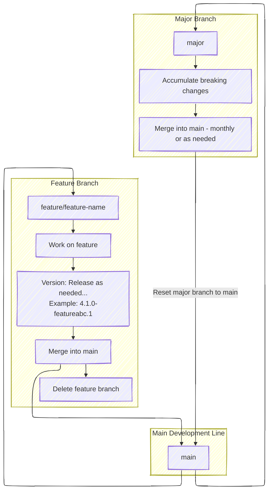

# RFC: Patina Release Process

This RFC proposes a process for releasing Patina crates.

## Change Log

- 2025-07-28: Initial draft of RFC.
- 2025-07-29: Add more granular crate versioning to the unresolved questions section.
- 2025-07-30:
  - Add feature and stability branching process
  - Clarify crate versioning process
  - Clarify open source versioning plan
  - Add requirement that hot fixes will only occur on the greatest version of a release
- 2025-08-05:
  - Simplify language in the hot fix process
  - Add release note organization requirement for crates sharing the same version
- 2025-08-13:
  - Change the scheduled release day from Monday to Tuesday to discourage rushed releases at the start of the week.
- 2025-08-15:
  - Add a versioning process based on unique criteria for updating the major version.
  - Add breaking change requirements to the release process details section.
- 2025-08-27:
  - Branching section updates:
    - Clarify feature branch PR details
    - Replace the `stabilization` branch concept with a `major` branch and add details
    - Indicate all previously unresolved questions have been resolved.

## Motivation

As Patina nears its public release and shipping in production, the release process needs to be more formally defined.

Consumers need to understand how to anticipate Patina releases, how to request releases, and how hot fixes are
handled. This RFC proposes a process for Patina crate releases in the `patina` repositories that contain library
crates, such as `patina`, `patina-paging`, and `patina-mtrr`. This RFC does not cover aspects of the release process
once a release is made, such as testing and validation criteria.

## Technology Background

This RFC does not impact any technology specifically. The [Semantic Versioning 2.0.0 specification](https://semver.org/)
is used as a reference but not followed strictly for reasons explained in the RFC. The implementation of automated
processes is outside the scope of this RFC, but it is expected that the process will be implemented using GitHub
Actions or similar automation tools.

## Goals

1. Provide a clear and automated process for releasing Patina crates.
2. Ensure that releases are made in a timely manner and that consumers can anticipate releases.
3. Provide flexibility in the release process to support releases on demand.
4. Ensure that hot fixes can be made when necessary without disrupting the main release process.
5. Ensure multiple hot fixes can clearly be made on a single base version.
6. Ensure hot fix consumers clearly understand how to consume hot fixes.
7. Ensure that breaking changes are clearly documented and communicated to consumers.
8. Ensure that releases are versioned according to a well-defined but modified semantic versioning scheme.
9. Ensure that release notes are automatically generated and published with each release.
10. Ensure that the release process is automated as much as possible to reduce manual effort and errors.
11. Provide a model for larger breaking changes to be made without impacting the main development branch.

## Release Version Details and Requirements

Patina generally follows the [Semantic Versioning 2.0.0 specification](https://semver.org/) with some project-specific
criteria for distinguishing between **minor breaking changes** and **major breaking changes**. It aims to provide clear
guidance on when a version bump—particularly a major version update—is warranted based on the nature and impact of
changes to the public API, system behavior, and integration effort required by consumers.

### Definitions

- **Public API**: Interfaces exposed by Patina that are intended for use by external components or consumers. This
  includes:
  - Rust APIs explicitly marked as public and intended for external use.
  - The C FFI layer exposed by Patina.
- **Private API**: Internal interfaces used exclusively within Patina crates and not intended for external consumption.

### Criteria for Breaking Changes

#### Non-Breaking Changes

The following changes are **not** considered breaking:

1. **Modifications to Private APIs**

   Changes or removals of APIs considered private to Patina (i.e., exposed from internal Patina crates for use by other
   Patina crates) are not considered breaking changes.

2. **Semantic-Preserving API Changes**

   Changes that alter the API surface but preserve semantic behavior, such as:

   - Type signature changes that improve correctness without altering behavior (e.g., `u32` → `usize`).
   - Addition of new parameters to an API with default values or options that preserve previous behavior (e.g.,
     `do_something()` → `do_something(extended_behavior: bool)` where `extended_behavior = false` preserves original
     semantics).
   <!-- cspell:disable-next-line -->
   - API renames that preserve behavior (e.g., `do_soemthing()` → `do_something()`).

3. **Addition of New Public APIs**

   Introducing new public APIs is not considered a breaking change.

4. **Refactoring Without Semantic Change**

   Refactoring the internal implementation of a public API function is not breaking unless it results in significant
   semantic differences when called with the same parameters.

5. **Component Changes Without Operational Impact**

   Moving or removing components or drivers is not breaking if Patina continues to operate correctly without them.

#### Breaking Changes

The following changes are considered **breaking** and may require a major version update:

1. **Removal of Public APIs**

   Removing existing public APIs is a breaking change.

2. **Semantic-Altering Refactors**

   Refactoring a public API in a way that changes its semantic behavior (e.g., `do_something()` →
   `do_something_with(complicated_to_construct: thing)`) is considered breaking.

3. **Critical Boot Path Modifications**

   Moving a component into or out of the critical boot path is breaking if:

   - The component becomes required for Patina to boot or operate.
   - Removal of a component or driver causes Patina to fail.

4. **C FFI Layer Changes**

   The C FFI layer is part of the public API and follows the same rules for breaking changes as Rust APIs. Changes to
   this layer are considered breaking if they alter expected behavior or structure.

5. **Behavioral Changes in Public APIs**

   If a public API is refactored such that calling it without changes results in significantly different behavior
   (e.g., `core_allocate_pages` returning pages marked `RWX` vs. `RP`), it is considered a breaking change.

### Release Notes

- Are generated automatically in a GitHub release draft as pull requests are merged.
- Content is determined as follows:
  - Title: Based on the pull request title.
  - Body: Based on the pull request description.

### Pull Request Version Mapping

- The version is automatically updated in the GitHub release draft based on the labels associated with the pull
  requests that compose the release.
  - The version is determined as follows:
    - Increment to Major:
      - 'impact:breaking-change'
      - 'semver:major'
    - Increment to Minor:
      - 'semver:minor'
      - 'type:design-change'
      - 'type:enhancement'
      - 'type:feature-request'
    - Increment to Patch:
      - 'impact:non-functional'
      - 'semver:patch'
      - 'type:bug'
      - 'type:documentation'
    - Default: Update patch

### Release Process Details

- The release process is automated and triggered by a GitHub action at 7am Pacific time on Tuesday on a cadence decided
  in the project.
  - This RFC proposes a weekly release cadence.
  - May be triggered by a Patina team member at any time outside of the scheduled time.
  - The release is composed of changes in the `main` branch that have been merged since the last release.
- Bases the releases notes and version on the GitHub draft that was automatically drafted after
  each pull request merge.
- Publishes the release to the active project crate registry (e.g. crates.io).
- Has special requirements for a breaking change:
  1. The breaking change must be documented in the pull request description with exact instructions on how to
      migrate from the previous version to the new version.
  2. The breaking change must be labeled with 'impact:breaking-change'.
  3. Prior to merging a breaking change:
      - If any content is pending for release, that content must be released first.
      - The breaking change (or `stabilization` branch) is then merged into the `main` branch.
      - The breaking change is immediately released as a new version.

### Crate Versioning

- All crate versions share the same version that is incremented based on the release process. This version matches
  the GitHub repository version.
  - This not a "strong" requirement and may be reviewed again the future if a compelling use case arises for more
    granular crate versioning. At a minimum, the "core" and "SDK" crates are expected to share the same version.

- Note: Since all crates will have the same version, the release notes must be organized to break down changes by
  crate. This will allow a given crate consumer to filter the changes relevant to them. The implementation details of
  how to achieve this are outside the scope of this RFC.

### Branching

- The `main` branch is the primary development branch.
  - Any release made from a non-`main` branch must have a pre-release identifier in the version.
- A `feature` branch may be created for an involved feature or enhancement.
  - The `feature` branch is merged into the `main` branch when the feature is complete and ready for release.
  - The `feature` branch is deleted after it is merged.
  - **Branch name**: `feature/<feature-name>`
  - **Version Format**: `<major>.<minor>.<patch>-feature<feature-name>.<feature_release_number>`
    - **Example**: `4.1.0-featureabc.1`
  - Changes must be submitted by PR so feature changes are visible to the project, however, PR requirements may vary
    from those in the `main` branch. The final feature merge to `main` will be subject to the normal `main` branch PR
    requirements.
- All breaking changes must be made into the `major` branch.
  - The `major` branch is used to allow multiple breaking changes to be developed in parallel without blocking
    non-breaking changes in the `main` branch.
  - The `major` branch is merged into the `main` branch on a regular (monthly) cadence.
    - The `major` branch may be merged into `main` sooner if all breaking changes are complete, ready for release,
      and required before the monthly cadence merge.
  - **Branch name**: `major`
  - PR requirements into `major` are the exact same as those to the `main` branch.



## Unresolved Questions

- None remaining.

## Prior Art (Existing PI C Implementation)

Various projects have incorporated semantic versioning in their release processes. This process is largely based on
the Semantic Versioning 2.0.0 specification. In terms of related open source firmware project, Tianocore follows a
[stable tag](https://github.com/tianocore/tianocore.github.io/wiki/EDK-II-Release-Planning) process that releases on
a quarterly interval with freeze periods preceding the release point. [Project Mu](https://microsoft.github.io/mu/) has
an [automated release note process](https://github.com/microsoft/mu_devops?tab=readme-ov-file#release-drafting) that
portions of this proposal are based on.

A large number of popular Rust projects do not pick up a major version for a long time.

## Proposed Release Process

Patina makes official releases on as the project determines necessary. This RFC covers three types of releases:

- **Regular Releases**: A release is made on Tuesday each week. If there are no changes, the release is not made. The
  release process is automated including the release notes, versioning, and publishing to crates.io. However, a Patina
  team member with proper access can always make a release at any time.
  > Note: Tuesday is chosen as it provides the maximum amount of time for the Patina team to be available for feedback
  and support of the release during the given work week and discourages rushed changes over the weekend or at the
  start of the week.
  - If Tuesday falls on a holiday, the automated release process still makes the release on Tuesday, but the Patina team
    will not be available for support until the next business day.
  - More frequent releases are encouraged to provide greater granularity of changes and to avoid large releases
    that may be harder to test and validate.
  - The `major` branch is merged into `main` on the third Tuesday of each month if there are any breaking changes
    pending in the `major` branch. If there are no breaking changes, the merge does not occur.
- **Requested Releases**: A release may be requested by a non-Patina team member to unblock a platform or feature
  that depends on the change.

  A requested release may only be made for changes that have already been merged into the `main` branch and are
  pending in a draft GitHub release. The requestor must open a GitHub issue task and simply request the release be
  made and explicitly state which changes are needed so the Patina team member can ensure the release successfully
  resolves the request. The task is closed by the Patina team member once the release is made.
- **Hot Fixes**: A hot fix is made when a critical change needs to be applied on a previous release.
  > Note: It is always preferred to use the latest official release when possible. Hot fixes introduce maintenance
  overhead and should be avoided when possible.

  A "Hot Fix" issue template will be made available in the GitHub repository to request a hot fix. The template
  will include the following fields:

  - `Title`: Patina Hot Fix Release Request
  - `Description`:
    - `Patina Base Version: <ver>`
    - `Request Reason: <reason(s)>`
    - `Exact Changes Needed: <change(s)>`
    - `Requested Delivery Date: <date>`
      - Examples
        - `<reason(s)>`: Needed to enable unblock feature a on x and y platforms
        - `<change(s)>`: Include commit ae4b134 from the main branch
        - `<date>`: 8/1/2025

  `<date>` must be at least the next business day from the request date. For example, a request cannot be made on
  Friday at 11am for a release on Friday. At the earliest, the release will be made on Monday by 5pm. All times are
  based on Pacific time unless noted otherwise. The Patina team will acknowledge the expected release date in the
  discussion section of the work item request. Note that the requested date may not be feasible; try to plan a
  special release request as early as possible.

  Please consider if you can simply take a newer release and avoid a hot fix.

## Hot Fix Process

  Hot fixes are made when an out-of-cycle release is requested on a `base change` in which the `main` branch already
  contains additional commits on top of the `base change` (`base change` is not the tip of the branch).

  In this case, a new branch is created from `base change` with the minimum commits needed to include `Exact Changes
  Needed`. The branch follows the naming convention "hotpatch/\<Patina Base Version\>/\<Hot Fix Number\>". Hot fix crate
  versions are versioned as "\<Patina Base Version\>-hotfix.\<Hot Fix Number\>". For example, if a hot fix is requested
  on Patina v4.1.0 and it is the second hot fix requested on that base version, the following branches will exist with
  the following versions produced from those branches:

- Request 1:
  - Branch: `hotpatch/4.1.0/1`
  - Version: `4.1.0-hotfix.1`
- Request 2: `hotpatch/4.1.0/2`
  - Version: `4.1.0-hotfix.2`

  `Request 1` may have come from "Team A" and `Request 2` may have come from "Team B" and contain an entirely different
  change on top of the `4.1.0` release. Hot fixes are not intended serve as long term branches. Once the hot fix is
  made, the hot fix branch is "locked" and no further changes are made to it. Hot fixes are recommended on the
  greatest patch version of a major release. For example, if `4.2.1` is the latest release, then hot fixes may be
  requested on `4.2.1` but not `4.2.0`, `4.1.0`, or `4.0.0`. If a hot fix must occur on a previous patch version, then
  the hot fix request must explain why the hot fix cannot be made on the latest patch version.

  In the above example, if another change is requested in `hotpatch/4.1.0/2`, then a new branch and hot fix
  release is created as `hotpatch/4.1.0/3` with the version `4.1.0-hotfix.3`.

  Consumers that use hotfix versions, should set the hotfix version of the crate as the exact version that they
  depend on. For example, if a consumer needs to use the `4.1.0-hotfix.2` version, they should set their
  `Cargo.toml` to depend on that exact version:

  ```toml
  [dependencies]
  patina = { version = "4.1.0-hotfix.2" }
  ```

  This ensures that the consumer is using the exact version of the crate that was released as a hot fix and avoids
  potential issues with future releases that may not include the hot fix changes.

## Open Source Versioning Plan

When Patina is made open source, it will begin publishing to crates.io (instead of the `patina-fw` public registry).
At that time, the first release will begin at version `0.1.0` for all Patina crates. Per the Semantic Versioning
specification suggestion, the `1.0.0` release will be made when Patina is first shipped in production. This is the
current plan for transparency and to ensure that consumers of Patina can anticipate the versioning scheme but it is
not a requirement and may change in the future.
