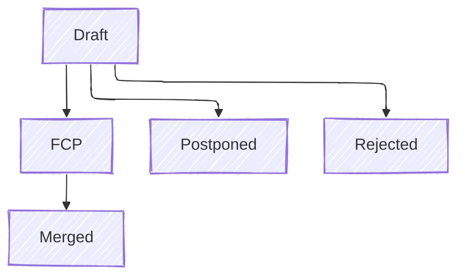

# The Request For Comments (RFC) Lifecycle

Typically small to medium changes such as bugfixes, existing implementation improvements, and documentation are handled
via pull requests. Depending on the size they may also have an associated github issue or discussion. These are
expected to be simple changes without much controversy.

The RFC process comes into play when a particular change becomes large, introduces new features, or breaks existing
interfaces. In these scenarios, the developer is expected to follow the RFC process outlined below to ensure not only
proper involvement from maintainers, but also from the community as a whole. The goal is to reach a community consensus
before introducing large changes as described above.

As a developer, you should use your best judgement to determine if an RFC is required or not. Maintainers have the
right to ask that an RFC is created for a submitted pull-request, or an RFC is converted directly to a pull-request,
depending on the proposal.

The complete RFC process is:

1. **Create** a new branch for your RFC.
2. **Copy** the template from `docs/src/rfc/template.md` Ito a new file in the `docs/src/rfc/text` directory named
   `0000-<feature-name>.md` where `0000` is a placeholder until the RFC is accepted (so use `0000` in your PR) and
   `<feature-name>` is a short name for the feature.
3. **Fill out** the RFC template with your proposal.
4. Submit a **pull request** (PR) with your RFC.
5. The PR will be discussed, reviewed, and may be iteratively updated.
6. Once there is consensus, one of the following will occur:
   - If approved, the RFC will be **merged** and assigned an official number.
   - If rejected, the RFC will be **merged** to the rejected directory and assigned an official number.

## The RFC Life Cycle

Each RFC goes through these stages:

- **Draft**: The initial state when a PR is opened. The community and relevant teams provide feedback.
- **Final Comment Period (FCP)**: Once there is rough consensus, an FCP of 7–10 days starts. During this time, final
  objections can be raised.
- **Merged**: After FCP with no blocking concerns, the RFC is merged and becomes official.
- **Postponed**: RFCs may be deferred due to lack of clarity, priority, or readiness.
- **Rejected**: With strong reasoning and community consensus, RFCs can be declined.

## Implementing and Maintaining an RFC

Once accepted:

- The implementation is tracked through linked issues or repositories.
- Any changes during implementation that deviate from the RFC must go through a **follow-up RFC** or an **amendment**
  process.
- An RFC can be **revised** in-place via a new RFC that supersedes or modifies the previous one.

## Rejected RFCs

Due to community feedback, some RFCs may be rejected. In order to track these and be able to reference back to them,
these RFCs are maintained in the Patina repo as files in `docs/src/rfc/rejected`. Each merged RFC in Patina will have
a unique number to reference it by, whether it was merged to the `text` (approved) or `rejected` directories; that is
RFC numbers shall be unique in Patina regardless of whether the RFC was approved or rejected.

Rejected RFCs must contain a new section that summarizes the community's decision to reject the RFC. The PR remains
the source of the full community discussion.

Following the rejection of an RFC, that RFC may be raised to the community again at some point in the future. In this
case, a new RFC should be created that points back to the original RFC and explains what is different about the new
proposal or why the original proposal is appropriate to bring back to the community.
